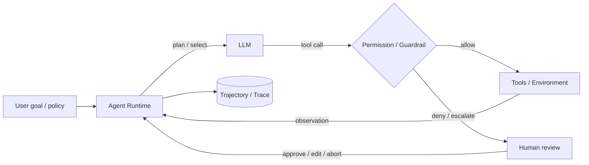

# 架构设计：LLM 编排工具完成多步任务——规划/调用/观察循环，带权限、人审与可观测边界

> 模式：deliverable  
> 已定关键决策：以增强型 LLM + 工具环境反馈为基本积木；默认走「够用最简」复杂度阶梯；生产路径要求工具循环、会话/状态边界、权限与审批闸门、可回放轨迹；长任务与副作用路径预留 HITL / checkpoint。  
> 明确不做：把某一 IDE/产品的模块图当作本问题类架构；默认上最重图框架或「全自治无护栏」；用微服务拓扑或前端包结构冒充 agent 运行时；假装单次生成无需观察闭环。  
> 待验证事实：具体产品里何种副作用必须人审的策略阈值；给定模型下工具错误复合率曲线；某一 tracing 后端的采样成本（以 D8 公开工程文心智为金标基线，不锁死产品数值）。

## 层 A — 叙事

### A1 摘要

我们要解决的不是「再画一张 Codex/某助手的产品模块图」，而是一类运行时问题：**让 LLM 在开放式任务上编排工具，经规划→调用→观察的循环把事做完**，同时把权限、人审与可观测性当成一等边界——因为模型非确定性、工具有副作用、失败重跑昂贵。

成功时，系统能在明确停止条件下结束循环；每一步工具调用可授权或拦截；关键副作用可暂停给人改；整条轨迹可回放评估。失败时宁可以护栏中止或等人审，也不把不可逆操作当成「模型说了就算」。不在范围内的是：只回答一次就永久正确的神话、无工具的纯聊天、以及用服务拆分图代替循环与边界机制。

### A2 上下文与边界

系统落在**智能体运行时 / 编排层**：上游是用户目标、策略与可用工具目录；下游是真实环境（文件系统、终端、浏览器、API、工单、代码库）。信任边界大致是：谁能发起会话；模型只能通过声明的工具触达环境；护栏与审批决定「说了是否做得成」；轨迹存储的访问与保留策略独立于对话正文。外部接口是：会话/运行 API、工具注册与权限策略、人审控制台或回调、以及 tracing/评估导出。

与「工作流引擎」或「微服务」的边界：对外可以像自动化一样用，但对内契约是**模型在循环中动态选下一步**（可与确定性节点混布），真相来自工具观察而非仅来自模型自述；权限与轨迹不是贴在旁边的运维插件。

### A3 主路径

一次关键任务可走通如下：

1. **接纳目标**：运行时打开会话（session），装载指令、工具目录、策略（允许的工具、是否强制人审、停止条件）。用户给出目标；可选地由模型或编排器写出短计划——计划是可修订的，不是不可违背的 DAG 合同（除非策略选了预定义工作流）。  
2. **规划 / 选择动作**：模型基于当前上下文决定：直接作答、再问用户、或发起一次/一批工具调用。  
3. **权限闸门**：工具调用进入 guardrail / 权限检查（输入校验、工具白名单、副作用分级）。拒绝则记录原因并中止或改道；需人审则暂停，把提议动作与 diff/命令展示给人。  
4. **执行与观察**：获准后执行工具（同步、沙箱或异步队列）；把**原始或规范化后的工具结果**回注会话上下文——这是环境 ground truth。  
5. **循环直至停止**：模型消费观察，更新计划或直接下一步；直到任务完成、触达停止条件、护栏失败、或人审中止。全程写入 **trace**（步骤、工具、护栏、人审决策）。

读者应能跟着走完：目标 → 选工具 → 闸门 → 观察回注 → 完成/中止，而无需假设「一次 prompt 出最终结果」或「无权限也能随便改生产」。

### A4 组件与契约

| 组件 | 职责 | 契约要点 |
|------|------|----------|
| LLM（增强型） | 在上下文中选择下一言语/工具动作 | 不直接拥有环境；只能经工具/受控通道作用 |
| Agent Runtime / Loop | 托管回合：调用模型、调度工具、合并观察、判停 | 必须有明确停止条件；禁止无限空转无预算 |
| Tools（ACI） | 对环境的类型化操作面 | 接口清晰、错误可观察；设计质量与提示同等重要 |
| Session / State | 循环内工作上下文；与外部记忆分界 | 上下文有界；长任务靠摘要/checkpoint，而非假装无限窗 |
| Guardrails / Permissions | 输入输出校验、工具授权、副作用分级 | 可与执行并行启动，失败应能快速中止 |
| HITL Gate | 中断、展示、改状态、恢复或中止 | 人审是控制流一等公民，不是日志里的注释 |
| Tracing | 记录可回放轨迹 | 无轨迹则难以评估与追责；采样策略可演进但不取消机制 |

禁止越界：让模型「口头宣布已执行」却无工具观察；把护栏做成可被 prompt 轻易绕过的软提示唯一防线；用产品 UI 模块名替换上表职责。

### A5 状态、失败与恢复

**持久化什么**：会话工作上下文（或可恢复 checkpoint）；工具与环境侧的真实副作用（文件、PR、工单）——运行时状态不是环境的唯一真相；轨迹与人审记录用于审计。长期记忆若存在，须与本回合 session 显式分界，避免「记忆污染」被误当成当轮观察。

**挂了怎么办**：模型胡言或工具报错 → 观察回注后由循环重试、改工具或升级人审；护栏失败 → 快速中止该步或整 run。进程崩溃或长任务超时 → 从 checkpoint / 沙箱工作区恢复，而不是默认丢弃已付的模型与工具成本。人审超时 → 策略决定挂起、自动拒绝或有限重试——须事先约定，不能 silently 当批准。

**用户可见失败态**：权限拒绝、护栏命中、工具超时、上下文溢出、轨迹显示循环空转、人审队列积压。恢复路径是收紧工具面、缩短任务、强制 checkpoint、提高人审优先级、或降级为预定义工作流。

### A6 安全与身份

适用：默认适用。身份落在「谁发起 run」「以谁的凭证执行工具」「谁有权批准副作用」。架构后果是：工具执行身份通常**不是**模型本身，而是委派的用户/服务账号；越权风险来自过大的工具权限与过宽的 session 共享。密钥不得进入可被轨迹或提示泄露的明文通道。沙箱（文件系统/网络隔离）把「能想」和「能碰」分开。安全不是贴合规标签，而是改变主路径：许多写操作从「自动执行」变为「提议 → 审批 → 执行」。

### A7 演进切片

- **现在（问题类最小可讲清心智）**：单 agent 工具循环 + session 边界 + 权限闸 + 轨迹；副作用路径可 HITL；复杂度默认从简单调用爬升。  
- **下一刀**：多 agent handoff / orchestrator-workers、图上混布确定性节点、耐久 checkpoint 与异步工具队列、更强评估闭环（evaluator-optimizer）。  
- **明确不做**：一上来绑死最重框架；无护栏全自治操作生产；把架构文档写成某产品的目录树。

### A8 如何验收

1. **刺激**：给出需 2+ 工具才能完成的任务；**观察**：出现至少一轮「选工具 → 结果回注 → 再决策」，而非单次终答冒充完成。  
2. **刺激**：对高副作用工具关闭自动批准；**观察**：执行前进入人审/暂停态，批准后才产生环境变化；拒绝则无副作用且轨迹可查。  
3. **刺激**：注入非法输入或越权工具调用；**观察**：护栏或权限层拦截并中止/改道，run 状态与 trace 记录原因。  
4. **刺激**：在长任务中途杀死运行时进程（或模拟）；**观察**：能从 checkpoint/工作区恢复续跑，或明确失败而不是静默丢状态；整条轨迹仍可导出评估。

## 层 B — 机制与策略

### B1 基本事实

- **已证实（Anthropic）**：多数应用先试单次 LLM（±检索）；agent 用延迟与成本换表现，复杂度须由评测证明值得；工具接口（ACI）与提示同等重要。  
- **已证实**：工作流（代码预定义路径）与自治 agent（模型动态主导）是不同复杂度；开放式任务才更常需要后者。  
- **已证实（OpenAI Agents SDK）**：生产级编排需要少量原语覆盖循环、工具、护栏、会话与追踪；handoff / agents-as-tools 是多 agent 协调选项。  
- **已证实（LangGraph）**：长时、有状态、可环的任务需要 checkpoint、HITL 中断恢复与流式；DAG 框架不够；短 agent / 无工具场景可能不需要重框架。  
- **已证实**：非确定性与不可逆副作用并存时，人审与沙箱是控制手段，不是可选装饰。  
- **待验证（部署相关）**：某团队工具错误率阈值阈值；具体 tracing 存储成本；何种任务必须强制 HITL——金标不锁死产品政策数字。

### B2 机制

该类问题几乎绕不开的结构（问题类语言）：

1. **工具循环（plan / act / observe）**：模型迭代地选择动作；环境结果回注；直至完成或停止。  
2. **增强型 LLM 积木**：tools / retrieval / memory 挂在模型外，由运行时编排，而不是「更大的 prompt 冒充系统」。  
3. **会话与状态边界**：循环内工作上下文有界；与长期记忆、外部系统真相源分离。  
4. **权限与护栏闸门**：在模型意图与真实副作用之间插入可强制的策略点（输入/输出/工具）。  
5. **可观测轨迹**：步骤级 trace 支撑调试、评估、微调与事故复盘。  
6. **人审与可恢复执行（生产常驻）**：中断 → 改状态 → 恢复；长任务 checkpoint / 沙箱工作区，避免昂贵整段重跑。

显式模式名：Agent loop、ACI（tool design）、Guardrail、Session、Handoff、Checkpointing、HITL、Tracing；工作流侧：Prompt chaining、Routing、Orchestrator-workers、Evaluator-optimizer。

### B3 策略选项

| 策略维 | 选项 A | 选项 B | 依赖的事实 |
|--------|--------|--------|------------|
| 复杂度 | 单次 LLM / 预定义工作流 | 自治 agent 循环 | 路径是否可硬编码；评测是否证明 agent 值得 |
| 编排形态 | 单 agent 内置循环（SDK 原语） | 有环图运行时（确定性+agentic 混布） | 是否要耐久、细粒度中断、复杂分支 |
| 多 agent | Handoff / agents-as-tools | Orchestrator-workers / 图节点 | 子任务是否事先不可预测；协调成本 |
| 人审 | 副作用强制审批 | 抽检或全自治 | 不可逆性、合规、延迟预算 |
| 工具执行 | 同步进程内 | 沙箱 / 异步队列 / 可恢复工作区 | 是否要隔离、长任务、重试独立于请求线程 |
| 运行时厚度 | 自管 API 循环 | Agents SDK / LangGraph 等 | 是否需要托管护栏、session、checkpoint、流式 |

### B4 取舍

选择 **「够用最简」阶梯上的工具循环运行时：session 边界 + 权限闸 + 轨迹；副作用默认可 HITL；需要耐久/复杂控制流再上图运行时**，因为问题类要同时满足：开放任务可完成、副作用可控、失败可解释可恢复、成本与复杂度可辩护。

明确放弃：

- **默认最重框架**：短任务与可硬编码路径被框架淹没；代价是失去 Anthropic 式 when/when not 纪律。  
- **无护栏全自治**：演示好看，生产不可追责；代价是人审与沙箱带来的延迟。  
- **只靠提示当权限**：模型可被诱导绕过；代价是工程上要真闸门。  
- **产品模块图冒充架构**：校准与迁移时无法迁移到 Codex 类异构实现；代价是作者要忍住不画包结构当机制。  
- **否认观察闭环**：把「生成即完成」当 agent；代价是与环境脱节，复合错误无人发现。

负面后果需写进沟通：agent 换的是延迟与金钱；轨迹有隐私面；强制 HITL 会改变 SLA；多 agent 增加协调故障模式。

### B5 与对照的关系

- **Anthropic Effective Agents**：教「先问是否需要 agent」与模式词汇表；教训——机制之前先做复杂度诚实。  
- **OpenAI Agents SDK**：教少原语产品化（loop / guardrail / session / trace / handoff）；教训——生产路径不是「自管循环演示」。  
- **LangGraph**：教耐久、HITL、有环控制与流式；教训——运行时能力与模式文是正交轴，可组三角共思，不可互相替代。  
- 本金标校准用途：构建期对照候选 deliverable 是否命中工具循环问题类的机制/策略；**禁止**用某一商业 coding agent 的 UI/包名清单充当合格答卷。
