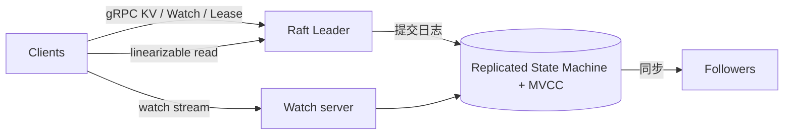

# 架构设计：强一致、可持久的元数据存储与协调原语——反脑裂优先

> 模式：deliverable  
> 已定关键决策：单一致复制组（Raft）保管小规模元数据；KV 默认可线性化；MVCC + revision 逻辑时钟；Watch / Lease / Lock / Election 与存储同体；宁可牺牲部分可用性也不容忍 split-brain。  
> 明确不做：把系统建成海量业务数据仓库或完整服务发现产品；默认 AP / 可脑裂；把 Lock API 当作对外部资源的充分互斥证明；用最终一致缓存心智描述主路径。  
> 待验证事实：具体集群规模与磁盘下的 compaction / 历史窗口运维阈值；serializable 读在特定负载下的延迟收益与陈旧度分布（以官方 Learning 心智为金标基线）。

## 层 A — 叙事

### A1 摘要

我们要解决的不是「再做一个最终一致的配置缓存」，而是为大规模分布式系统提供**强一致、可持久的元数据存储与协调原语**：配置分发、服务发现登记、选主、以及锁与租约类优化。成功时，客户端通过条件写与事务更新共享键值空间，观察者用 Watch 跟上变更，协调原语（Lease / Lock / Election）与同一真相源绑定；集群宁可在分区时拒绝冒险写入，也不出现双主真相。

不在范围内：把 etcd 当海量业务库或 SQL 分析仓；做成 Consul 式端到端服务发现产品；或宣称「超时后仍可安全假定操作已完成」。硬约束是：**永不容忍 split-brain（CP 取向）**、元数据可靠量级约数 GB、客户端必须理解选主/超时时的**完成性不确定**。

### A2 上下文与边界

系统落在控制面与协调层：上游是编排器、控制面组件、业务侧的配置与发现客户端；下游是依赖同一元数据真相做路由、选主与栅栏的进程。信任边界大致是：经认证的客户端访问 gRPC/HTTP API；集群内成员通过 Raft 复制状态机；运维负责成员变更、备份与 compaction 窗口。

与「通用数据库」的边界：对外可以像 KV 一样用，但对内契约是**小规模协调存储**——单分片强顺序、历史可压缩、原语与存储同体，不是分片海量 OLTP。

### A3 主路径

一次关键配置变更与观察可走通如下：

1. **写入**：客户端向当前 **Raft leader** 提交 Put / 条件事务（compare-and-swap 一类）；leader 将请求写入 Raft 日志并等待多数派确认。  
2. **状态机应用**：提交后的条目应用到复制状态机；**MVCC** 为该键生成新版本，集群级 **revision** 单调前进，充当逻辑时钟。  
3. **线性化读**：默认读路径经 leader（或等价线性化协议）返回与已提交写一致的视图，而不是任意本地陈旧副本。  
4. **Watch**：订阅者附着在 revision 流上接收有序事件；可用 bookmark / 从上次 revision **resume**，在历史窗口内可靠重放；Watch **不**承诺与线性化读相同的线性化保证。  
5. **Lease / 协调**：客户端创建并续约 **Lease**，把键绑定到租约；超时撤销触发键删除与后续 Watch；Lock / Election 建立在同一存储与租约语义之上。

读者应能跟着走完：写 → Raft quorum → MVCC revision → 线性化读 / Watch，而无需假设「最终一致缓存 + 尽力通知」。

### A4 组件与契约

| 组件 | 职责 | 契约要点 |
|------|------|----------|
| Client | 认证、超时重试、条件写、Watch 恢复 | 超时 ≠ 未发生；须用 revision/条件再确认 |
| Raft Leader / Followers | 共识日志与成员 | 写经多数；分区时少数侧不得形成第二真相 |
| MVCC Store | 多版本键值 + revision | 历史有窗口；compaction 后旧 revision 不可读 |
| Watch | 变更通知流 | 有序、可靠、可恢复；非线性化保证 |
| Lease / Lock / Election | 协调原语 | 与 KV 同体；Lock **不**单独证明外部资源互斥 |

禁止越界：用「读到本地 follower」冒充默认可线性化；把 Watch 延迟说成有上界保证；把 etcd 当对象存储/大数据湖。

### A5 状态、失败与恢复

**持久化什么**：Raft 日志与快照、MVCC 键值与租约状态、成员配置。历史窗口内的旧版本支撑 Watch 恢复与条件读；**compaction** 之后更早 revision 消失。

**挂了怎么办**：leader 失败时多数派选出新 leader；正在进行的客户端请求可能超时——**完成性不确定**，应用须用条件读/事务确认后再重试。多数派不可用时写入失败（CP）：避免脑裂比「分区两侧都写」优先。磁盘与历史膨胀靠 compaction 与合理配额，而非无限保留所有版本。

**用户可见失败态**：选主期间不可用、配额/体积触发的拒绝、Watch 在不健康集群上长期收不到事件、Lease 过期导致键消失。恢复路径是等待多数恢复、修复成员、从备份恢复、或从仍存在的 revision 重建观察者。

### A6 安全与身份

适用：控制面默认需要客户端认证与授权（谁能读写哪些前缀）、传输保护、以及成员间对等认证。架构后果是：协调原语的误用（无 fencing 的锁、忽略超时不确定）会变成跨服务的安全事故，而不只是「配置读错」。身份边界在客户端↔集群 API；业务侧对外部资源的互斥仍须在资源上校验版本/fencing token——etcd Lock **本身不保证**外部互斥。

### A7 演进切片

- **现在**：单 Raft 组 + MVCC + 默认可线性化 + Watch/Lease 同体，作为强一致元数据与协调的最小可讲清心智。  
- **下一刀**：serializable 读降延迟的场景标定、compaction/备份运维策略、成员动态变更的演练——仍服从 CP 与元数据规模，不改成 AP 缓存。  
- **明确不做**：为迁就「总能写入」而容忍脑裂；把库做成海量业务仓；用外挂 recipes 假装可以没有同体租约/版本语义。

### A8 如何验收

1. **刺激**：对同一键做条件 Put（基于预期版本）并发冲突；**观察**：至多一个事务按预期成功，revision 单调，失败者可读到新版本再决策。  
2. **刺激**：写入后立即做默认可线性化读；**观察**：读到已提交值，而不是任意更旧的本地视图（相对「随便读 follower」叙事）。  
3. **刺激**：Watch 从某 revision resume，期间制造若干 Put；**观察**：事件有序到达且可在历史窗口内恢复；不把 Watch 宣传为线性化。  
4. **刺激**：绑定 Lease 的键在停止续约后；**观察**：租约过期键被删并产生可观察事件；同时记录「客户端时钟以为仍持有」的风险须在应用层处理。  
5. **刺激**：隔离少数成员制造分区；**观察**：少数侧不能独立提供可写真相（无脑裂双写）。

## 层 B — 机制与策略

### B1 基本事实

- **已证实（公开 Learning / Why）**：协调与控制面元数据需要强一致与反脑裂；多数派共识是该问题类的主流结构。  
- **已证实**：小规模元数据（约数 GB 心智）可放在单复制组里用全局顺序简化推理；海量业务数据应另选分片/NewSQL 路径。  
- **已证实**：MVCC + 全局 revision 同时支撑条件事务、历史窗口内的 Watch 恢复与逻辑时钟叙事。  
- **已证实**：Watch 可做到有序、可靠、可恢复，但**不保证线性化**；与 KV 默认可线性化是不同保证。  
- **已证实**：Lease 绑定物理时钟 TTL → 存在服务端已撤、客户端仍自认持有的窗口；Lock 需资源侧版本/fencing。  
- **待验证（部署相关）**：具体硬件与负载下 compaction 节奏、serializable 读的延迟/陈旧曲线——金标不锁死运维数值。

### B2 机制

该类问题几乎绕不开的结构（问题类语言）：

1. **Consensus / 复制状态机（Raft）**：单一致复制组，写经 quorum。  
2. **全局逻辑时钟（revision）**：为条件写、Watch 位点与因果叙述提供单调序号。  
3. **MVCC + compaction**：多版本并存于历史窗口，再压缩以控体积。  
4. **默认可线性化读写契约**：读路径对齐已提交写，而非默认可陈旧。  
5. **Watch（bookmark / resume）**：变更通知与恢复，保证弱于线性化。  
6. **Lease + 条件更新（CAS / 事务）**：存活与互斥优化的基础；配合 fencing/version validation。  
7. **同体协调原语（Lock / Election）**：建立在 KV/Lease 上，而不是纯外挂文档 recipes。

显式模式名：Replicated State Machine、Lease + fencing token（对照 Chubby sequencer / Kleppmann）、Compare-and-swap / 条件事务。

### B3 策略选项

| 策略维 | 选项 A | 选项 B | 依赖的事实 |
|--------|--------|--------|------------|
| 一致性取向 | CP / 反脑裂 | AP / 分区可写 | 控制面能否接受双真相 |
| 数据模型与 API | 一致 KV + 原语齐全（gRPC） | ZK 层次 znode + 客户端拼装 | 生态、动态成员、MVCC/可靠 watch 需求 |
| 产品边界 | 只做强一致元数据存储 | 端到端服务发现产品（如 Consul） | 是否要 DNS/健康检查/目录一体 |
| 规模路径 | 单分片强顺序 | NewSQL / 分片海量 | 数据是否远超元数据量级 |
| 读延迟 | 默认可线性化 | 可选 serializable 读 | 能否接受相对 quorum 的旧值 |

### B4 取舍

选择 **Raft 单组 + MVCC/revision + 默认可线性化 + Watch/Lease 同体**，因为问题类要的是控制面级真相与可组合协调，而不是高可用优先的缓存，也不是大数据仓库。

明确放弃：

- **AP / 可脑裂写入**：分区两侧都写会摧毁选主与配置权威。代价：多数不可用时写入失败，客户端必须处理不确定完成。  
- **当海量业务库 / SQL 仓**：单组强顺序与元数据假设被破坏。代价：用户需另建数据平面。  
- **做成完整服务发现产品**：扩大问题类；etcd 更适合「存与协调元数据」。代价：发现、健康检查等要在上层拼。  
- **Lock API = 外部互斥**：忽略资源侧 fencing。代价：分布式锁「看起来互斥」却双持有外部资源。  
- **Watch = 线性化**或「延迟有上界」：与公开保证不符；不健康集群可能长期收不到事件。

负面后果需写进沟通：Lease 的物理时钟窗口；超时重试必须幂等/条件化；历史窗口与 compaction 是正确性与容量的交叉点。

### B5 与对照的关系

- **金标本体系（etcd Learning / Why）**：用对照表划清问题类（相对 ZooKeeper、Consul、NewSQL）是优秀架构叙述——先对齐「强一致元数据」，再谈 API 与原语。  
- **对照 ZooKeeper（短记）**：二者同属协调元数据问题类；分叉在数据模型（KV+revision vs 层次 znode）、共识教学材料与 API 气质、原语是同体还是客户端拼装。教训：选型常落在生态与运维熟悉度，而非「谁更像协调」。  
- **对照 Consul / NewSQL**：Consul 偏端到端发现产品；NewSQL 偏海量/SQL——都不要整段套到本金标的单组协调心智。  
- 本金标校准用途：构建期对照候选 deliverable 的机制/策略命中，不作为运行时用户考题。
