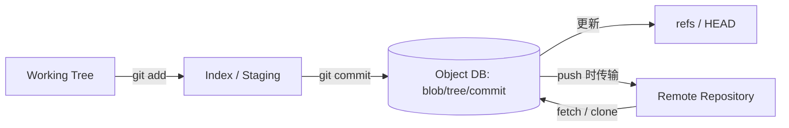

# 架构设计：高方差贡献者群体中可分布式协作的数字工作体——内容完整、可发散收敛的版本历史

> 模式：deliverable  
> 已定关键决策：以内容寻址对象库存快照；历史与内容皆用 DAG；用可变 refs 做轻量分支/标签；本地 commit 与远程 push 解耦；命令面分 plumbing 与 porcelain。  
> 明确不做：中央服务器作为「记入历史」的必经点；以线性修订号为唯一历史真相；把分支做成整树拷贝；要求用户每次本地变更立刻同步公共仓库。  
> 待验证事实：特定超大二进制仓库下 loose vs pack 的磁盘与 clone 成本曲线；libgit2 / 替代后端对「工具箱 + 对象格式」心智的长期影响（以 AOSA Git 章时代心智为金标基线）。

## 层 A — 叙事

### A1 摘要

我们要解决的不是「再做一个必须连中央才能提交的版本库」，而是在**贡献者数量大、参与深度方差高**的协作场景里，维护一份可分布式协作的数字工作体（常为代码）：工作要能暂时发散再收敛，内容损坏要可发现，日常操作要足够快——哲学上是 **反 CVS**：不要把中央服务器当成唯一能写下历史的地方。

成功时，协作者在本地完整对象库里增量 commit、建轻量分支、离线查历史；准备好分享时再 push 到一个或多个公开仓库。相同内容共享同一对象身份，合并能靠祖先 DAG 高效定位。不在范围内的是：把「提交」绑死在中央事务上、用整目录拷贝冒充分支、或假装线性修订号能自然表达多父合并。

### A2 上下文与边界

系统落在开发者工具链：上游是工作区里的文件变更与协作意图；下游是其他协作者的仓库、CI、代码托管与审查流程。信任边界大致是：本地仓库保管对象与 refs；远程仓库是可选的分享节点而非「唯一真相闸门」；传输协议在同步时校验可应用性。外部接口是：本地读写对象库与 refs、暂存区（index）、以及与其他 Git 仓库交换 pack/对象的远程协议。

与「中央 VCS 产品」的边界：对外可以有一个大家约定的公开仓库，但对内契约是**对等仓库网络**——每个完整 clone 都能本地形成历史；公开节点是工作流约定，不是架构上的提交前提。

### A3 主路径

一次关键本地提交与（可选）分享可走通如下：

1. **变更**：在工作区修改文件；可选地用 index 选择性暂存，使一次 commit 只收录意图内的变更集合。  
2. **对象入库**：`commit` 时为变更文件写入（或复用）**blob**；沿目录路径为变更涉及的目录写入新 **tree**（未改文件复用既有 blob/tree 引用）；写入 **commit** 对象，指向根 tree、父 commit(s) 与作者等元数据。对象身份由内容哈希（SHA）决定，一经写入不可变。  
3. **更新 ref**：把当前分支 ref（如 `refs/heads/main`）前移到新 commit；`HEAD` 通常间接指向该分支。至此历史已在**本地**成立——无需网络。  
4. **分享（解耦步骤）**：需要让协作者看见时，再 `push`：计算对方缺失的对象，打包传输；对方在校验可快进/可合并后把相同对象写入其对象库并更新其 ref。`fetch`/`clone` 是对称方向的对象与 ref 同步。

读者应能跟着走完：工作区 →（index）→ 对象入库 → 更新 ref →（可选）push，而无需假设「没有中央服务器就无法 commit」。

### A4 组件与契约

| 组件 | 职责 | 契约要点 |
|------|------|----------|
| Working Tree | 可编辑的检出内容 | 与对象库解耦；未暂存/未提交的变更可丢失或冲突 |
| Index（暂存区） | 下一次 commit 的候选树快照 | `add` 更新 index，不直接改对象库中的 commit 历史 |
| Object Database | 不可变 blob/tree/commit/tag | 相同内容 ⇒ 相同 SHA；损坏可通过重算哈希发现 |
| Refs / HEAD | 可变指针到 commit（或再间接到 ref） | 分支 = 移动指针；不复制整棵树 |
| Remote + Protocol | 仓库间同步对象与 refs | push/fetch 是分享，不是本地提交的前置条件 |
| Plumbing / Porcelain | 底层 DAG 操作 vs 用户工作流命令 | 用户常走 porcelain；脚本与高级工具可直达 plumbing |

禁止越界：用「必须先连远程才能 commit」描述默认模型；把分支说成目录级整库拷贝；用线性全局修订号暗示多父合并的唯一真相。

### A5 状态、失败与恢复

**持久化什么**：对象库中的不可变对象（loose 或 pack）、refs、配置与 hooks；index 是本地暂存状态。远程上的对象/refs 是副本或约定发布面，不是本地历史能否成立的条件。

**挂了怎么办**：对象损坏时，SHA 重算可暴露不一致；完整 clone / 其他远程可再取对象。误操作可用 ref 日志与可达对象找回「仍被引用或尚未 gc」的 commit。合并冲突停在工作区/index，由用户解决后再形成合并 commit（多父）。push 被拒（非快进等）时本地历史仍在，需先整合远程再推。

**用户可见失败态**：冲突、push 拒绝、对象缺失、浅克隆导致祖先不可达、大文件导致仓库膨胀。恢复路径是解决冲突、rebase/merge、从其他远程取回对象、或走 pack/gc 与大文件策略（金标不锁死 LFS 等产品细节）。

### A6 安全与身份

适用：内容完整性是一等设计目标——对象身份与哈希绑定，传输与 pack 格式演进强调可检测损坏。身份与授权更多落在托管面（谁能 push 哪些 ref）与签名标签/提交（可选）上，而不是把 ACL 写进每个 blob。信任边界：本地仓库持有者可读其对象；远程按宿主策略鉴权；**哈希相等即内容相等**支撑分布式去重与短路，但也意味着内容保密不能靠「不知道路径」——敏感内容一旦进对象库就需按密钥与权限模型另管。若不做多租户托管，最小叙述仍须保留「完整性校验 ≠ 访问控制」。

### A7 演进切片

- **现在**：内容寻址对象库 + DAG 历史 + 轻量 refs + 本地/推送解耦 + plumbing/porcelain，作为分布式协作 VCS 的最小可讲清心智。  
- **下一刀**：pack 压缩与传输时即时 pack、更友好的嵌入式库（libgit2 等）、大仓库与大文件策略——仍服从「对象格式与对等仓库」而非改回中央必经提交。  
- **明确不做**：为迁就中央直觉而把本地 commit 做成「未真正提交」；默认线性中央修订叙事；把分支做成整树拷贝以「简化」心智。

### A8 如何验收

1. **刺激**：断网环境下修改文件并 `commit`；**观察**：本地对象库出现新 blob/tree/commit，分支 ref 指向新 commit；历史可本地查阅。  
2. **刺激**：从同一根 commit 建两分支、各自提交后合并；**观察**：产生多父 commit；共同祖先可从父指针 DAG 推断，而非仅靠「更大修订号」。  
3. **刺激**：两次提交中未改动的大文件；**观察**：未改内容复用同一 blob SHA，比较可短路，而非每版强制存一份完整新副本作为逻辑主模型（pack 层 delta 是存储优化，不否定快照对象模型）。  
4. **刺激**：本地已有若干 commit 后再 `push` 到空远程；**观察**：远程获得相同对象与更新后的 ref；此前本地历史不依赖该远程是否曾在线。

## 层 B — 机制与策略

### B1 基本事实

- **已证实（AOSA Git 章）**：高方差贡献者与内核式工作流需要分布式、可离线增量提交，以及何时分享由作者决定。  
- **已证实**：用内容哈希标识不可变对象，可同时服务「相同则共享/短路」与「损坏可检测」。  
- **已证实**：快照式 tree/blob DAG 使「同一路径同一 SHA ⇒ 同内容」；历史用多父 commit DAG 表达合并，优于纯线性修订在分支合并语义上的表达力。  
- **已证实**：refs 与对象分离——对象不可变，指针可变——使分支创建与移动廉价。  
- **已证实**：完整快照在「大文件小改」场景曾不空间友好；后续用 pack（含 delta 压缩）缓解，但不改「逻辑上是快照对象」的主模型。  
- **待验证（部署/生态相关）**：特定巨仓下的 clone 时间与磁盘曲线；嵌入式库普及后对「fork+exec 工具箱」抱怨的缓解程度——金标不锁死数值。

### B2 机制

该类问题几乎绕不开的结构（问题类语言）：

1. **内容寻址存储**：工作体切片以内容哈希为身份；去重与完整性同一机制。  
2. **快照 DAG（blob/tree）**：一次提交是目录树快照，未改子树复用引用。  
3. **历史 DAG（commit 父指针）**：发散与合并是一等公民；祖先查询走图而非全局递增号。  
4. **可变引用（refs）**：分支/标签/HEAD 是指针；轻量分支 = 指针移动。  
5. **本地仓库完备性**：完整 clone 含对象与历史，支撑离线工作。  
6. **提交与发布解耦**：commit 写本地；push/fetch 同步仓库网络。  
7. **分层工具箱**：plumbing 暴露 DAG/对象原语；porcelain 组合为日常工作流。

显式模式名：Content-Addressable Storage、DAG、Command layered architecture (plumbing/porcelain)、Snapshot vs Delta。

### B3 策略选项

| 策略维 | 选项 A（Git 路径） | 选项 B（对照） | 依赖的事实 |
|--------|-------------------|----------------|------------|
| 内容存储 | DAG 快照对象 | Delta changeset 为主模型 | 是否需内容身份短路、合并祖先效率、大文件小改空间 |
| 历史 | 多父 DAG | 线性修订号历史 | 是否原生记录合并、分支是否一等 |
| 分发 | 分布式多仓库 | 中央服务器必经 | 是否要离线提交、多发布面、完整本地历史 |
| 工作流复杂度 | 高灵活（commit ≠ push） | 中央「提交即分享」更简单 | 用户能否负担概念；协作是否需暂存未发布工作 |
| 命令面 | Plumbing + Porcelain | 单一高层 API/库优先 | 脚本能力 vs IDE/长驻进程嵌入成本 |

### B4 取舍

选择 **内容寻址快照 DAG + 历史 DAG + 轻量 refs + 本地/推送解耦 + 工具箱分层**，因为问题类要同时满足：分布式与离线、防内容损坏、高性能比较/合并、以及灵活的发散—收敛工作流。

明确放弃：

- **中央必经才能记入历史**：实现「提交即对所有人可见」更简单，但扼杀离线增量与「何时分享由作者决定」。代价：用户必须理解 commit vs push。  
- **纯线性历史**：心智更简单，但合并谱系与「变更是否已包含」难表达。代价：多分支协作要靠目录惯例等外部约定。  
- **Delta 作为唯一内容主模型**：小改大文件更省空间，但丢失「同 SHA 同内容」的短路与分布式去重直觉；Git 选择快照主模型，再用 pack delta 做存储优化。代价：早期 loose 对象膨胀，需 gc/pack 运维心智。  
- **分支 = 整树拷贝**：对中央线性系统更直观，但创建分支昂贵，且难与 DAG 合并语义对齐。

负面后果需写进沟通：灵活换心智成本（新手易在 push/ rebase / detached HEAD 迷路）；工具箱 + `die()` 式进程模型曾不利于嵌入 IDE；大文件小改依赖后续压缩路径，不能假装「快照永远最省盘」。

### B5 与对照的关系

- **金标本体系（AOSA Git）**：用「存内容 / 追历史 / 分发」三问组织策略空间，再落到 Git 的 DAG 与 refs——可复用到其他工具链问题类。反 CVS 动机与 Torvalds 三目标（分布式、完整性、性能）应在叙事中可见，而不是只罗列命令。  
- **对照中央线性 VCS（如 SVN 心智）**：提交经中央、历史线性、分支常为目录约定。教训：若问题类需要离线、多发布面与一等合并，不要用对方的「修订号 + 中央事务」叙事硬套到本金标的对象库心智；反之，若团队只要简单中央工作流，Git 的概念负担是真实代价而非美德。  
- 本金标校准用途：构建期对照候选 deliverable 的机制/策略命中，不作为运行时用户考题。
