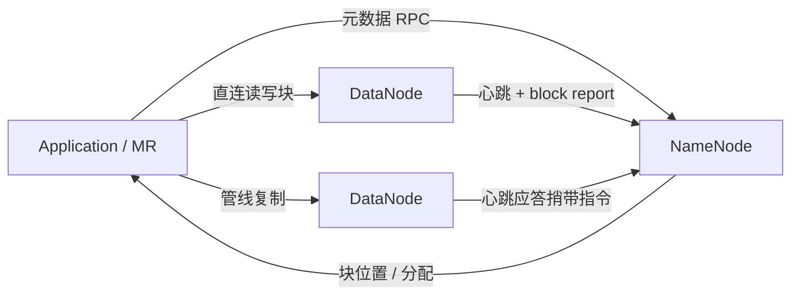

# 架构设计：商品机集群上的可靠超大存储——元数据与数据分离、大块多副本的流式分布式文件系统

> 模式：deliverable  
> 已定关键决策：NameNode 保管命名空间与块映射，DataNode 保管块副本；文件切大块并以跨节点多副本（而非 DN 侧 RAID）换耐久与读带宽；客户端直连 DataNode 传数据；命名空间用 WAL journal + checkpoint 持久化；指令经心跳应答捎带；对外暴露块位置以支持计算靠近数据。  
> 明确不做：经 NameNode 中转块字节；以 DataNode 本地 RAID 作为主耐久叙事；完整 POSIX 忠诚优先于批处理吞吐；把块位置当作 NameNode 持久 checkpoint 的一部分；默认假设单 NameNode 无 SPOF / 元数据无限扩展。  
> 待验证事实：具体集群规模下 NameNode 堆与文件/块数上限的运维曲线；后续 HA/Federation 部署对「单 NN 心智」的迁移成本（以 AOSA 时代架构为金标基线，不锁死运维数值）。

## 层 A — 叙事

### A1 摘要

我们要解决的不是「再做一个完整 POSIX 网络盘」，而是在**数千台商品服务器**上可靠存放超大数据集，并以高带宽**流式**供给计算框架（如 MapReduce），让计算任务尽量跑在数据附近。规模锚定可用公开经验中的数量级：万级节点、数十 PB 在线数据——架构必须按「节点天天坏」来设计，而不是按机房偶发故障来设计。

成功时，命名空间与块位置在 NameNode 侧可查询；文件内容以大块形式落在多台 DataNode 上并保持目标副本数；客户端拿到位置后直连 DataNode 读写；节点丢失后系统能并行再复制，读带宽与数据局部性机会随副本增加。失败或慢节点不会逼着元数据服务器去搬运所有字节。不在范围内的是：用 NameNode 当数据中转站、用本地 RAID 替代跨节点副本作为主耐久故事、或假装全 POSIX 语义与批处理高吞吐可以零代价兼得。

### A2 上下文与边界

系统落在大数据平台的存储层：上游是分析作业、ETL 与需要顺序大吞吐的应用；下游是带本地盘的商品机池与（可选）机架网络拓扑。信任边界大致是：谁能改命名空间由 NameNode 鉴权/权限模型决定；谁能存块是集群内注册的 DataNode；客户端库对用户隐藏「元数据服务器 ≠ 数据服务器」的拆分。外部接口是：类文件系统的路径操作（创建/读写/删除、目录）、块位置与副本因子等扩展 API、以及运维侧的 checkpoint / 退役 / 均衡工具。

与「传统 NAS / 本地 POSIX 文件系统」的边界：对外路径像文件系统，但对内契约是**元数据面与数据面分离的块存储**——耐久靠跨节点复制，吞吐靠大块顺序与计算局部性，而不是靠单机 RAID 阵列叙事。

### A3 主路径

一次关键写入与读取可走通如下：

1. **打开/创建**：客户端向 **NameNode** 请求创建或打开文件；写者获得租约（单写者多读者模型）。NameNode 在命名空间中记录 inode，并把变更写入 **journal**（写前日志），按设计在应答前 flush-and-sync（可批处理多事务）。  
2. **分配块**：需要新块时，NameNode 分配 block ID，并按放置策略选出承载副本的 DataNode 列表；客户端按拓扑距离组织 **pipeline**，把数据包推入管线，各副本依次落盘并回 ACK。  
3. **读路径**：客户端向 NameNode 询问块→副本位置（列表按相对读者的网络距离排序），然后**直连**最近可用 DataNode 拉取块内容；校验和不匹配则报告坏副本并换其他副本。  
4. **存活与修复**：DataNode 定期 **heartbeat** 与 **block report**；长时间无心跳则副本视为不可用，NameNode 在心跳应答中捎带再复制/删除等指令——NN 不主动对 DN 推送复杂控制面 RPC。关闭文件后读者对新数据的可见性有明确边界；需要中间可见时可显式 hflush。

读者应能跟着走完：路径 → NameNode 元数据 → 直连 DataNode 块 IO → 副本管线 / 校验换副本，而无需假设「所有字节过 NameNode」。

### A4 组件与契约

| 组件 | 职责 | 契约要点 |
|------|------|----------|
| NameNode | 命名空间、块→DN 映射、租约、放置与再复制调度 | 元数据面；当时设计通常单实例；映像宜常驻内存；块位置主要靠 DN 汇报重建 |
| Journal / Checkpoint | 命名空间变更的 WAL 与检查点 | 变更先入 journal；checkpoint 合并后可截断 journal；块位置不进持久 checkpoint |
| DataNode | 本地文件系统上存块数据与校验元数据 | 数据面；握手/注册后汇报块；执行心跳捎带的复制/删除等指令 |
| HDFS Client | 对应用导出文件系统接口；编排 NN 查询与 DN 传输 | 隐藏拆分；写管线、读就近、校验；可查询块位置供调度器使用 |
| CheckpointNode / BackupNode | 辅助元数据耐久与只读待命 | Checkpoint 周期合并；Backup 可同步内存命名空间映像（只读 NN 心智） |

禁止越界：把 NN 写成数据面；把「副本位置」说成已永久写入 checkpoint 而无需 block report；把 DN 本地 RAID 说成取代跨节点复制的默认耐久方案。

### A5 状态、失败与恢复

**持久化什么**：命名空间映像的 checkpoint + journal；每个块副本在 DataNode 本地的数据文件与校验元数据；集群 namespace ID / storage ID 等身份。块→节点的**当前映射**主要是运行态：重启后靠 DataNode 的 block report 重建，而不是从 checkpoint 「读出全部位置」。

**挂了怎么办**：DataNode 失联 → 副本标记不可用 → 优先队列再复制到其他节点（并行，随集群规模加速）。坏校验副本先保留、优先复制好副本，达到目标副本数后再删坏副本。NameNode 所在机故障是当时架构的中心风险：依赖 journal/checkpoint 冗余卷与 NFS 等副本、Checkpoint/Backup 角色、以及运维重启回放；journal 过长会拉长重启。机架/核心交换机故障可导致切片不可用，修复网络后副本恢复可见。断电重启后统计上可能丢掉少量块——耐久叙事必须包含相关失败，而非「三副本绝对永不丢」。

**用户可见失败态**：写租约冲突或超时关闭、读到坏校验后换副本延迟、副本不足（under-replicated）、NameNode 不可用导致元数据面停摆、保留/配额耗尽。恢复路径是重试其他副本、等待再复制、从最近 checkpoint+journal 恢复 NN、或按运维规程回滚升级快照。

### A6 安全与身份

适用：多租户共享集群时需要权限模型（类 Unix 的 owner/group/other）与更强身份（从「主机说你是谁」演进到凭证/Kerberos 等）。架构后果是：NameNode 成为身份与配额（空间、命名空间条目）的强制点；DataNode 亦可被要求出示凭证。安全不是贴纸——弱身份下「谁都能冒充写者」会直接破坏租约与权限边界。金标本体系以 AOSA 叙述的权限与凭证演进为边界，不锁死某一发行版的安全插件细节。

### A7 演进切片

- **现在（AOSA 心智）**：单 NameNode + 多 DataNode、大块多副本、journal/checkpoint、心跳捎带、管线写、机架感知放置、块位置 API。  
- **下一刀**：CheckpointNode/BackupNode 纪律、Balancer/退役、权限与配额、以及公开讨论中的 **Federation**（多独立命名空间共享存储）与后续生态中的 HA——仍服从「元数据/数据分离 + 副本」而非退回经 NN 搬数据。  
- **明确不做**：为迁就 POSIX 直觉而放弃流式大吞吐假设；用 RAID 替代副本作为主故事；把元数据扩展问题假装已在「单 NN 全内存」设计里消失。

### A8 如何验收

1. **刺激**：写入远大于块大小的文件并关闭；**观察**：NameNode 可见路径与块映射；多个 DataNode 上出现该文件块的副本；客户端读时直连 DN 且校验通过。  
2. **刺激**：杀掉承载某一副本的 DataNode（在仍有其他副本时）；**观察**：读可换副本继续；NN 将块标为欠副本并调度再复制，而不是要求应用改去「修 RAID」。  
3. **刺激**：仅重启 NameNode（journal/checkpoint 完好，DN 仍在）；**观察**：回放后命名空间恢复；块位置在收到 block report 后重新完备——证明位置不依赖「写进 checkpoint」。  
4. **刺激**：MapReduce（或等价调度）查询块位置并在本地/同机架优先调度；**观察**：架构提供局部性 API，而不是迫使所有字节先汇聚到元数据节点。

## 层 B — 机制与策略

### B1 基本事实

- **已证实（AOSA）**：在商品机集群上，把文件系统元数据与应用数据分开放到 NameNode / DataNode，并用 TCP 互联，是支撑超大数据集与高带宽流式访问的核心拆分。  
- **已证实**：与 Lustre/PVFS 等依赖存储端 RAID 的路径不同，HDFS 像 GFS 一样用**跨 DataNode 多副本**同时换耐久、读带宽与更多「计算靠近数据」机会。  
- **已证实**：大块（典型约 128MB 量级、可按文件配置）降低元数据压力并匹配顺序吞吐；客户端写时组 pipeline，读时按拓扑距离优选副本。  
- **已证实**：命名空间映像常驻内存；持久化靠 checkpoint + write-ahead journal；块副本位置不在持久 checkpoint 中，而由 block report / 心跳维护。  
- **已证实**：NameNode 通过心跳应答下发复制/删除等指令，而不是主动对 DN 推复杂请求；可支撑高频心跳。  
- **待验证（部署相关）**：特定版本下 NN 堆与文件数的精确容量规划；HA/Federation 落地后的运维 RTO——金标不锁死数值。

### B2 机制

该类问题几乎绕不开的结构（问题类语言）：

1. **元数据 / 数据平面分离**：命名空间与块映射集中；块字节分散在存储节点。  
2. **大块 + 独立复制**：文件是块序列；每块有自己的副本集合与副本因子。  
3. **客户端直连数据节点**：元数据 RPC 与数据传输解耦，避免元数据服务器成为字节瓶颈。  
4. **WAL journal + checkpoint**：命名空间变更可恢复；定期合并控制 journal 体积与重启时间。  
5. **心跳 + block report + 捎带指令**：存活检测、位置视图与控制指令共用轻量通道。  
6. **管线写与校验读**：顺序高吞吐写入；损坏可发现并切换副本。  
7. **数据局部性 API**：把块位置暴露给计算调度，使「计算靠近数据」可执行。

显式模式名：Master-Slave / Primary-Secondary（NN/DN）、Replication for durability & read bandwidth、Write-Ahead Log、Pipeline write、Rack-aware placement。

### B3 策略选项

| 策略维 | 选项 A | 选项 B | 依赖的事实 |
|--------|--------|--------|------------|
| 耐久 | 跨节点多副本 | 存储节点 RAID | 商品机故障率；是否要乘读带宽与局部性 |
| 元数据拓扑 | 单 NameNode（当时） | HA / Federation 多命名空间 | 一致性简化 vs SPOF / 堆扩展上限 |
| 元数据辅助 | CheckpointNode 周期合并 | BackupNode 同步内存映像 | 重启时间、只读待命、journal 是否外置 |
| Journal 提交 | 批处理 flush-and-sync | 逐事务同步 | 多客户端并发下的 journal 瓶颈 |
| 语义忠诚 | 牺牲部分 POSIX 换吞吐 | 完整 POSIX | 主要负载是否为大批量顺序读写 |
| 副本放置 | 机架感知（如默认三副本跨机架） | 平坦随机 | 机架故障域与写路径跨机架成本 |

### B4 取舍

选择 **NN/DN 分离 + 大块多副本 + 客户端直连 DN + journal/checkpoint + 心跳捎带 + 管线写 / 局部性 API**，因为问题类要同时满足：商品机上的耐久、流式高带宽、计算靠近数据，以及元数据面可恢复。

明确放弃：

- **经 NameNode 搬块字节**：实现「像单机文件服务器」更直观，但 NN 会立刻成为吞吐与可用性瓶颈。代价：客户端与 DN 协议更复杂。  
- **DN 侧 RAID 作主耐久**：与部分并行文件系统同类，但丢掉副本带来的聚合读带宽与调度局部性，且与「节点整机常挂」的运维现实不匹配。代价：用户需理解「三副本不是浪费」。  
- **完整 POSIX 优先**：随机小写、强语义会与大块流式、单写者模型冲突。代价：应用要适应「追加/批处理友好、不是通用 NAS」。  
- **块位置写入持久 checkpoint**：看似重启更快，实则副本位置高频变化，持久化成本高且易陈旧；选择运行态汇报。代价：NN 冷启动后有一段时间依赖 DN 汇报齐套。  
- **假装单 NN 无代价**：单 NN 简化一致性，但堆内存限制文件/块规模，且为元数据 SPOF。后续 Federation/HA 是演进，不是金标否认该权衡。

负面后果需写进沟通：journal 过长 → 重启慢（需 checkpoint 纪律）；升级需快照/回滚叙事；相关故障（机架断电）仍可能丢块；Java NN 的 GC/对象开销是扩展摩擦——简单架构换来的是可运维的明确上限。

### B5 与对照的关系

- **金标本体系（AOSA HDFS）**：开篇用 Yahoo! 规模数字锚定问题类；明确「不像传统文件系统」的牺牲；对照 GFS 的副本策略与对照 Lustre/PVFS 的 RAID 路径——先讲约束与机制，再挂组件名。  
- **对照后续生态（短记）**：HA NameNode、Federation、EC（纠删码）等改变的是元数据可用性与空间效率策略，不取消「元数据/数据分离 + 客户端直连数据面」的问题类骨架。教训：校准时不要用今天发行版功能清单覆盖 AOSA 时代权衡；也不要把 GFS/HDFS 副本叙事套回「必须本地 RAID」。  
- 本金标校准用途：构建期对照候选 deliverable 的机制/策略命中，不作为运行时用户考题。
