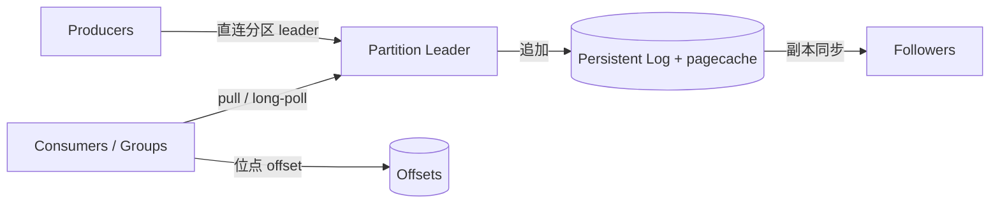

# 架构设计：公司级统一实时数据源——高吞吐、可积压、分区并行的分布式追加日志

> 模式：deliverable  
> 已定关键决策：以持久化分区日志为统一抽象；生产者写分区 leader；消费者 pull + 组内竞争消费；位点为客户端可 rewind 的 offset；存储路径拥抱 OS pagecache 与顺序写。  
> 明确不做：broker push 投递模型；消费即从日志删除；以堆内大缓存替代 pagecache 作为主吞吐路径；要求全 topic 全局总序。  
> 待验证事实：具体集群规模下的 SSL 对 sendfile/零拷贝路径的吞吐折损量级；分层存储演进对「日志共置」运维心智的影响（以官方 Design 时代心智为金标基线）。

## 层 A — 叙事

### A1 摘要

我们要解决的不是「再做一个传统消息队列」，而是把公司里的页面行为、业务事件、审计与派生流，收敛成**同一类实时数据源**：写入要扛高吞吐，离线与周期负载要能留下大 backlog，在线场景仍要低延迟，处理侧要能按分区并行，机器故障时不丢主路径上的持久数据。

成功时，上游把记录追加进主题分区日志，下游按自己的速率拉取并推进位点；同一数据可被多个独立消费组重放。失败或慢消费者不会逼着 broker 按对方节奏 push，也不会因为「已读」就抹掉日志。不在范围内的是：用 broker 替每个消费者维护逐条 ack 状态机、保证跨分区的全局总序、或把系统建成堆内缓存优先的消息中转站。

### A2 上下文与边界

系统落在数据平台与流式集成层：上游是业务服务与采集管道（producers），下游是流处理、批补数、搜索索引、监控与多租户应用（consumers）。信任边界大致是：客户端认证与授权决定谁能写/读哪些 topic；broker 集群保管分区日志与副本；消费组协调决定分区所有权。外部接口是：生产 API（按键路由到分区）、消费 API（按分区 pull、提交/重置 offset）、运维与配额边界（保留时长、磁盘、副本因子）。

与「队列产品」的边界：对外可以像队列一样用，但对内契约是**分布式 commit log**——保留、重放、多订阅者是一等公民，不是插件。

### A3 主路径

一次关键投递与消费可走通如下：

1. **生产**：应用按业务键（或显式分区）选择 topic 分区，客户端直连该分区的 **leader broker**，将记录（通常经批处理）追加写入分区日志。  
2. **持久化**：leader 把记录顺序追加到磁盘支持的日志段；热数据驻留在 OS **pagecache**；按配置同步到 follower 副本以满足容错水位。  
3. **消费**：同属一个 **consumer group** 的消费者被分配互不重叠的分区集合；每个消费者对负责的分区 **pull**（可长轮询等待新数据），用整数 **offset** 标记下一条要读的位置。  
4. **推进与重放**：消费成功后提交 offset；需要纠错或重建下游时，把位点 rewind 到更早 offset，从仍保留的日志段重新拉取——日志不因「已消费」而删除。

读者应能跟着走完：键 → leader → 追加日志 → pull → offset，而无需假设 broker 主动把消息推到客户端进程。

### A4 组件与契约

| 组件 | 职责 | 契约要点 |
|------|------|----------|
| Producer | 序列化、分区、批处理、发往 leader | 不得假定「写入即全集群立刻可见」；语义分区键带来同键有序 |
| Partition / Log | 有序追加、段文件、保留策略 | 分区内有序；跨分区无全局总序承诺 |
| Leader / Followers | 写入入口与副本 | 客户端写 leader；副本策略决定 ack 与容错 |
| Consumer | pull、反序列化、处理 | 速率由自身决定；位点可本地/集中保管但语义是 offset |
| Consumer Group | 分区所有权协调 | 组内同一分区至多一个活跃成员；组间彼此独立可重复消费 |

禁止越界：用「消费确认」暗示物理删除；用 push 语义描述默认投递；把堆缓存当成主存路径而绕过顺序日志。

### A5 状态、失败与恢复

**持久化什么**：分区日志中的记录（在保留策略内）、副本状态、消费位点（offset）。位点与日志解耦——消费推进不等于抹日志。

**挂了怎么办**：leader 失败时，满足同步副本条件的 follower 可接任；生产者与消费者重连新 leader。消费者失败时，组内 rebalance 把分区转给其他成员；未提交位点可导致至少一次重投，应用需可重入或幂等。磁盘与 pagecache 路径上，顺序写降低寻道放大；大 backlog 时靠保留与磁盘容量，而非「赶消费者立刻清干净」。

**用户可见失败态**：生产超时/不可用分区、消费滞后（lag）、rebalance 暂停拉取、保留到期导致无法 rewind 到过旧位点。恢复路径是重试、扩容分区或消费者、调整保留与副本、或从仍存在的最早 offset 重建。

### A6 安全与身份

适用：多租户与公司级平台默认需要认证（谁连集群）、授权（读写哪些 topic/组）、以及传输保护。Design 视角下的架构后果是：启用 SSL 等加密路径时，**sendfile/零拷贝**优化可能受限，吞吐策略要从「内核零拷贝」退到用户态拷贝预算——安全不是贴标签，而是改变主路径成本。身份边界在客户端↔broker；broker 不把业务身份逻辑塞进日志格式本身。

### A7 演进切片

- **现在**：分区日志 + pull + consumer group + pagecache/顺序写/批处理，作为统一实时数据源的最小可讲清心智。  
- **下一刀**：副本与 ack 水位的运维策略、保留与多租户配额、（后续）分层存储等演进——仍服从「日志是源」而非改回 ack 队列。  
- **明确不做**：为迁就传统队列直觉而改成消费即删；默认 push；用堆内大缓存「加速」却引入 GC 与双缓存一致性税。

### A8 如何验收

1. **刺激**：向带键的 topic 持续写入；**观察**：同键记录在同一分区内有序追加，不同消费者组可各自从头（或指定 offset）拉取同一段日志。  
2. **刺激**：人为降低某一消费者处理速率；**观察**：broker 不因该消费者变慢而改写其他消费者的可用数据；lag 上升但日志仍按保留策略存在。  
3. **刺激**：将某组位点 rewind 到较早 offset 并重新 pull；**观察**：仍在保留期内的记录可被再次消费，且无需「消息曾被删除后再注入」。  
4. **刺激**：杀掉某分区 leader（在副本满足条件下）；**观察**：新 leader 选出后生产/消费主路径恢复，已持久化且达 ack 要求的数据不因单机宕机而从主路径叙事中消失。

## 层 B — 机制与策略

### B1 基本事实

- **已证实（公开 Design）**：高吞吐场景下，顺序磁盘写与 OS pagecache 可支撑远超「惧盘、主堆缓存」直觉的吞吐；Kafka 将持久化日志视为核心而非附属。  
- **已证实**：消费即删会迫使 broker 跟踪每消费者状态并放大随机 IO；长时间保留 + offset 位点把「进度」从「消息是否还在」中拆出。  
- **已证实**：异构消费者速率下，pull（含长轮询）比 broker push 更容易匹配双方；位点用分区上的单调 offset 即可。  
- **已证实**：分区是并行单位；键哈希提供语义局部性与分区内有序。  
- **待验证（部署相关）**：特定版本/配置下 SSL 对零拷贝路径的精确吞吐曲线；具体保留与磁盘水位策略的容量规划数字——金标不锁死运维数值。

### B2 机制

该类问题几乎绕不开的结构（问题类语言）：

1. **持久化追加日志**：事件的真相来源是可重放的有序日志，不是瞬态缓冲。  
2. **顺序写与 pagecache 友好布局**：用文件系统与内核缓存，而不是在堆内再做一套大缓存。  
3. **分区**：把总流量切成可并行、可副本、分区内有序的分片。  
4. **生产直连分区主副本**：写入路径短；路由由键/分区器决定。  
5. **拉取式消费 + 长轮询**：消费速率自治；空闲时可阻塞等待。  
6. **消费组与位点**：组内竞争分区所有权；进度是可 rewind 的整数 offset。  
7. **批处理与通用二进制格式**：摊销系统调用与序列化；在许可时走 sendfile/零拷贝。

显式模式名：Write-Ahead / Commit Log、Partitioned Log、Consumer Group（组内 Competing Consumers）、Batching、Zero-Copy。

### B3 策略选项

| 策略维 | 选项 A | 选项 B | 依赖的事实 |
|--------|--------|--------|------------|
| 存储 | pagecache 中心日志 | 堆内大缓存 | 顺序写与内核缓存效率 vs GC/双缓存 |
| 消费模型 | pull（+ 长轮询） | broker push | 异构消费速率；谁背背压 |
| 消费位点 | 客户端侧 offset | broker 逐条 ack 状态机 | 是否要重放/多订阅；元数据放大 |
| 分区键 | 键哈希语义局部性 | 纯随机 | 是否需要同实体有序与局部性 |
| 压缩 | 批次端到端压缩 | 逐条压缩 | 批大小与 CPU/带宽比 |

### B4 取舍

选择 **pagecache 日志 + pull + 客户端 offset + 语义分区 + 批压缩**，因为问题类要同时满足：高吞吐写入、大积压、多独立下游、可重放与故障后仍有持久真相源。

明确放弃：

- **Push**：难匹配快慢消费者，broker 易成调度中心。代价：客户端要自己管拉取与空闲等待（长轮询补齐延迟）。  
- **消费即删 / broker 逐条 ack**：破坏重放与多组独立进度。代价：用户直觉上「不像队列」，要教育「日志 + 位点」。  
- **堆内大缓存**：看似低延迟，实则 GC 与双缓存一致性税，且与「惧盘」迷思绑定。代价：冷读与重启后更依赖磁盘路径设计。  
- **纯随机分区**：实现简单但丢掉同键有序与局部性。  
- **全 topic 全局总序**：与分区并行冲突；需要时应另建单分区或下游排序，而不是暗含在默认契约里。

负面后果需写进沟通：像队列又允许 rewind，会打破「消费即消失」；SSL 可能关掉最快零拷贝路径；多租户必须靠效率与配额，否则基础设施先于应用垮掉。

### B5 与对照的关系

- **金标本体系（Apache Kafka Design）**：开篇用多用例动机导出「统一实时数据源」；「Don’t fear the filesystem」式破除迷思是优秀架构叙述——先讲事实与机制，再挂产品名。  
- **对照 Pulsar（短记）**：二者共享持久日志、分片并行、多消费者与批处理；分叉在存储与服务是否分离、运维组件数量、云入口形态。教训：选前先对齐问题类——都不是传统「队列 ack 状态机」；不要用对方的组件拓扑叙事硬套到本金标的日志共置心智。  
- 本金标校准用途：构建期对照候选 deliverable 的机制/策略命中，不作为运行时用户考题。
