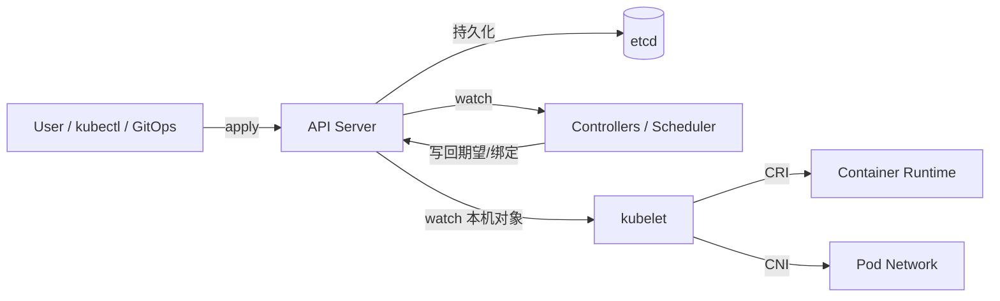

# 架构设计：在集群上运行容器化工作负载——声明期望状态并由控制面持续调和

> 模式：deliverable  
> 已定关键决策：控制面与节点分离；声明式 API + controller reconcile；etcd 为集群状态真相源；API Server 为唯一正规前门；节点侧运行时/网络可插拔（CRI/CNI）。  
> 明确不做：以 SSH/直连节点改容器作为集群真相；kubelet 或扩展组件绕过 API Server 写 etcd；把运行时与网络绑死为不可替换内核；生产默认单点控制面且无容错叙述。  
> 待验证事实：特定规模下 etcd 容量与备份 RPO/RTO 曲线；某 CNI 替代 kube-proxy 后的转发路径延迟分布（以官方 Cluster Architecture 心智为金标基线，不锁死运维数值）。

## 层 A — 叙事

### A1 摘要

我们要解决的不是「在几台机器上手工起容器」，而是在**集群**上持续运行容器化工作负载：用户声明期望状态（多少副本、什么镜像、何种网络与存储意图），由控制面**持续调和（reconcile）**到实际状态——机器故障、滚动升级、扩缩容都应落在同一套心智里。

成功时，一次 `kubectl apply`（或等价 API 写入）把对象写入集群真相源；控制器与节点代理各自观察差异并行动，直到实际逼近期望。失败节点上的 Pod 会被重新调度；扩展通过 API（含 CRD/聚合）接入，而不是私开后门改存储。不在范围内的是：把集群当成「SSH 清单」、让节点组件绕过 API 改 etcd、或假装没有一致存储也能可靠编排。

### A2 上下文与边界

系统落在容器编排与平台层：上游是开发者/CI/GitOps 与运维策略；下游是节点上的容器运行时、网络、存储与云厂商 API。信任边界大致是：认证授权发生在 API Server；etcd 只应被控制面正规路径访问；节点 kubelet 按分配到本机的对象执行，不充当全集群写入口。外部接口是：Kubernetes API（资源对象 CRUD/watch）、节点侧 CRI/CNI 插件契约、以及可选的云控制器对接。

与「单机 Docker / 脚本起容器」的边界：对外可以像「跑容器」一样用，但对内契约是**声明式集群状态机**——真相在 etcd（经 API），执行在节点，调和由控制循环完成。

### A3 主路径

一次关键部署可走通如下：

1. **声明**：用户（或控制器）经 `kubectl apply` / 客户端调用 **API Server**，提交或更新资源对象（如 Deployment、Pod 模板意图）。  
2. **持久化**：API Server 完成认证、鉴权、准入与校验后，将对象写入 **etcd**（集群状态真相源）；随后向 watch 方通知变更。  
3. **调和**：相关 **controller**（如 Deployment/ReplicaSet 控制器）与 **scheduler** watch 到期望与实际的差距：创建/更新子对象、绑定 Pod 到节点等，再经 API Server 写回。  
4. **节点执行**：目标节点上的 **kubelet** watch 到分配给本机的 Pod，经 **CRI** 拉起容器、经 **CNI** 配置网络；状态再经 API 回报。整条路径是：**kubectl apply → API Server → etcd → controller watch → 节点执行**。

读者应能跟着走完上述链路，而无需假设「改 etcd 文件」或「SSH 进节点改容器」是正规主路径。

### A4 组件与契约

| 组件 | 职责 | 契约要点 |
|------|------|----------|
| API Server | 无状态前门：鉴权、校验、版本化 API、watch | 唯一正规读写集群状态的入口；本身不是持久真相源 |
| etcd | 强一致键值存储 | 对象与配置的持久真相；不得被节点/随意扩展直写 |
| Controllers | reconcile 循环：watch → diff → act | 经 API 读写；可水平扩展为多实例（需选主/分片约定） |
| Scheduler | 将待调度 Pod 绑定到节点 | 可替换；决策结果仍写回 API |
| kubelet | 节点代理：按本机 Pod 规格驱动运行时 | 只执行分配到本节点的工作；经 API 汇报，不直写 etcd |
| kube-proxy / CNI 转发 | Service 等流量规则 | 可裁剪：CNI 可自带转发替代经典 kube-proxy 路径 |
| CRI / CNI 插件 | 容器运行时与 Pod 网络实现 | 可插拔；控制面不绑死某一实现 |

禁止越界：扩展「为方便」绕过 API Server 写 etcd；把节点本地容器状态当成集群级真相而不经 API 回报；用命令式一次性脚本替代持续 reconcile 作为默认心智。

### A5 状态、失败与恢复

**持久化什么**：API 对象与集群配置在 etcd；节点本地有运行时状态与缓存，但**集群级真相**以经 API 可见的对象为准。证书、密钥等敏感对象亦经 API/ Secret 机制管理（具体加密at-rest 策略为部署选项）。

**挂了怎么办**：生产控制面需可容错（多副本 API Server、etcd 集群等）——单机控制面只适合实验。etcd 损坏或丢失是架构级事故：备份与容量规划是一等风险。节点故障时，控制器把工作负载迁到健康节点；kubelet 重启后按仍绑定本机的对象重新调和。控制器进程崩溃后重启应继续 reconcile，而非要求人工「接着点下一步」。

**用户可见失败态**：API 不可用、调度失败（Pending）、镜像拉取失败、探针失败导致重启、网络策略拒绝、配额不足、etcd 延迟导致 API 变慢。恢复路径是修复控制面/etcd、调整资源与亲和、换节点、或回滚对象版本——仍走声明式更新，而不是绕过 API 手改存储。

### A6 安全与身份

适用：多租户与生产集群默认需要认证（谁连 API）、授权（RBAC 等决定能对哪些资源做什么）、准入控制（策略与变更校验）、以及传输保护。信任边界在客户端↔API Server；**API 是唯一前门**意味着扩展与自动化也必须持有身份与权限，而不能「在节点上有 root 就等于有全集群写权」。etcd 访问应限制在控制面；把 etcd 暴露给工作负载网络是严重越界。身份模型服务「谁能改期望状态」，而不是把 ACL 塞进每个容器镜像。

### A7 演进切片

- **现在**：控制面/节点分离 + 声明式 API + reconcile + etcd 真相源 + API Server 前门 + CRI/CNI 可插拔，作为集群编排的最小可讲清心智。  
- **下一刀**：控制面部署变体（Static Pod / Self-hosted / Managed）、cloud-controller-manager 拆分、CNI 自带转发裁剪 kube-proxy、CRD/聚合 API 扩展——仍服从「经 API 声明与调和」而非改回节点直改真相。  
- **明确不做**：为迁就「快」而开放 etcd 直写扩展路径；默认生产单点控制面；把运行时/网络做成不可替换内核。

### A8 如何验收

1. **刺激**：`kubectl apply` 一个多副本 Deployment；**观察**：对象出现在 API；etcd 侧有持久记录（经正规工具可见）；控制器创建 Pod，scheduler 绑定节点，kubelet 经 CRI 拉起容器。  
2. **刺激**：杀掉一个运行中 Pod 所在节点（或驱逐）；**观察**：控制面将缺失副本在其他节点重建，而无需人工 SSH 起容器。  
3. **刺激**：仅修改声明（镜像或副本数）并再次 apply；**观察**：reconcile 收敛到新期望；主路径仍经 API，而非运维直接改节点本地状态作为「已发布」。  
4. **刺激**：尝试设想「扩展组件直连 etcd 写入」；**观察**：与金标契约冲突——正规扩展应经 API Server（含 CRD）；绕过 API 不得被叙述为推荐路径。

## 层 B — 机制与策略

### B1 基本事实

- **已证实（官方 Architecture）**：集群编排需要把「期望」与「实际」分开，并用控制循环持续缩小差距，否则故障与变更无法统一处理。  
- **已证实**：强一致共享状态存储（etcd）支撑多控制面组件并发读写与 watch；API Server 水平扩展时保持无状态前门角色。  
- **已证实**：控制面决策与节点执行分离，使调度/控制器可独立于具体运行时演进。  
- **已证实**：CRI/CNI 等插件边界让运行时与网络可替换，而不改控制面主契约。  
- **已证实**：逻辑上多个控制器、物理上常打包进少数进程（如 kube-controller-manager）——简化部署，但耦合进程生命周期。  
- **待验证（部署相关）**：具体 etcd 规模与备份策略数字；某托管产品的责任边界细节——金标不锁死厂商数值。

### B2 机制

该类问题几乎绕不开的结构（问题类语言）：

1. **控制面 / 数据面（节点）分离**：编排与执行分家；节点提供计算、网络、存储执行面。  
2. **声明式 API**：用户提交期望对象；系统负责逼近，而非逐步远程过程调用驱动每台机器。  
3. **Controller reconcile（控制循环）**：watch → 比较期望与实际 → 行动；持续而非一次性。  
4. **集中式一致状态存储**：etcd 等作为真相源；支撑并发与故障恢复。  
5. **无状态 API 前门（Gateway）**：鉴权、校验、版本化、watch 扇出；水平扩展的入口。  
6. **可插拔运行时 / 网络 / 调度**：CRI、CNI、自定义调度器、CRD/聚合 API——扩展走契约，不挖地道。  
7. **分层**：API → 控制器 → 节点代理；addons（Sidecar/DaemonSet 类）挂在同一模型上。

显式模式名：Control Loop / Reconciliation、Gateway（API Server）、Layered（API → 控制器 → 节点代理）、Sidecar/DaemonSet 类插件（addons）。

### B3 策略选项

| 策略维 | 选项 A | 选项 B | 依赖的事实 |
|--------|--------|--------|------------|
| 控制面部署 | 传统多机自建 / Static Pod / Self-hosted | Managed 控制面 | 运维复杂度、升级责任、故障域归属 |
| 节点转发 | kube-proxy（iptables/ipvs 等） | CNI 自带转发、裁剪 kube-proxy | 网络插件能力；节点组件可否简化 |
| 云相关控制 | cloud-controller-manager 拆分 | 与通用控制器混部 | 云 API 依赖、发布节奏、权限最小化 |
| 布局 | 小集群控制面与负载混部 | 生产专用控制面节点 | 规模、干扰、安全边界 |
| 扩展面 | CRD + 控制器经 API | 直写 etcd / 旁路节点脚本 | 是否保持「API 唯一前门」与多租户安全 |

### B4 取舍

选择 **控制面/节点分离 + 声明式 API + reconcile + etcd 真相源 + API Server 前门 + CRI/CNI 可插拔**，因为问题类要同时满足：持续期望状态、故障后自愈、控制面可容错扩展、以及节点技术可演进而不推翻编排契约。

明确放弃：

- **命令式「SSH/脚本即真相」**：短期直观，但无法统一故障、扩缩与审计。代价：用户要接受「对象是源、节点是投影」。  
- **绕过 API 写 etcd 的扩展**：看似少一跳，实则击穿鉴权、版本与准入，毁掉多控制器共存前提。代价：扩展必须学 API/CRD。  
- **绑死单一运行时/网络**：集成简单，但无法跟随生态与性能需求。代价：要维护插件契约与兼容矩阵。  
- **生产默认单点控制面**：部署最省，但不满足容错硬约束。代价：多机 etcd/API 与运维复杂度。

负面后果需写进沟通：强依赖 etcd → 备份与容量是架构级风险；多控制器逻辑塞进单一二进制 → 部署简单但进程生命周期耦合；声明式心智对「立即命令一台机器」的用户有教育成本。

### B5 与对照的关系

- **金标本体系（Kubernetes Cluster Architecture）**：先讲角色分工与真相源，再列组件；「Architecture variations」式策略目录（控制面怎么部署、代理怎么裁剪）是优秀范例——机制稳定，策略随规模与责任边界分叉。  
- **对照单机容器工具（如仅 Docker Engine 心智）**：本地起停容器足够，但缺少集群级声明、跨机调和与统一 API 前门。教训：若问题类是「多机持续期望状态」，不要用对方的「本机容器进程」叙事硬套到本金标的 etcd + reconcile 心智；反之，单机开发场景不必假装需要完整控制面。  
- 本金标校准用途：构建期对照候选 deliverable 的机制/策略命中，不作为运行时用户考题。
