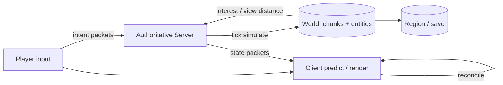

# 架构设计：多人共享体素/实体模拟世界——权威状态、预测与兴趣同步

> 模式：deliverable  
> 已定关键决策：服务端拥有世界权威；固定节奏 tick 推进模拟；按区块/兴趣区域裁剪同步；客户端可对部分输入做预测并以服务端和解；内容扩展走数据驱动/模组加载边界且不得绕过权威。  
> 明确不做：把金标写成「如何编写 Java 插件」教程；假装存在 Mojang 官方完整架构白皮书正典；默认全图广播或客户端可信；用启动器/商城模块图冒充共享模拟架构。  
> 待验证事实：具体版本协议字段与包 ID；某一第三方服务端在给定硬件上的区域并行收益；某模组加载器的精确类加载隔离策略（以公开 wiki/协议/社区叙述为基线，不锁死小版本数值）。  
> **诚实边界**：本叙述是基于公开 wiki、协议文档与社区/第三方实现材料的**合理重构**，**非**厂商正典白皮书。

## 层 A — 叙事

### A1 摘要

我们要解决的不是「再教一遍怎么写服务器插件」，而是一类**多人共享模拟**问题：在体素世界与实体之上，维持一份可作弊抵抗的权威状态，按可理解的时间步推进物理与游戏规则，并把每个玩家**需要看见的那一块**世界高效同步出去——同时让本地操作不至于等一整个 RTT 才有反馈。

成功时：破坏方块、移动、攻击与库存变更最终以服务端结果为准；远处玩家不浪费带宽收全图；客户端预测与服务端冲突时能收敛；模组/数据包扩展内容时仍落在同一权威与协议边界内。失败时宁可橡皮筋/回滚或拒绝非法动作，也不让客户端擅自成为第二真相。

不在范围内：单机存档编辑器心智、纯客户端资源包美化、以及把「插件热重载 API」当成问题类本身。

### A2 上下文与边界

系统落在**共享世界模拟与状态同步层**：上游是玩家输入、命令与模组/数据包定义的内容；下游是持久化区块、网络对端上的客户端渲染与本地预测。信任边界大致是：客户端不可信；经认证的会话进入游戏态后，只应提交意图（移动、交互），由服务端裁决结果；模组若双侧存在，仍须服从服务端权威规则与协议兼容面。

与「通用 MMO 后端」或「CRUD 业务服务」的边界：对外可以像「联机游戏服」一样运维，但对内契约是**离散 tick 上的权威世界机** + **按兴趣裁剪的协议复制**，不是请求/响应式业务 API，也不是「客户端算完再告诉服务器真相」。

### A3 主路径

一次「走近一块矿、挖开、捡起」可走通如下：

1. **兴趣进入**：玩家移动使新区块进入视距；服务端（或区块系统）加载/生成区块，经协议把区块与相关实体发给该客户端；离开视距则卸载对端视图并停止无谓更新。  
2. **输入与预测**：客户端本地预测挖掘动画/部分位移以保手感，同时把交互意图发给服务端。  
3. **权威 tick**：服务端在 tick 中校验可达性、工具、游戏模式与方块状态，应用破坏与掉落物生成；非法意图被拒绝。  
4. **结果同步**：方块变更、实体生成/元数据、库存变化作为状态包推给兴趣内观察者；发起者客户端用服务端结果和解（必要时回滚预测）。  
5. **持久化边界**：脏区块按策略写入区域文件；崩溃恢复依赖已刷盘状态，而非客户端内存。

读者应能跟着走完：兴趣加载 → 意图上行 → tick 裁决 → 状态下行 → 和解，而无需假设「客户端改方块即真理」或「全服每人每 tick 收整个世界」。

### A4 组件与契约

| 组件 | 职责 | 契约要点 |
|------|------|----------|
| Authoritative Server | tick 模拟、规则裁决、反作弊基线 | 世界真相在此；客户端包是意图不是命令结果 |
| World (chunks + entities) | 体素与实体状态、碰撞/AI/方块实体 | 按区块组织；加载与模拟范围可分离 |
| Interest / view manager | 决定谁订阅哪些区块与实体更新 | 视距与距离阈值裁剪；禁止默认全图广播 |
| Protocol session | 登录/配置/游戏态包交换 | 状态机清晰；版本协商失败则拒绝 |
| Client predict + reconcile | 本地先行与服务端对齐 | 冲突以服务端为准；可橡皮筋 |
| Persistence | 区域/玩家数据落盘 | 与在线模拟解耦；刷盘节奏是正确性/性能交叉点 |
| Content extension (datapack / mod loader) | 注册方块/物品/行为与资源 | 扩展不得绕过权威；协议与存档兼容是硬边界 |

禁止越界：把插件监听器教程当成架构主路径；声称「有官方白皮书已规定线程模型」而无公开出处；用客户端模组单方面改规则却假设多人一致。

### A5 状态、失败与恢复

**持久化什么**：区块区域、玩家库存与位置、世界元数据、以及模组附加 NBT/数据（若启用）。在线实体与未刷盘脏区块是易失的。

**挂了怎么办**：进程崩溃 → 回到上次成功保存；进行中的交互可能丢失或半应用，需可接受或靠更频繁刷盘降低窗口。网络分区/高延迟 → 客户端预测漂移，和解时橡皮筋；服务端可踢出严重不同步连接。区块加载失败/世界损坏 → 隔离区域、从备份恢复，而不是让客户端「补」权威。

**用户可见失败态**：卡顿（tick 跟不上）、鬼畜拉回、方块闪回、实体假死、模组协议不匹配无法进服。恢复路径是降视距/减实体压力、修模组对齐、从备份回滚世界。

### A6 安全与身份

适用：会话认证与加密传输（防窃听与会话劫持）、权限/OP 与命令边界、以及**反作弊作为权威模型的一部分**（速度、触达、物品复制）。架构后果是：任何「相信客户端坐标/库存」的捷径都会变成经济崩溃与玩法破坏。模组双侧信任仍不等于可信任客户端二进制——恶意客户端永远存在。身份边界在玩家账号↔会话；世界内权限（领地、容器）是游戏规则层，建立在权威状态之上。

### A7 演进切片

- **现在**：单逻辑世界权威 + tick 模拟 + 区块兴趣同步 + 有限客户端预测，作为可讲清的最小多人体素心智。  
- **下一刀**：区域并行模拟、代理/群组多逻辑服、更强预测与滞后补偿、数据驱动内容占比提升——仍服从服务端权威与兴趣裁剪。  
- **明确不做**：为手感放弃权威；为「插件好写」把问题类改写成 API 教程；宣称已有厂商正典白皮书可抄。

### A8 如何验收

1. **刺激**：两名玩家同时对同一方块交互；**观察**：最终方块/掉落以服务端一次裁决为准，无持久双真相。  
2. **刺激**：玩家高速移动穿过未加载区域；**观察**：区块按视距流式到达，未进入兴趣的观察者收不到该处高频更新。  
3. **刺激**：人为延迟下连续移动；**观察**：客户端有预测手感，延迟恢复后与服务端位置和解（可橡皮筋），不以客户端终态覆盖服务器。  
4. **刺激**：发送非法物品复制/穿墙类意图；**观察**：服务端拒绝或校正，世界不出现客户端宣称的状态。  
5. **刺激**：仅装客户端模组改规则、服务端未认同；**观察**：联机一致性失败或被拒绝——扩展必须落在双端/服务端权威边界内。

## 层 B — 机制与策略

### B1 基本事实

- **重构依据（非厂商正典）**：公开资料表明 Minecraft 联机是**服务端权威**的共享世界模型；社区协议文档描述客户端↔服务端包同步，而非「客户端提交最终世界」。本金标据此重构问题类，**不是** Mojang 官方架构白皮书摘录。  
- **已广泛证实（公开游戏/wiki 心智）**：世界按**区块**组织；模拟按**tick**推进（经典公开叙述约 20 TPS 心智）。  
- **已广泛证实**：带宽与 CPU 约束下必须做**视距/兴趣管理**，不能默认全图实体与方块广播。  
- **已广泛证实**：为手感存在**客户端预测**；冲突时以服务端为准的和解/橡皮筋是常态叙事。  
- **已广泛证实**：内容可通过**数据包/模组加载器**扩展；深度模组可触及协议与模拟，从而制造兼容分叉。  
- **待验证（实现/版本相关）**：具体包布局、区域并行的跨区实体语义、某代理拓扑下的玩家转移一致性窗口——金标不锁死小版本与第三方产品数值。

### B2 机制

该类问题几乎绕不开的结构（问题类语言）：

1. **服务端权威状态机**：方块、实体、库存与规则结果以服务端为准。  
2. **离散 tick 模拟循环**：固定节奏推进物理、AI、方块调度与游戏规则。  
3. **区块（chunk）空间分区**：加载、生成、模拟与磁盘区域对齐的基本单位。  
4. **兴趣管理 / 视距裁剪**：按玩家位置订阅区块与实体更新（AOI）。  
5. **协议化状态同步**：意图上行、状态下行；会话状态机（握手→游戏态）。  
6. **客户端预测 + 和解**：本地先行减感知延迟；分歧时收敛到权威。  
7. **持久化边界**：脏区块/玩家数据刷盘与在线模拟解耦。  
8. **可模组/数据驱动扩展边界**：注册内容与行为，但权威与协议兼容仍是硬约束。

显式模式名：Authoritative Server、Client-Side Prediction / Reconciliation、Interest Management / AOI、Tick-based Simulation、Chunk Streaming、Mod/Data-driven Content Loading。

### B3 策略选项

| 策略维 | 选项 A | 选项 B | 依赖的事实 |
|--------|--------|--------|------------|
| tick 调度 | 单线程（或单世界）tick，易推理 | 区域/线程并行模拟（如 Folia 类心智） | 跨区交互频率、竞态可接受度、实现复杂度 |
| 拓扑扩容 | 单逻辑世界权威服 | 代理 + 多逻辑服（群组） | 是否要玩法隔离/水平扩人数；跨服状态是否必需 |
| 预测强度 | 弱预测（少回滚） | 强预测 / 更积极的滞后补偿 | RTT 分布、作弊面、和解复杂度 |
| 内容扩展 | 偏数据驱动（datapack 等） | 深度模组/改协议与字节码 | 兼容面、更新成本、双端一致性 |
| 服务端实现 | 接近原版模拟语义 | 第三方优化服（异步区块、实体开关等） | 插件/模组生态 vs 纯吞吐 |

### B4 取舍

选择 **服务端权威 + tick 模拟 + 区块兴趣同步 + 有限预测 + 显式扩展边界**，因为问题类要的是可作弊抵抗的共享世界与可运维的同步成本，而不是「客户端说了算」的流畅幻觉，也不是插件 API 说明书。

明确放弃：

- **客户端可信 / 客户端提交最终世界**：作弊与经济崩溃。代价：必须做校验与和解，手感受 RTT 影响。  
- **全图广播**：带宽与 CPU 在人数与视距上升时崩坏。代价：兴趣系统复杂度、远处一致性窗口。  
- **把金标写成插件教程**：偏离架构问题类；代价：校准无法检验机制/策略思维。  
- **假装厂商正典白皮书**：材料上不诚实。代价：幻觉与不可复核引用。  
- **无边界深度模组却期望无摩擦联机**：协议与存档分叉。代价：必须版本锁定与双端对齐。

负面后果需写进沟通：tick 跟不上时全服「变慢」；并行区域后跨区事件变难；代理群组下「同一角色同一时刻一个世界」的约束；预测越强，作弊与和解边角越多。

### B5 与对照的关系

- **对照通用权威多人游戏**：射击/MOBA 同属权威+预测+AOI；分叉在体素破坏/生成与区块流式是一等公民，且模组生态更强。教训：机制可迁移，策略权重不同。  
- **对照「仅状态同步的薄房间服」**：若无本地 tick 权威模拟，则不是本问题类——那是房间转发，不是共享体素世界。  
- **对照插件平台叙事**：Bukkit/Paper API 是**扩展面**，建立在权威模拟之上；金标先机制后 API，避免本末倒置。  
- 本金标校准用途：构建期对照候选 deliverable 的机制/策略命中，不作为运行时用户考题；**无专属复现校准前 `skill_calibrated: none`**。
