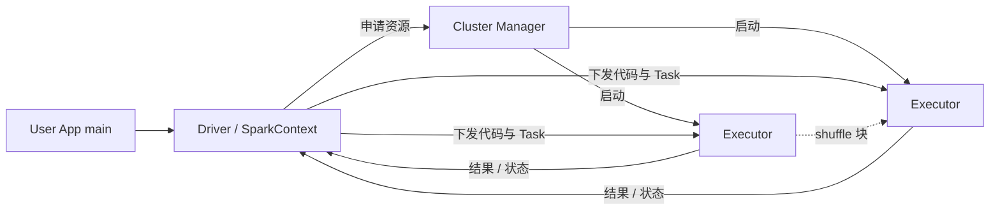

# 架构设计：商品机集群上的通用数据并行引擎——多阶段 DAG、惰性求值与血缘容错的内存友好计算

> 模式：deliverable  
> 已定关键决策：Driver 持上下文并调度；Executor 执行 task 并可跨操作保留分区；以惰性 transformation 构图、action 触发 Job；按 shuffle（宽依赖）切 Stage；窄依赖流水线；容错以血缘重算为主、persist 为加速；对 Cluster Manager 无关。  
> 明确不做：把 Spark 叙述成「无磁盘、无 shuffle」；否认 lineage、声称丢分区即永久失败；把引擎与某一种资源管理器绑死；默认把每个 transformation 立即物化到外部存储（MapReduce 心智硬套）。  
> 待验证事实：具体版本下 Catalyst/AQE 对某 SQL 的 stage 合并细节；给定集群的 shuffle 文件保留与磁盘水位运维曲线（以官方 Cluster/RDD 文档心智为金标基线，不锁死运维数值）。

## 层 A — 叙事

### A1 摘要

我们要解决的不是「再包一层两阶段 MapReduce」，而是在商品机集群上提供**通用数据并行计算**：一次应用里可以有多阶段流水线，迭代算法与交互查询能复用工作集，节点失败时仍能从血缘恢复，而不是假设数据永远装得进内存、或每次阶段边界都必须落外部分布式文件系统。

成功时，用户程序在 Driver 上描述变换；集群上的 Executor 跑并行 task；只有 action 才真正计算；需要跨分区重分布时付出 shuffle 代价并形成 Stage 边界；可对热点 RDD/Dataset 显式 persist。失败时丢失的分区按 lineage 重算，而不是整作业从零只靠外部落盘快照。不在范围内的是：用「纯内存神话」掩盖 shuffle spill、把 Spark 说成不能落盘、或假装没有宽依赖。

### A2 上下文与边界

系统落在大数据平台的**计算引擎层**：上游是存放在 HDFS/对象存储/本地集等的数据集与用户程序；下游是聚合结果、物化表、机器学习迭代中间态与交互查询应答。信任边界大致是：谁能提交应用到 Cluster Manager / 队列；Executor 进程属于单个 Application（与其它应用 JVM 隔离）；数据面访问受底层存储 ACL 约束。外部接口是：提交脚本与配置（`spark-submit`）、Driver 上的编程 API（RDD / DataFrame 等）、以及 Driver UI（任务、Executor、存储用量）。

与「单次 MapReduce 作业」的边界：对外仍可跑批处理，但对内契约是**惰性 DAG + 可选内存工作集 + 血缘**——Stage 可以多于两个，复用不必每次写回外部存储，容错叙事以重算为主。

### A3 主路径

一次关键计算可走通如下：

1. **提交与资源**：用户启动 Driver（client 或 cluster 部署模式）。Driver 创建 SparkContext，连接 **Cluster Manager**（Standalone / YARN / Kubernetes 等），为该 Application 申请 **Executor** 进程；把应用代码分发给 Executor。  
2. **惰性构图**：程序对分布式数据集声明 transformation（map、filter、join…）。此时通常**不读全量数据、不执行**；只记录如何从父数据集导出子数据集（血缘 / 逻辑计划）。  
3. **Action 触发 Job**：遇到 collect、save、count 等 action 时，Driver 将计算划为 **Job**，再按是否需要 **shuffle** 切成多个 **Stage**；每个 Stage 内是可流水线的窄依赖算子链，拆成对分区的 **Task** 发给 Executor。  
4. **Shuffle 与复用**：宽依赖（如 reduceByKey、join、repartition）触发跨 Executor 的数据重分布：写出 shuffle 文件、拉取、可能 spill 到磁盘。若用户对中间结果 `persist`/`cache`，后续 action 可命中缓存；丢分区仍可按血缘重算。

读者应能跟着走完：Driver → 申请 Executor → 惰性图 → Action → Stage/Task →（可选）Shuffle / Persist，而无需假设「每个算子立刻落 HDFS」或「从不写本地盘」。

### A4 组件与契约

| 组件 | 职责 | 契约要点 |
|------|------|----------|
| Driver | 跑用户 main；持 SparkContext；调度 Job/Stage/Task；汇总结果 | 须对 Executor 网络可寻址；宜靠近 worker；勿把超大 collect 当默认 |
| Cluster Manager | 跨应用分配 CPU/内存等资源 | Spark 对具体实现无关；只要求能拿到 Executor 进程 |
| Executor | 应用专属进程；多线程跑 Task；可内存/磁盘保留分区 | 生命周期随 Application；不与其它 SparkContext 共享堆内缓存 |
| RDD / 执行图 | 分区集合 + 变换血缘（DataFrame 则为优化后的物理计划） | Transformation 惰性；Action 物化；分区是并行单位 |
| Stage / Task | Stage 是 shuffle 边界之间的任务集；Task 作用单分区 | 窄依赖可同 Stage 流水线；宽依赖切开 Stage |
| Shuffle 子系统 | 跨分区重分布的落盘、传输与聚合 | 昂贵；可产生大量本地临时文件；失败路径依赖重算/保留的 shuffle 块 |

禁止越界：把 Cluster Manager 写成「执行用户算子的地方」；把 Executor 写成跨应用共享内存总线；用「缓存了所以无需容错」否定 lineage。

### A5 状态、失败与恢复

**持久化什么**：用户显式写出的结果（save 等到外部存储）；Executor 上可选的缓存分区（内存/磁盘/副本 StorageLevel）；shuffle 中间文件（在对应 RDD 仍被引用时可保留以免重算）。血缘本身在 Driver 侧调度状态中，不是「另一份完整数据副本」。

**挂了怎么办**：某个 Executor 或分区丢失 → 调度器按 lineage 重算缺失分区（从可靠输入或仍存活的父分区/shuffle 块继续）。persist 的副本级别可减少等待重算的时间，但不改变「可重算」契约。Driver 失败通常意味着 Application 失败（需外部重提或高可用部署演进）——金标基线强调 Executor/分区级恢复，不假装 Driver 无关紧要。Shuffle 期间节点失败时，引擎会保留部分中间数据以避免从原始输入整树重放（文档亦建议对要复用的结果显式 persist）。

**用户可见失败态**：OOM（缓存或 shuffle 结构过大）、磁盘被 shuffle 文件打满、straggler/倾斜导致 Stage 长时间不收尾、Driver 与 Executor 网络不通、collect 撑爆 Driver。恢复路径是调分区与并行度、改 StorageLevel、减轻宽依赖、本地目录扩容、把 Driver 放到集群近旁、以及对倾斜键做预处理。

### A6 安全与身份

适用：多租户共享 YARN/K8s 队列时需要提交身份、命名空间隔离与对存储的凭证（HDFS Kerberos、云凭据等）。架构后果是：权限强制点常在 Cluster Manager 与底层存储，而不是「Executor 之间互信即可」；加密与隔离会改变 shuffle 与本地盘路径的成本模型。金标本体系只要求写出「身份落在提交与数据面」，不锁死某一发行版的安全插件清单。

### A7 演进切片

- **现在（经典心智）**：Driver/Executor、惰性 RDD 图、Job/Stage/Task、shuffle 宽依赖、persist StorageLevel、多 Cluster Manager、client/cluster 部署。  
- **下一刀**：DataFrame/Dataset + Catalyst/AQE、结构化流、动态分配与更细的 shuffle 优化——仍服从「惰性计划 → Stage → 可能 shuffle → 血缘/重算」骨架。  
- **明确不做**：为营销「内存计算」而删除磁盘与 shuffle 叙事；退回「每一算子阶段都必须外部物化」并称之为唯一正确模型。

### A8 如何验收

1. **刺激**：编写含若干 map/filter 与一次 reduceByKey 的作业并触发 action；**观察**：出现多个 Stage（至少在 shuffle 边界切开）；窄变换与局部聚合可同 Stage 流水线；有 shuffle 读写痕迹而非「纯堆内传递」臆测。  
2. **刺激**：对迭代用的中间 RDD `persist` 后连续两次 action；**观察**：第二次显著减少重复从外部存储扫描（或 UI 显示缓存命中）；杀掉一 Executor 后缺失分区仍能重算完成。  
3. **刺激**：同一套应用代码分别向 Standalone 与另一 Cluster Manager（或文档声明支持的 YARN/K8s）提交；**观察**：执行心智不变——仍是 Driver 调度、Executor 跑 Task，资源面可替换。  
4. **刺激**：人为制造远大于内存的 shuffle 键组；**观察**：出现 spill/磁盘与性能下降，而不是引擎「拒绝使用磁盘」或静默正确且零代价。

## 层 B — 机制与策略

### B1 基本事实

- **已证实（Cluster Overview）**：Spark 应用 = Driver 程序 + 一组 Executor；SparkContext 连接 Cluster Manager 申请资源；任务由 Driver 调度到 Executor。  
- **已证实**：应用获得自有 Executor，生命周期覆盖整个应用，任务多线程执行；应用间调度与 JVM 隔离；跨 Application 共享数据需外部存储。  
- **已证实（RDD Guide）**：transformation 惰性，action 触发计算；默认可对每次 action 按血缘重算；persist/cache 将分区留在集群上以加速复用。  
- **已证实**：shuffle 用于按键聚合、join、repartition 等；代价含磁盘 IO、序列化与网络；内存不足时结构会 spill。  
- **已证实**：缓存分区丢失时按创建它的变换重算——容错与缓存并存。  
- **待验证（部署相关）**：特定版本 AQE/自适应执行对某一查询的 stage 切分；长作业 shuffle 文件 GC 与磁盘规划数字——金标不锁死。

### B2 机制

该类问题几乎绕不开的结构（问题类语言）：

1. **Driver / Executor 拆分**：控制面与数据并行执行面分离；Driver 持图与调度，Executor 持分区与任务。  
2. **惰性求值与血缘**：先描述「如何算」，再在 action 时物化；血缘同时服务优化机会与故障重算。  
3. **DAG 与 Stage**：多算子图按宽依赖（shuffle）切段；窄依赖流水线，减少物化。  
4. **分区并行 Task**：并行单位是分区上的任务，而非「整表单线程」。  
5. **Shuffle（宽依赖）**：跨节点重分布；承认 all-to-all 成本与本地临时文件。  
6. **工作集持久化**：persist/cache + StorageLevel，服务迭代与交互。  
7. **资源管理器无关**：计算引擎契约与 YARN/K8s/Standalone 解耦。

显式模式名：Driver–Executor、Lazy Evaluation、Lineage-based Fault Recovery、DAG Scheduling、Stage Pipelining、Shuffle、Cache/Persist。

### B3 策略选项

| 策略维 | 选项 A | 选项 B | 依赖的事实 |
|--------|--------|--------|------------|
| 作业模型 | 多阶段 DAG + 内存工作集复用 | MapReduce 式每阶段外部物化的一次性作业 | 是否迭代/交互；写外部存储的开销 |
| 物化 | 显式 persist（选 StorageLevel） | 每 action 全量按血缘重算 | 重算 CPU vs 内存/磁盘占用 |
| 集群管理 | Standalone / YARN / Kubernetes | 与引擎绑死的专用资源面 | 多租户、运维栈、是否混部 |
| 部署模式 | cluster（driver 在集群内） | client（driver 在提交机） | Driver 与 executor 网络距离 |
| API / 计划 | RDD 显式变换图 | DataFrame/SQL + 优化器 | 谁负责谓词下推与 join 策略；物理上仍有 stage/shuffle |
| 缓存层级 | MEMORY_ONLY 优先 | MEMORY_AND_DISK / 序列化 / 多副本 | 重算成本 vs 读盘成本 vs 空间 |

### B4 取舍

选择 **Driver–Executor + 惰性 DAG + Stage/Shuffle 边界 + 血缘重算 + 可选 persist + 可插拔 Cluster Manager**，因为问题类要同时满足：多阶段流水线、迭代/交互复用、分区并行，以及商品机故障下可恢复——且不把「写回 HDFS」当成唯一的阶段间通信方式。

明确放弃：

- **MR 每阶段外部物化**：实现与推理简单，但迭代算法与多轮查询会被 IO 打穿。代价：用户与运维必须理解内存压力、缓存驱逐与 shuffle 调优。  
- **「纯内存、无磁盘」叙事**：营销简单，但与官方 shuffle/spill/磁盘 StorageLevel 事实冲突，会误导容量规划。代价：沟通上要反复强调内存是加速层不是唯一介质。  
- **引擎与单一资源管理器绑死**：减少适配面，但无法嵌入已有 YARN/K8s 运维。代价：多一层 Cluster Manager 抽象与部署模式选择。  
- **默认立即物化每个 transformation**：调试直觉好，但失去流水线与整体 Stage 优化。代价：必须教育惰性语义与 action 边界。  
- **跨 Application 共享 Executor 堆缓存**：看似省内存，但破坏隔离与调度独立性；选择外部存储共享。

负面后果需写进沟通：shuffle 文件可长期占用本地盘；Driver 单点与 collect 风险；倾斜与 straggler；缓存不保证常驻（LRU）；「比 MR 快」取决于工作集是否真正复用而非口号。

### B5 与对照的关系

- **金标本体系（Spark 官方 Cluster + RDD 文档）**：用 Application/Driver/Executor 与 Job/Stage/Task 词汇固定部署与执行心智；用惰性、shuffle、persist 固定计算与容错心智——先讲机制，再挂 SQL/结构化流等演进名。  
- **对照 MapReduce / HDFS 计算入口（短记）**：二者共享分区并行、商品机、shuffle 聚合与失败重试直觉；分叉在「多阶段 DAG + 工作集复用 + 血缘」vs「两阶段（或链式 MR）且阶段间常外部物化」。教训：校准时不要用 MR 作业提交叙事覆盖 Spark Application 生命周期；也不要用 HDFS 金标的元数据/数据分离细节冒充 Spark 执行层。  
- **对照后续 SQL/流式层**：Catalyst、结构化流改变的是计划与触发方式，不取消 Stage、shuffle 与 Executor 内存/磁盘现实。  
- 本金标校准用途：构建期对照候选 deliverable 的机制/策略命中，不作为运行时用户考题。
