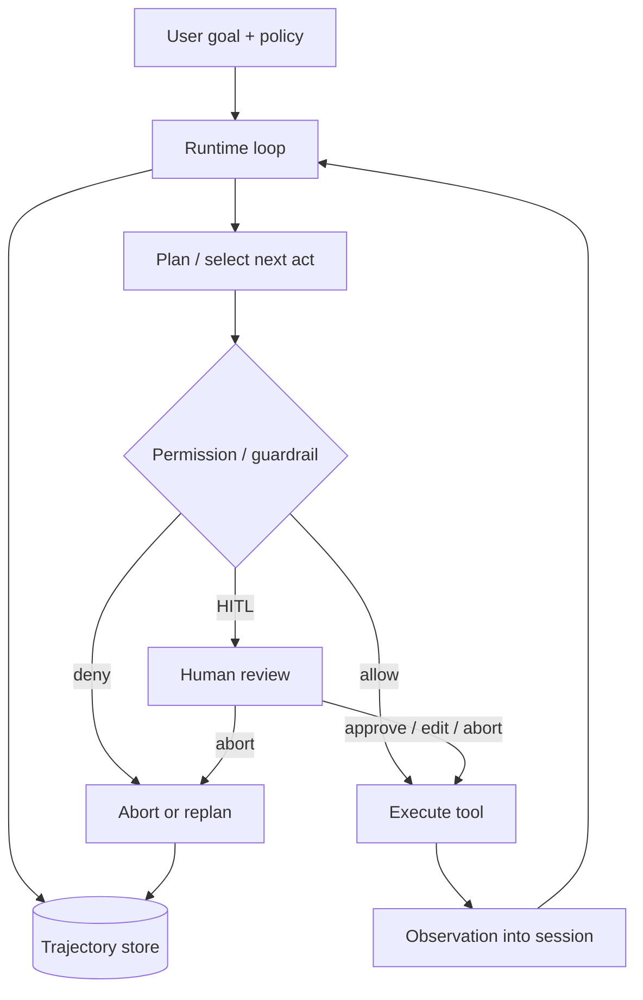

# 架构设计：让模型经工具循环完成多步任务，并在副作用前停得住、事后查得清

> **calibration reproduce（维护者复现校准）**：非正式金标；对照 `corpus/golden/agent-runtime` 的 RUBRIC 打分，不冒充 GOLDEN。  
> 模式：deliverable  
> 已定关键决策：环境反馈经工具回注驱动下一回合；模型意图与真实副作用之间必须有权限/护栏闸；高副作用路径可 HITL；整条 run 可追踪回放；复杂度默认「够用最简」。  
> 明确不做：把某一 coding agent / IDE 的包或屏幕拓扑当作本问题类；默认无护栏全自治；把预定义工作流与自治 agent 混称为同一种东西且不写 when/when not；假装单次生成即永久正确。  
> 待验证事实：某组织强制人审的副作用分级阈值；给定模型族的工具错误复合率；具体 tracing 后端的采样与保留成本。

---

## 层 A — 叙事

### A1 摘要

问题类：用 **LLM + 工具** 在开放任务上走完多步——模型规划或选择下一步，调用工具，把观察塞回上下文，直到完成或停止。因为模型非确定性、工具会改真实世界、失败整段重跑很贵，所以**权限闸门、人审中断、轨迹可观测**不是附属功能，而是运行时边界本身。

成功时：读者能看见「目标 → 选动作 → 过闸 → 执行观察 → 再决策」的闭环；拒绝或升级人审时环境不变（或已约定的回滚）；事后能导出步骤级轨迹做评估与事故复盘。不解决：纯聊天无工具、把微服务拆分图当 agent 架构、或「上了框架就自动安全」。

硬约束动机：非确定性、延迟/成本、副作用不可撤销、需要可评可追。

### A2 上下文与边界

落点：**agent 编排 / 运行时层**（问题类语言，非某一产品模块图）。上游：用户目标、策略（允许工具、人审规则、停止条件）、可用工具目录。下游：真实环境——文件系统、终端、HTTP API、工单、代码库、浏览器等。

信任边界：

- 谁能开会话 / 提交 run；
- 模型**不能**直接碰环境，只能经声明的工具面（ACI）；
- 护栏与授权决定「意图是否落地」；
- 轨迹存储的访问与保留独立于对话正文。

与工作流引擎的边界：对外可像自动化一样调用；对内关键路径是**模型在有界上下文里动态选下一步**（可与确定性步骤混布），ground truth 来自工具观察，不是模型自述「我已经做了」。

### A3 主路径

端到端「做完一件需工具的事」：

1. **开会话**：装载指令、工具目录、权限策略、停止/预算条件；写入初始用户目标。可选短计划——可修订，除非策略明确选了预定义工作流。  
2. **Plan**：模型根据当前 session 决定：终答、追问用户、或发出工具调用（单次或一批）。  
3. **Authz / 护栏**：对提议动作做输入校验、工具白名单、副作用分级。拒绝 → 记因并中止或改道；需人审 → 暂停并把 diff/命令给人。  
4. **Act + Observe**：获准后执行（进程内、沙箱或异步队列）；把工具结果（原始或规范化）**回注** session——环境反馈成为下一回合事实。  
5. **停止或继续**：消费观察后更新计划或再选工具；触达完成条件、护栏失败、预算耗尽或人审中止则结束。全程写入轨迹：步骤、工具调用、护栏命中、人审决策。

读者应能走通：**目标 →（可选计划）→ 选工具 → 权限闸 → 执行观察 → 轨迹记录 → 完成/中止/人审恢复**，而无需假设「一句 prompt 出最终结果」或「无权限也能改生产」。

### A4 组件与契约

| 职责块 | 做什么 | 可调用 / 禁止 |
|--------|--------|----------------|
| 增强型 LLM | 在上下文里选言语或工具动作 | 只能经工具触达环境；禁止口头宣布已执行而无观察 |
| Runtime loop | 调模型、调度工具、合并观察、判停 | 必须有停止/预算；禁止无上限空转 |
| Tools（ACI） | 对环境的类型化操作面 | 错误可观察；接口质量与提示同等重要 |
| Session / 工作上下文 | 本轮循环状态 | 与长期记忆、外部系统真相源可区分；禁止「一切塞进无限 prompt」当唯一设计 |
| Permission / Guardrail | 输入输出校验、工具授权、副作用分级 | 意图与副作用之间的强制点；失败应能快速中止 |
| HITL | 暂停、展示、改状态、恢复或中止 | 控制流一等公民，不是日志注释 |
| Tracing | 可回放轨迹 | 支撑评估与追责；可演进采样，不可取消机制 |

分层契约：**模型意图 → 闸门 → 工具执行 → 观察回注 → 轨迹**。产品 UI 名称不得替换上表职责。

### A5 状态、失败与恢复

**持久化**：session（或 checkpoint）里的工作上下文；环境侧真实副作用（文件、PR、工单）——运行时状态不是环境的唯一真相；轨迹与人审记录用于审计。长期记忆若存在，必须与当轮 session 显式分界。

**失败语义**：

- 工具报错 / 模型胡言 → 观察回注后重试、换工具或升级人审；  
- 护栏命中 → 快速中止该步或整 run；  
- 进程崩溃 / 长任务超时 → 从 checkpoint 或可恢复工作区续跑，默认不是丢弃已付成本后静默重来；  
- 人审超时 → 策略预约定挂起、拒绝或有限重试，**禁止 silently 当批准**。

用户可见态：权限拒绝、护栏命中、工具超时、上下文溢出、循环空转、人审积压。恢复：收紧工具面、缩短任务、强制 checkpoint、提高人审优先级、或降级为预定义工作流。

### A6 安全与身份

默认适用。身份落在：谁发起 run、以谁的凭证执行工具、谁能批准副作用。工具执行身份通常是委派的用户/服务账号，**不是**「模型本人」。越权来自过大工具权限与过宽 session 共享。密钥不得进入可被 prompt 或轨迹泄露的明文通道。沙箱把「能想」和「能碰」分开。安全改变主路径：许多写操作变成 **提议 → 审批 → 执行**。

禁止叙事：「上了 agent 框架就自动安全 / 无需权限与人审」。

### A7 演进切片

| 现在 | 下一刀 | 明确不做 |
|------|--------|----------|
| 单 agent：plan/act/observe + session 边界 + 权限闸 + 轨迹；副作用可 HITL | 多 agent handoff / orchestrator-workers；图上混布确定性节点；耐久 checkpoint 与异步工具队列；更强评估闭环 | 默认绑死最重框架；无护栏全自治操作生产；架构正文写成某 IDE/产品目录树 |
| 复杂度从单次 LLM / 工作流爬升到自治循环 | 按评测证明再加厚度 | 把预定义工作流与自治 agent 混为一谈且不写适用条件 |

### A8 如何验收

1. **刺激**：任务需 ≥2 次工具才能完成 → **观察**：至少一轮「选工具 → 结果回注 → 再决策」，不是单次终答冒充完成。  
2. **刺激**：对高副作用工具关闭自动批准 → **观察**：执行前进入人审/暂停；批准后才改环境；拒绝则无副作用且轨迹可查原因。  
3. **刺激**：注入越权或非法工具调用 → **观察**：权限/护栏拦截并中止或改道；run 状态与 trace 记录原因。  
4. **刺激**：长任务中途杀掉进程（或等价故障）→ **观察**：能从 checkpoint/工作区恢复续跑，或明确失败而非静默丢状态；轨迹仍可导出。  
5. **刺激**：对照「仅预定义工作流足够」的任务仍强制上最重自治框架 → **观察**：设计叙述应给出 when/when not 或降级理由（验收文档诚实性，而非强制产品行为）。

---

## 层 B — 机制与策略

### B1 基本事实

| 事实 | 状态 |
|------|------|
| 工具结果是环境反馈 / ground truth；无回注则谈不上「完成多步任务」 | 已证实 |
| 工作流（代码预定义路径）与自治 agent（模型动态主导）复杂度不同；开放式任务才更常需要后者 | 已证实 |
| 多数场景应先试更简单方案（单次 LLM ± 检索 / 预定义工作流）；agent 用延迟与成本换表现 | 已证实 |
| 非确定性 + 不可逆副作用 → 需要可强制的权限/人审，不能只靠事后道歉 | 已证实 |
| 长时有状态任务失败后从头重跑昂贵 → 需要可中断恢复 / checkpoint | 已证实 |
| 无可回放轨迹则难以评估、微调与事故追责 | 已证实 |
| 某团队强制 HITL 的阈值与 tracing 采样成本 | 待验证 |

### B2 机制

该类「LLM 编排工具完成多步任务」几乎绕不开：

1. **工具循环（plan / act / observe）**：回合内决定下一步 → 调用工具 → 观察回注 → 直至完成或停止。  
2. **工具作为环境接口（ACI）**：工具设计与提示同等重要；结果是 ground truth。  
3. **工作上下文 / 会话边界**：循环内 session 与长期记忆、外部真相源可区分。  
4. **权限与审批闸门**：输入/输出护栏、工具白名单、副作用分级；失败可快速中止。  
5. **可观测轨迹（tracing）**：步骤、工具调用、护栏命中、人审决策可回放。  
6. （加分常驻生产）**HITL / 中断恢复**：副作用前可暂停、改状态、再继续；长任务靠 checkpoint / 可恢复工作区。

相关模式名（词汇，非产品拓扑）：Agent loop、Guardrail、Session、Handoff、Checkpointing、HITL、Tracing；工作流侧 Prompt chaining、Routing、Orchestrator-workers、Evaluator-optimizer。

### B3 策略选项

| 策略维 | 选项 | when / 代价 |
|--------|------|-------------|
| 复杂度阶梯 | 单次 LLM（±RAG）/ 预定义工作流 vs 模型主导自治 agent | 路径可硬编码则不必上 agent；agent 换延迟与复合错误风险 |
| 编排形态 | 单 agent 内置循环 vs 有环图（确定性+agentic 混布）vs handoff / orchestrator-workers | 要耐久细粒度中断/复杂分支再上图；多 agent 增加协调故障 |
| 人审策略 | 副作用强制审批 vs 高风险抽检 vs 全自治 | 全自治须写明不可追责与不可逆代价 |
| 工具执行 | 同步进程内 vs 沙箱 / 异步队列 / 可恢复工作区 | 隔离与长任务重试独立于请求线程 |
| 运行时厚度 | 自管 API 循环 vs Agents SDK 类原语 vs 耐久图框架 | 短 agent / 无工具可能不需要重框架 |

### B4 取舍

选 **够用最简阶梯上的工具循环运行时**：session 边界 + 权限闸 + 轨迹；副作用路径默认可 HITL；需要耐久/复杂控制流再加厚运行时——因为问题同时要求：开放任务可完成、副作用可控、失败可解释可恢复、复杂度可辩护。

明确放弃及代价：

- **默认最重框架**：淹没可硬编码路径；丢掉 when/when not 纪律。  
- **无护栏全自治**：演示好看，生产不可追责。  
- **只靠提示当权限**：可被诱导绕过；须真闸门。  
- **产品模块图冒充架构**：无法校准到异构 Codex 类实现。  
- **否认观察闭环**：「生成即完成」与环境脱节。

### B5 与对照的关系

对照公开工程文与本地 D8 survey（OpenAI Agents SDK、Anthropic Effective Agents、LangGraph），抽共性而非抄产品拓扑：

- **Anthropic**：先问是否真需要 agent；模式表带适用条件——教训：机制之前先做复杂度诚实。  
- **OpenAI Agents SDK**：少原语覆盖循环、护栏、session、tracing、handoff——教训：生产路径不是「自管循环演示」 alone。  
- **LangGraph**：checkpoint、HITL、有环控制、流式——教训：运行时耐久能力与模式选型是正交轴，可组三角共思。  

本文件是 **calibration reproduce**，用于维护者对照 RUBRIC 打分；**不是** `corpus/golden/agent-runtime/GOLDEN.md` 本身。

---

## 校准对照

- **日期**：2026-08-05  
- **skill 版本**：architecture-buddy `0.3.1`（deliverable 双层 + S6 gate；host 即将 bump 至 0.3.1）  
- **对照对象**：`corpus/golden/agent-runtime/RUBRIC.md`（可读 SOURCES / D8 survey；不冒充 GOLDEN）

### 必中机制命中表

| 必中机制 | 判定 |
|----------|------|
| 工具循环（plan / act / observe） | 命中 |
| 工具作为环境接口（ACI） | 命中 |
| 工作上下文 / 会话边界 | 命中 |
| 权限与审批闸门 | 命中 |
| 可观测轨迹（tracing） | 命中 |
| （加分）HITL / 中断恢复 | 命中 |

### 必中策略命中表

| 必中策略分叉 | 判定 |
|--------------|------|
| 复杂度阶梯：单次 LLM/工作流 vs 自治 agent | 命中 |
| 编排形态：单 agent 循环 vs 图运行时 vs handoff/orchestrator-workers | 命中 |
| 人审策略：强制审批 / 抽检 / 全自治（写明代价） | 命中 |
| （加分）工具执行同步 vs 沙箱/异步/可恢复；运行时厚度 | 命中 |

### 幻觉黑名单检查

| 黑名单项 | 结果 |
|----------|------|
| 写成某一 IDE/产品模块图而无工具循环与边界机制 | 未出现 |
| 声称上了 agent 框架就自动安全 / 无需权限与人审 | 未出现 |
| 否认工具结果回注或循环观察 | 未出现 |
| 预定义工作流与自治 agent 混为一谈且无 when/when not | 未出现 |
| 生产多步 agent 不需要轨迹，或失败只能从头重跑且当作唯一正确模型 | 未出现 |
| 微服务/前端组件叙事冒充 agent 运行时，或「只要 prompt 够好就不需要 ACI/护栏」 | 未出现 |

### S6 结构

| Gate 项 | 结果 |
|---------|------|
| 摘要说清解决/不解决 | 通过 |
| 信任边界 + 端到端主路径 | 通过 |
| 机制与策略分开；有为何选/不选 | 通过 |
| 失败语义 + ≥3 可测验收 | 通过（5 条） |
| 演进切片（现在/下一刀/不做） | 通过 |
| 正文几乎无内部黑话（M/S 编号） | 通过 |
| 封面标明 calibration reproduce / 非 GOLDEN | 通过 |

### 判定

**PASS**

（本轮候选直接达标；未改 skill / 模板以凑分。）
