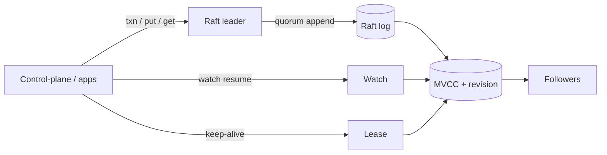

# 架构设计：控制面级强一致元数据面——Raft、MVCC 与同体协调原语

> **calibration reproduce（维护者复现校准）**：非正式金标；对照 `corpus/golden/etcd` 打分，不冒充 GOLDEN。  
> 模式：deliverable  
> 已定关键决策：小规模元数据放进单 Raft 复制组；KV 默认走可线性化；用全局 revision + MVCC 支撑条件写与历史；Watch/Lease/Lock/Election 挂在同一存储上；分区时宁可不可用也不双主。  
> 明确不做：当大数据仓库或完整服务发现套件；宣传可脑裂的 AP 写入；把 etcd Lock 当成外部资源互斥的充分条件；用「最终一致配置中心」描述主路径。  
> 待验证事实：给定硬件下 compaction 窗口与体积曲线；开启 serializable 读时的延迟收益与可见陈旧度。

---

## 层 A — 叙事

### A1 摘要

目标是给大规模分布式系统一块**可信的元数据与协调平面**：配置、登记、选主、租约与锁优化都依赖同一强一致真相。成功时：写经多数派落地，读默认与已提交写对齐，观察者能按 revision 接上变更流，Lease 绑定键的生命周期。失败时宁可拒绝冒险写入，也不出现 split-brain 双真相。

不解决：把这块平面扩成海量业务存储；做成带健康检查/DNS 的完整发现产品；或让客户端在超时后假定「一定没写成」。硬约束：**CP / 反脑裂**、元数据大约数 GB 量级、超时与选主期间**完成性不确定**。

### A2 上下文与边界

落点：编排与控制面、以及需要共享协调状态的业务组件。信任边界：客户端凭据访问 KV/Watch/Lease API；成员节点之间复制 Raft 日志；运维负责成员、备份、历史压缩。外部接口是 gRPC（及网关），不是「随便读任意副本当权威」。

契约心智是**单分片强顺序的协调存储**，不是分片 OLTP，也不是缓存旁路。

### A3 主路径

1. **提案**：客户端把 Put 或条件事务发给 **leader**；leader 写入 Raft 日志并收集多数票。  
2. **应用**：提交条目进入状态机；**MVCC** 产出新键版本，集群 **revision** 前进。  
3. **读**：默认 **linearizable** 读对齐已提交前缀，避免「本地随便读」当契约。  
4. **订阅**：Watch 挂在 revision 序列上，支持从上次点位 **resume**；保证是有序/可靠/可恢复，**不是**线性化。  
5. **租约协调**：创建 Lease 并续约，键附着租约；过期删除驱动后续事件；Lock/Election 复用同一套语义。

应能走通：条件写 → quorum → revision → 线性化读或 Watch，且不把 Watch 误当成线性化读的替身。

### A4 组件与契约

| 组件 | 职责 | 可调用 | 禁止越界 |
|------|------|--------|----------|
| Client | 条件写、重试确认、Watch 恢复 | KV/Watch/Lease API | 超时即视为未提交且不再核对 |
| Raft 组 | 共识与成员 | 日志/快照 | 少数分区独立可写真相 |
| MVCC | 多版本与 revision | 状态机应用路径 | 无限保留全部历史假装无 compaction |
| Watch | 事件流 | MVCC 历史窗口 | 宣称线性化或延迟上界 |
| Lease / Lock / Election | 存活与协调 | 同体存储 | Lock 单独证明外部资源互斥 |

### A5 状态、失败与恢复

- **持久化**：Raft 日志/快照、MVCC、租约与成员信息。  
- **leader 更替 / 超时**：请求可能已提交或未提交——客户端必须用 revision/条件读消歧后重试。  
- **多数不可用**：写入失败（接受 CP），避免脑裂。  
- **历史**：compaction 后过旧 revision 不可用于 Watch 恢复。  
- **可见故障**：选主不可用、空间/配额拒绝、不健康集群上 Watch 长期静默、Lease 过期删键；恢复靠多数恢复、备份、重建订阅。

### A6 安全与身份

控制面场景默认要认证授权与传输保护。更关键的是使用条件：分布式锁必须在**被保护资源**上做版本/fencing 校验；Lease 依赖物理时钟 TTL，存在「服务端已收回、客户端仍以为持有」的窗口。身份边界在 API；业务互斥不能只停在 etcd 锁对象上。

### A7 演进切片

| 现在 | 下一刀 | 明确不做 |
|------|--------|----------|
| 单 Raft + MVCC + 默认可线性化 + Watch/Lease | 标定 serializable 读与 compaction 运维 | 改为可脑裂 AP；当大数据仓 |
| 同体 Lock/Election | 演练成员变更与备份 RPO | 外挂 recipes 替代租约/版本语义 |

### A8 如何验收

1. **刺激**：两客户端对同一键做基于版本的冲突事务 → **观察**：至多一方按预期成功，revision 前进。  
2. **刺激**：写成功后立刻默认可线性化读 → **观察**：读到新值。  
3. **刺激**：Watch 从旧 revision 恢复并持续写入 → **观察**：窗口内事件有序可恢复；文档/叙述不声称 Watch 线性化。  
4. **刺激**：停 Lease 续约 → **观察**：键删除与事件；应用层仍需处理时钟窗口。  
5. **刺激**：隔离少数节点 → **观察**：少数不能形成第二可写真相。

---

## 层 B — 机制与策略

### B1 基本事实

| 事实 | 状态 |
|------|------|
| 控制面元数据双真相（脑裂）代价高于短暂不可写 | 已证实（Why/Learning 动机） |
| 数 GB 级元数据可用单复制组 + 全局顺序简化 | 已证实 |
| MVCC + revision 支撑 CAS、Watch 位点与逻辑时钟 | 已证实 |
| Watch：有序/可靠/可恢复 ≠ 线性化 | 已证实 |
| Lease TTL 有物理时钟窗口；锁需资源侧 fencing | 已证实 |
| 某环境 serializable 读的具体延迟曲线 | 待验证 |

### B2 机制

「强一致元数据 + 协调」问题类几乎总要落到：

1. **Raft（复制状态机）** 单一致组，写走 quorum。  
2. **revision 逻辑时钟** 贯穿条件写与 Watch。  
3. **MVCC + compaction** 管历史窗口与体积。  
4. **默认可线性化** 读契约（可另开 serializable 降延迟）。  
5. **Watch resume/bookmark** 做变更通知。  
6. **Lease + CAS/事务**，并强调 fencing。  
7. **Lock/Election 与存储同体**，不是纯文档级外挂。

模式名：Consensus / RSM、Lease + fencing token、条件事务。

### B3 策略选项

| 选项 | 依赖的事实 | 含义 |
|------|------------|------|
| A. CP 反脑裂 | 双真相不可接受 | 选 |
| B. AP 分区可写 | 可接受短暂分叉 | 排除为主路径 |
| A. 一致 KV + 同体原语 | 需要 MVCC/可靠 watch/动态成员叙事 | 选（相对 ZK 拼装） |
| B. 层次 znode + 客户端 recipes | 生态已绑 ZK | 对照项 |
| A. 只做元数据存储 | 发现产品另建 | 选（相对 Consul 全家桶） |
| B. 端到端服务发现 | 要 DNS/健康检查一体 | 非本金标 |
| A. 单分片强顺序 | 数据是元数据量级 | 选 |
| B. NewSQL/分片 | 海量/SQL | 数据平面另选 |
| A. 默认可线性化读 | 要与已提交写对齐 | 默认 |
| B. serializable 读 | 可接受相对 quorum 旧值 | 延迟优化选项 |

### B4 取舍

选 **Raft + MVCC/revision + 默认可线性化 + 同体 Watch/Lease**，因为要的是控制面权威与可组合协调，不是缓存，也不是分析仓。

放弃：AP 脑裂写入、海量库定位、完整发现产品默认、Lock 即外部互斥、Watch=线性化。代价：多数不可用时写失败；客户端必须消歧超时；运维必须管 compaction 与备份；使用锁必须做资源侧校验。

### B5 与对照的关系

对照官方 Why 中的边界表，并短对照 ZooKeeper / Consul / NewSQL：

- **相对 ZK**：同问题类，分叉在 KV+revision vs znode、API 与原语同体程度。  
- **相对 Consul**：etcd 偏存储与协调，不自动等于发现产品。  
- **相对 NewSQL**：海量/SQL 走另一条；协调元数据留在单组强顺序。  
- 本校准不整段套用对照系统的组件拓扑。

---

## 校准对照

- **日期**：2026-08-05  
- **skill 版本**：architecture-buddy `0.3.0`（deliverable 双层 + S6 gate）

### 必中机制命中表

| 必中机制 | 判定 |
|----------|------|
| 单一致复制组 + Raft；revision 逻辑时钟 | 命中 |
| KV 严格可串行化 / 默认线性化读；写经 quorum | 命中 |
| MVCC + 历史窗口 + compaction | 命中 |
| Watch 有序/可靠/可恢复，不保证线性化 | 命中 |
| Lease / Lock / Election 与存储同体 | 命中 |
| 元数据量级（约数 GB），非海量业务仓 | 命中 |
| CP 反脑裂；超时完成性不确定 | 命中 |

### 必中策略命中表

| 必中策略分叉 | 判定 |
|--------------|------|
| 一致 KV+原语 vs ZK znode 拼装 | 命中 |
| 只做元数据存储 vs Consul 端到端发现 | 命中 |
| 单分片强顺序 vs NewSQL/分片海量 | 命中 |
| （加分）默认可线性化 vs serializable 降延迟 | 命中 |

### 幻觉黑名单检查

| 黑名单项 | 结果 |
|----------|------|
| 可容忍 split-brain / 默认 AP | 未出现 |
| 海量业务数据 / 通用 SQL 仓 | 未出现 |
| Watch 保证线性化且不点出差异 | 未出现 |
| Lock API 已保证外部资源互斥 | 未出现 |
| Lease TTL 无客户端自认持有窗口 | 未出现 |
| 最终一致 K/V 缓存叙事不点出 Raft/线性化 | 未出现 |

### S6 结构

| Gate 项 | 结果 |
|---------|------|
| 摘要说清解决/不解决 | 通过 |
| 信任边界 + 端到端主路径 | 通过 |
| 机制与策略分开；有为何选/不选 | 通过 |
| 失败语义 + ≥3 可测验收 | 通过（5 条） |
| 演进切片（现在/下一刀/不做） | 通过 |
| 正文几乎无内部黑话（M/S 编号） | 通过 |

### 判定

**PASS**

（本轮候选直接达标；未改 skill / 模板。）
