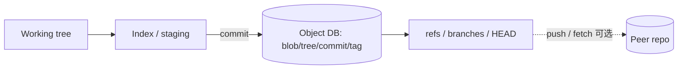

# 架构设计：在高方差贡献者中维护可分布式协作、可验完整性的内容历史

> **calibration reproduce（维护者复现校准）**：非正式金标；对照 `corpus/golden/git` 打分，不冒充 GOLDEN。  
> 模式：deliverable  
> 已定关键决策：内容寻址对象库 + DAG 快照历史；refs 轻量指向 commit；本地 commit 与 push 解耦；plumbing/porcelain 分层。  
> 明确不做：中央服务器才能形成本地历史；分支=整库目录拷贝；仅线性历史；commit 与 push 绑成同一操作。  
> 待验证事实：极大二进制文件工作负载下纯 snapshot 对象的成本曲线与 pack/delta 优化收益（章内已知有后续路径）。

---

## 层 A — 叙事

### A1 摘要

要解决的是：在贡献者地理与节奏高度分散时，如何维护一份（通常是代码的）数字工作体——支持发散再收敛、防止内容静默损坏、且日常操作要快。哲学上刻意**反 CVS 中央锁步**：本地即可完整记历史，分享是另一决策。

成功时：一次本地 commit 把工作区变更固化为可哈希校验的对象图，分支只是移动指针；需要协作时再 push/fetch。不在范围内：强制「一切变更必须先上中央才算提交」、把分支做成整树拷贝、或假定历史永远只能线性前进。

硬约束动机对齐 Torvalds/AOSA 叙述：分布式工作流、内容完整性、高性能。

### A2 上下文与边界

落点：开发者工作站上的本地仓库，以及可选的远程同伴仓库（GitHub 等只是常见宿主，不是架构上的必经真相源）。信任边界：对象库用内容哈希自证「拿到的字节是否即声称内容」；远程交换依赖传输与签名/托管策略，但不改变「本地先有完整历史」的能力。

外部接口：本地对象与 refs 操作；与远程的 pack 传输；用户通过 porcelain 命令完成日常工作流。

### A3 主路径

一次「记入历史并可稍后分享」的路径：

1. **变更**：在工作区改文件。  
2. **（可选）暂存**：`index` 选定下次快照要包含的路径与内容。  
3. **Commit**：根据 index 写出 **blob**（文件内容）、**tree**（目录快照）、**commit**（元数据 + 父指针 + 根 tree）；对象以内容哈希入库。  
4. **更新 ref**：当前分支 ref 轻量前移指向新 commit——不是复制整棵仓库目录。  
5. **分享（解耦）**：需要时再 **push** 到远程；离线可连续多次 commit，历史已在本地成立。

读者应能走通：工作区 →（index）→ 对象入库 → 更新 ref；push 不是 commit 的同义词。

### A4 组件与契约

| 组件 | 职责 | 可调用 | 禁止越界 |
|------|------|--------|----------|
| 工作区 | 用户可见检出文件 | 用户/工具编辑 | 单独充当「已提交历史」 |
| Index（暂存区） | 组装下一次快照 | commit 路径 | 替代对象库持久历史 |
| 对象库 | 内容寻址存储 blob/tree/commit/tag | plumbing、commit、merge | 依赖中央服务器才可写 |
| refs | 命名指针（分支/标签/HEAD） | 检出、合并、推送 | 把「建分支」实现为整库拷贝 |
| Plumbing | 直接操作对象/refs 的底层命令 | 脚本与内部 | 强迫用户日常只用 plumbing |
| Porcelain | 面向工作流的用户命令 | plumbing | 改写「相同内容必不同 SHA」语义 |
| 远程 | 对等分享完整或部分历史 | fetch/push | 声称无远程则无法本地 commit |

契约：相同内容 ⇒ 相同 SHA，可短路比较；commit 可有零或多父，合并记在父指针里。

### A5 状态、失败与恢复

- **持久化**：`.git/objects`（loose → 可 pack）+ refs；工作区与 index 可重建自对象（在未丢未提交改动前提下）。  
- **损坏检测**：取出对象时校验哈希；不匹配即失败，而非静默使用坏数据。  
- **合并冲突**：工作区/index 进入冲突态；用户解决后形成多父 commit。  
- **用户可见失败**：detached HEAD 误操作、推送被拒绝（非快进）、对象缺失；恢复路径包括 reset/reflog、fetch 补对象、强推策略由协作约定约束。

### A6 安全与身份

完整性首先来自**内容寻址**：身份「这是不是那份字节」由哈希回答。作者/提交者字段与 GPG 签名等是更高层身份；托管 ACL 管「谁能更新哪条 ref」。不适用「集群服务账号」模型时，写明：Git 核心信任的是对象图自洽，不是某台中央机的写权限 alone。

### A7 演进切片

| 现在 | 下一刀 | 明确不做 |
|------|--------|----------|
| 本地对象库 + refs + commit/push 解耦 | pack/delta 与大文件策略（LFS 等按需） | 恢复「必须中央才能提交」 |
| plumbing/porcelain 分层 | 降低心智成本的 UX，但不改机制 | 分支=整目录拷贝；禁多父合并 |

### A8 如何验收

1. **刺激**：断网后连续两次 commit → **观察**：本地 `log` 显示新历史；对象库出现新 blob/tree/commit；无需远程。  
2. **刺激**：建新分支并再 commit → **观察**：仅 refs 指针变化，磁盘上不是第二份完整工作树拷贝仓库。  
3. **刺激**：两分支修改后合并 → **观察**：产生多父 commit；历史为 DAG 而非被迫线性 rebase（除非用户选择）。  
4. **刺激**：两处相同文件内容分别加入 → **观察**：同一 blob SHA 可复用，比较可短路。

---

## 层 B — 机制与策略

### B1 基本事实

| 事实 | 状态 |
|------|------|
| 贡献者需要在无共享文件系统/VPN 时仍能完整工作并记录历史 | 已证实 |
| 静默比特翻转或传输出错必须能被发现 | 已证实 |
| 日常操作若每次全量扫描或重度中央往返，规模化后不可接受 | 已证实 |
| 「记住改了什么」与「与同伴同步」是可分离的决策 | 已证实 |
| 相同子树在多次提交中大量重复出现 | 已证实 |
| 超大二进制小改场景下纯快照对象的成本 | 待验证/已知有优化路径 |

### B2 机制

该类分布式 VCS 问题几乎绕不开：

1. **内容寻址对象库**（blob / tree / commit / tag），对象身份 = 内容哈希。  
2. **DAG 快照**：目录与历史都以图组织；相同 SHA ⇒ 相同内容，可短路比较与祖先查找。  
3. **历史亦为 DAG**：commit 可多父；合并记录在父指针中。  
4. **refs**：轻量指针指向 commit（或间接 ref）；分支是移动指针，不是目录拷贝。  
5. **本地提交与推送解耦**：可离线 commit，再决定何时 share。  
6. **Plumbing / Porcelain**：底层 DAG/对象操作与用户工作流命令分层。  
7. （加分）工作区 / index / 对象库三区；loose object 后继 **pack** 压缩路径。

### B3 策略选项

| 维度 | 路径 A | 路径 B | 本设计 |
|------|--------|--------|--------|
| 内容存储 | DAG 快照 | delta changeset（多数传统 VCS） | 选 A |
| 历史形态 | DAG 多父合并 | 线性历史（SVN 等） | 选 A（线性可选作策略，非唯一） |
| 分发 | 分布式多仓库，本地完整历史 | 中央服务器必经才能「记入历史」 | 选分布式 |
| 工作流心智 | 高灵活，commit≠push | 中央模型「忘记 push」更简单 | 接受灵活换心智成本 |

### B4 取舍

选 **内容寻址快照 DAG + 轻量 refs + 本地/远程解耦**，因为硬约束是分布式工作流与完整性，而不是「中央记一本流水账」。

明确放弃：中央必经才能提交、纯线性历史作为唯一模型、默认以 delta changeset 为主存模型、分支整库拷贝。代价：用户必须区分工作区/暂存/提交/推送；灵活工作流带来概念负担；大文件场景需额外策略。

### B5 与对照的关系

对照 AOSA Git 章相对 CVS/SVN 与 BitKeeper 心智：

- **教训**：用「存内容 / 追历史 / 分发」三问组织策略空间，比堆命令列表更能说明为何 snapshot+DAG+分布式绑在一起。  
- **差异策略**：相对 delta/中央模型，Git 用快照图与本地完整历史换灵活性；后续 pack 等是在不推翻机制下的存储策略演进。

---

## 校准对照

- **日期**：2026-08-05  
- **skill 版本**：architecture-buddy `0.3.0`（deliverable 双层 + S6 gate）

### 必中机制命中表

| 必中机制 | 判定 |
|----------|------|
| 内容寻址对象库（blob/tree/commit/tag） | 命中 |
| DAG 快照；相同 SHA ⇒ 相同内容可短路 | 命中 |
| 历史为 DAG；多父合并 | 命中 |
| refs；分支是轻量指针 | 命中 |
| 本地 commit 与 push 解耦 | 命中 |
| Plumbing / Porcelain 分层 | 命中 |
| （加分）工作区/index/对象库；pack | 命中 |

### 必中策略命中表

| 必中策略分叉 | 判定 |
|--------------|------|
| DAG 快照 vs delta changeset | 命中 |
| DAG 多父 vs 线性历史 | 命中 |
| 分布式多仓库 vs 中央必经 | 命中 |
| （加分）灵活心智 vs 中央「忘记 push」 | 命中 |

### 幻觉黑名单检查

| 黑名单项 | 结果 |
|----------|------|
| 必须中央服务器才能提交/形成本地历史 | 未出现 |
| 分支必须复制整棵工作树/仓库目录 | 未出现 |
| 相同内容必然不同对象身份、无法 SHA 短路 | 未出现 |
| 只能线性历史、不能多父合并 | 未出现 |
| commit 与 push 同一操作、不可离线提交 | 未出现 |
| 整段 CVS/SVN 中央必经叙事不点出差异 | 未出现 |

### S6 结构

| Gate 项 | 结果 |
|---------|------|
| 摘要说清解决/不解决 | 通过 |
| 信任边界 + 端到端主路径 | 通过 |
| 机制与策略分开；有为何选/不选 | 通过 |
| 失败语义 + ≥3 可测验收 | 通过（4 条） |
| 演进切片 | 通过 |
| 正文几乎无内部黑话 | 通过 |

### 判定

**PASS**

（本轮候选直接达标；未改 skill / 模板。）
