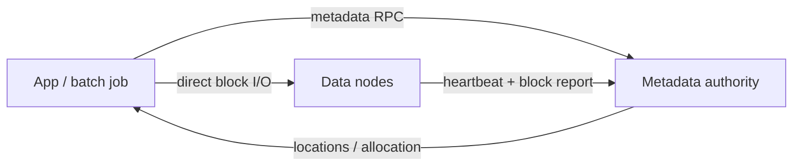

# 架构设计：商品机上的超大数据集可靠存储——元数据面与数据面分离的流式块存储

> **calibration reproduce（维护者复现校准）**：非正式金标；对照 `corpus/golden/hdfs` 打分，不冒充 GOLDEN。  
> 模式：deliverable  
> 已定关键决策：命名空间与块映射集中在元数据权威；块字节落在多台数据节点并以跨机多副本耐久；客户端拿位置后直连数据节点；命名空间用 journal + checkpoint；控制指令捎带在心跳应答；块位置 API 服务计算局部性。  
> 明确不做：块字节经元数据节点中转；以节点本地 RAID 当主耐久；完整 POSIX 优先于流式吞吐；把块位置写进持久 checkpoint；默认宣称单元数据节点无 SPOF。  
> 待验证事实：给定堆与文件数下的元数据运维上限；HA/Federation 相对「单 NN 心智」的迁移成本。

---

## 层 A — 叙事

### A1 摘要

目标是在**数千台商品机**上可靠存放超大数据集，并以高带宽**顺序流**供给批计算，让任务尽量靠近数据。成功时：路径与块→节点映射可查；内容以大块多副本分布；客户端直连数据节点读写；节点丢失后系统能再复制。失败时宁可拒绝冒险写入或换副本，也不让元数据节点去搬所有字节。

不解决：完整 POSIX 网络盘、以本地 RAID 替代跨节点副本、或把元数据面当数据中转。硬约束：商品机天天坏、流式高带宽、计算靠近数据、愿意牺牲部分 POSIX。

### A2 上下文与边界

落点：大数据平台的**存储层**——上游是 MapReduce/ETL/扫描型作业；下游是带本地盘的商品机与机架拓扑。信任边界：谁改命名空间由元数据权威决定；谁存块是注册的数据节点；客户端库隐藏「元数据 ≠ 数据」拆分。接口：类文件系统路径操作、块位置/副本因子扩展、运维侧 checkpoint/退役/均衡。

契约心智是**元数据与数据分离的块存储**，不是集中 SAN/POSIX NAS 的整盘叙事。

### A3 主路径

1. **创建/打开**：客户端向元数据权威申请；写者获租约；命名空间变更进 **WAL journal**（应答前可批处理 flush-and-sync）。  
2. **写块**：需要新块时权威分配 ID 与副本节点列表；客户端按拓扑组成 **pipeline**，数据包沿管线落盘并 ACK。  
3. **读块**：查块→副本位置（可按距离排序），**直连**可用数据节点拉取；校验失败则换副本并报告坏块。  
4. **存活修复**：数据节点 **heartbeat** 与 **block report**；权威在心跳应答中捎带再复制/删除指令——不主动对数据节点推复杂控制 RPC。

应能走通：元数据 RPC → 直连数据面 → 管线/校验 → 心跳驱动再复制。

### A4 组件与契约

| 组件 | 职责 | 可调用 | 禁止越界 |
|------|------|--------|----------|
| Client | 路径操作、组织读写管线 | 元数据 RPC + 直连 DN | 把块字节默认发往元数据节点 |
| NameNode | 命名空间、块映射、放置与修复决策 | journal/checkpoint、心跳应答 | 中转块字节；把块位置当持久 checkpoint 内容 |
| DataNode | 存块副本、校验、上报 | 客户端 I/O、心跳/报告 | 用本地 RAID 冒充集群主耐久 |
| Checkpoint / Backup 辅助 | 合并镜像或只读待命 | 与 NN 协作 | 替代跨节点副本策略 |

### A5 状态、失败与恢复

- **持久化**：命名空间镜像 + journal；块字节在数据节点；**块位置不在持久 checkpoint 内**，靠 block report 重建。  
- **节点丢失**：副本不足 → 再复制；读换健康副本。  
- **元数据权威宕机**：命名空间需 journal 回放/checkpoint 恢复；当时单 NN 设计下这是可见不可用窗口。  
- **可见故障**：空间不足拒绝写、坏块、租约冲突；恢复靠再复制、退役坏盘、checkpoint 纪律。

### A6 安全与身份

权限落在命名空间操作与（集群内）节点注册。数据面直连意味着 ACL/鉴权不能只挡在元数据 RPC；运维面（checkpoint、退役）需独立信任。若不做强多租户隔离，至少要分清「谁能改路径」与「谁能注册为数据节点」。

### A7 演进切片

| 现在 | 下一刀 | 明确不做 |
|------|--------|----------|
| 单 NN + DN 多副本 + 直连数据面 + 心跳捎带 | 标定堆/文件数运维上限；评估 HA | 数据经 NN 中转；RAID 主耐久 |
| journal + 周期 checkpoint | BackupNode/HA 待命路径 | 假装单 NN 天然无限扩展 |

### A8 如何验收

1. **刺激**：写大文件并杀一个副本节点 → **观察**：目标副本数恢复；读仍可用。  
2. **刺激**：读路径抓包/日志 → **观察**：块字节不经 NameNode，客户端直连 DN。  
3. **刺激**：重启 NameNode → **观察**：命名空间从 journal/checkpoint 恢复；块位置由 DN 报告重建而非从 checkpoint「读出全部副本表」。  
4. **刺激**：调度器查询块位置 → **观察**：能拿到副本主机以做局部性放置。  
5. **刺激**：对比「DN 本地 RAID 为主」叙述 → **观察**：设计文档明确主路径是跨节点多副本。

---

## 层 B — 机制与策略

### B1 基本事实

| 事实 | 状态 |
|------|------|
| 商品机故障是常态，不能按偶发机房事故设计 | 已证实 |
| 超大数据集顺序扫描时，元数据面不应搬字节 | 已证实 |
| 大块使元数据紧凑，利于集中权威 | 已证实 |
| 跨节点多副本同时给耐久与读带宽 | 已证实 |
| 块位置可由数据节点报告重建，不必进持久 checkpoint | 已证实 |
| 完整 POSIX（随机改写、强小文件语义）与批处理吞吐冲突 | 已证实 |
| 某集群 NN 堆与文件数的具体上限曲线 | 待验证 |

### B2 机制

「大规模可靠存储 + 高带宽供给计算」几乎总要落到：

1. **元数据 / 数据分离**（NameNode vs DataNode）。  
2. **大块 + 跨节点多副本**（非 DN 侧 RAID 主路径）。  
3. **客户端直连数据节点**传块字节。  
4. **WAL journal + checkpoint** 保护命名空间。  
5. **心跳捎带指令**（权威不主动复杂推送）。  
6. **暴露块位置**以支持计算靠近数据；（加分）写管线、读路径拓扑优选。

模式名：Primary–Secondary（NN/DN）、Replication for durability & bandwidth、WAL、Pipeline write。

### B3 策略选项

| 选项 | 依赖的事实 | 含义 |
|------|------------|------|
| A. 跨节点多副本 | 故障常态；要读带宽 | 选（主耐久） |
| B. 存储节点侧 RAID | 更像 Lustre/PVFS 路径 | 排除为主路径 |
| A. 单 NameNode（当时） | 简化一致性与放置 | 基线心智 |
| B. HA / Federation | 要消 SPOF / 扩命名空间 | 演进选项 |
| A. CheckpointNode 周期合并 | 控制 journal 长度 | 常见辅助 |
| B. BackupNode 内存同步只读 | 更快只读待命 | 对照路径 |
| （加分）批处理 journal flush | 吞吐优先于逐事务 POSIX 同步 | 可选 |

### B4 取舍

选 **集中元数据 + 大块多副本 + 直连数据面 + journal/checkpoint + 心跳捎带**，因为问题是流式高带宽与计算局部性，不是完整 POSIX 盘。

放弃：NN 中转数据、RAID 主耐久、完整 POSIX 优先、块位置持久进 checkpoint、单 NN「无代价无限扩展」。代价：元数据权威可用性/扩展上限；小文件与随机写不友好；运维必须管 checkpoint 与再复制带宽。

### B5 与对照的关系

对照 AOSA HDFS 章与 GFS 心智：

- **相对传统 NAS/SAN**：拆开元数据与数据；耐久在软件副本层。  
- **相对 Lustre/PVFS 式 RAID 叙事**：本路径以跨节点副本为主。  
- **相对后续 HA/Federation**：当时单 NN 是简化一致性的策略点，不是「天然无 SPOF」。  
- 本校准不整段套用集中 POSIX NAS 拓扑。

---

## 校准对照

- **日期**：2026-08-05  
- **skill 版本**：architecture-buddy `0.3.0`（deliverable 双层 + S6 gate）  
- **类型**：calibration reproduce / not golden

### 必中机制命中表

| 必中机制 | 判定 |
|----------|------|
| 元数据与数据分离：NN 命名空间/块映射；DN 块副本 | 命中 |
| 大块；每块独立多副本跨 DN（非 DN 本地 RAID） | 命中 |
| 客户端直连 DN；NN 只给位置/分配 | 命中 |
| WAL journal + checkpoint；块位置靠 block report 重建 | 命中 |
| NN 不主动复杂推送；指令捎带心跳应答 | 命中 |
| （加分）写管线；读拓扑优选；块位置 API / 局部性 | 命中 |

### 必中策略命中表

| 必中策略分叉 | 判定 |
|--------------|------|
| 跨节点多副本 vs 存储节点侧 RAID | 命中 |
| 单 NameNode vs 后续 HA / Federation | 命中 |
| CheckpointNode 周期合并 vs BackupNode 只读待命 | 命中 |
| （加分）批处理 flush-and-sync vs 逐事务；POSIX vs 吞吐 | 命中 |

### 幻觉黑名单检查

| 黑名单项 | 结果 |
|----------|------|
| 块字节默认经 NameNode 中转 | 未出现 |
| 耐久主路径写成 DN 本地 RAID | 未出现 |
| 块位置作为持久 checkpoint 一部分 | 未出现 |
| 单 NN 天然无 SPOF / 无限扩展且无代价 | 未出现 |
| 必须完整 POSIX 才算文件系统 | 未出现 |
| 整段套用集中 SAN/POSIX NAS 不点分离与副本 | 未出现 |

### S6 结构

| Gate 项 | 结果 |
|---------|------|
| 摘要说清解决/不解决 | 通过 |
| 信任边界 + 端到端主路径 | 通过 |
| 机制与策略分开；有为何选/不选 | 通过 |
| 失败语义 + ≥3 可测验收 | 通过（5 条） |
| 演进切片（现在/下一刀/不做） | 通过 |
| 正文几乎无内部黑话（M/S 编号） | 通过 |

### 判定

**PASS**

（本轮候选直接达标；未改 skill / 模板以凑分。透镜 GFS-MR 另轮加厚，不改变本 run 判定。）
