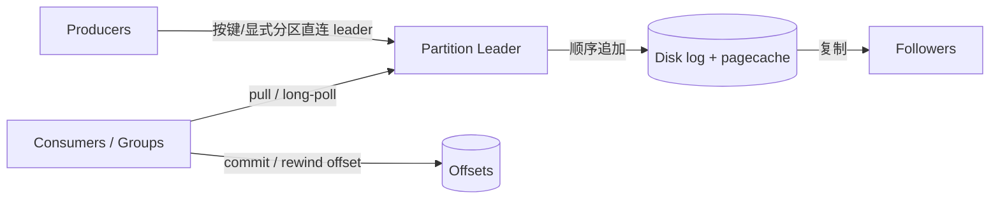

# 架构设计：把实时事件收敛成可积压、可重放的公司级分区日志平台

> **calibration reproduce（维护者复现校准）**：非正式金标；对照 `corpus/golden/kafka` 打分，不冒充 GOLDEN。  
> 模式：deliverable  
> 已定关键决策：持久化追加分区日志为统一抽象；Producer 写分区 leader；Consumer pull + consumer group；位点为可 rewind 的分区 offset；主吞吐路径依赖顺序写与 OS pagecache。  
> 明确不做：broker 默认 push；消费即删日志；堆内大缓存当主存储；跨分区全局总序承诺。  
> 待验证事实：开启 SSL 后 sendfile/零拷贝路径的吞吐折损；分层存储对「日志与 broker 共置」运维心智的影响幅度。

---

## 层 A — 叙事

### A1 摘要

目标不是再做一个「投递后消息消失」的传统队列，而是建设**统一实时数据源**：页面行为、业务事件、审计与派生流都写入同一类可共享的日志。写入要扛高吞吐，离线/周期负载要能留下大 backlog，在线订阅仍要低延迟，处理侧按分区并行，单机故障时主路径数据仍可从副本恢复。

成功时：上游把记录追加进 topic 分区；下游按自己的速率拉取并推进位点；多个独立消费组可各自重放同一段历史。不在范围内：broker 按每个慢消费者节奏 push、保证全 topic 全局总序、或把系统建成纯内存中转站。

### A2 上下文与边界

落点：数据平台 / 流式集成层。上游是业务服务与采集管道（producers）；下游是流处理、批补数、索引、监控等多类消费者。信任边界：客户端凭据决定谁能读写哪些 topic；broker 集群保管分区日志与副本；消费组协调器分配分区所有权。

对外接口：生产 API、消费 API（按分区拉取、提交/重置 offset）、保留时长与配额等运维边界。契约心智是**分布式 commit log**，不是「确认即消失」的队列状态机。

### A3 主路径

1. **生产**：应用按业务键（或显式分区号）选定 topic 分区；客户端**直连该分区 leader**，将记录（通常经批处理）追加写入。  
2. **持久化**：leader 顺序追加到磁盘日志段；热数据驻留 OS **pagecache**；按 ISR/副本配置同步到 follower，达到容错水位后对生产者确认。  
3. **消费**：同一 **consumer group** 内成员分到互不重叠的分区；消费者对负责分区 **pull**（可长轮询），用整数 **offset** 标记下一条位置。  
4. **推进与重放**：成功处理后提交 offset；纠错或重建时把位点 rewind，从仍保留的日志段重新拉取——**消费不删除日志**。

读者应能走通：键 → leader → 追加日志 → pull → offset，且不假设 broker 主动 push 到客户端。

### A4 组件与契约

| 组件 | 职责 | 可调用 | 禁止越界 |
|------|------|--------|----------|
| Producer 客户端 | 分区选择、批处理、直连 leader 写入 | 分区 leader | 假定 broker push；跨分区总序 |
| Partition leader | 追加日志、复制协调、服务 pull | 本地日志、followers | 替每个消费者维护逐条 ack 状态机 |
| Follower | 复制日志以容错 | leader 的复制流 | 接受该分区生产写入（非 leader） |
| Consumer / Group | pull、位点推进、组内分区分配 | leader、协调器 | 把「已读」解释为日志可删 |
| Offset 存储 | 记录组×分区位点 | consumers / 组协调 | 强制只能 broker 内部不可 rewind |

契约语言：分区是**并行与有序的边界**；位点是分区上的单调整数；保留策略由时间/大小决定，与消费进度解耦。

### A5 状态、失败与恢复

- **持久化**：分区日志段 + 副本；消费位点独立于日志内容。  
- **leader 故障**：选举新 leader（需满足副本水位）；生产者与消费者重连新 leader 后继续追加/拉取。  
- **慢消费者 / 大 backlog**：日志按保留策略积压；pull 模型让快慢消费者互不拖垮对方节奏。  
- **用户可见失败**：生产超时/不可用分区、消费 lag、组重平衡导致短暂停读；恢复路径是重连、等待 ISR、必要时 rewind 重放。

### A6 安全与身份

信任模型：集群边界内 broker 互信复制；客户端经认证授权访问 topic。身份边界在「谁能写/读哪些分区日志」，而非「谁持有队列中的消息所有权」。多租户依赖配额与极致效率，避免基础设施先于应用崩溃。若不部署跨租户隔离，需在演进中补强，不假装已解决。

### A7 演进切片

| 现在 | 下一刀 | 明确不做 |
|------|--------|----------|
| 分区日志 + pull + group + pagecache 主路径 | 分层存储 / 更细配额与多租户隔离 | 改成默认 push；消费即删；堆内大缓存主路径 |
| 键哈希语义分区 | 按工作负载调分区数与保留 | 承诺全 topic 全局总序 |

### A8 如何验收

1. **刺激**：向带键的 topic 持续高压写入 → **观察**：leader 磁盘顺序增长、pagecache 命中良好、生产延迟在目标内。  
2. **刺激**：消费组处理到一半停掉，稍后 rewind 到更早 offset → **观察**：仍能拉取到保留窗口内的历史记录。  
3. **刺激**：同 topic 上启动两个独立消费组 → **观察**：各自独立位点，互不影响；组内同一分区不会被两个活跃成员同时消费。  
4. **刺激**：杀掉当前分区 leader → **观察**：新 leader 接手后生产/消费恢复，已提交副本数据不丢。

---

## 层 B — 机制与策略

### B1 基本事实

| 事实 | 状态 |
|------|------|
| 海量事件写入若依赖随机寻道与每消费者元数据放大，吞吐会先垮 | 已证实（Design 动机） |
| 顺序追加到文件系统、借 OS pagecache，可同时服务持久化与热读 | 已证实 |
| 异构消费者速率差异大；broker 难为所有人选对 push 节奏 | 已证实 |
| 许多下游需要重放与大 backlog，不能「读完即删」 | 已证实 |
| 有序性通常只需在业务键局部成立，不必全 topic 总序 | 已证实 |
| SSL 下零拷贝路径受限的具体折损 | 待验证（环境相关） |

### B2 机制

该类「统一实时数据源 / 分布式日志」问题几乎绕不开：

1. **持久化追加日志**（commit / write-ahead 心智），长时间保留而非消费即删。  
2. **顺序写 + 拥抱 pagecache**，避免堆内双缓存与 GC 主导路径。  
3. **按 topic 分区**：并行单位与有序边界。  
4. **Producer 直连分区 leader**，按键语义分区（或显式指定）。  
5. **Consumer pull**（可长轮询）；位点 = 分区 offset 整数，可 rewind。  
6. **Consumer group**：组内同一分区至多一个活跃消费者；多组可并行订阅同一日志。  
7. **批处理 + 通用二进制格式 + 零拷贝/sendfile**（条件允许时）摊薄每条开销。

### B3 策略选项

| 选项 | 依赖的事实 | 含义 |
|------|------------|------|
| A. pagecache 中心日志 | 顺序写 + OS 缓存足够热 | 选：主吞吐路径 |
| B. 堆内大缓存 | 惧盘、愿付 GC/双缓存代价 | 排除为主路径 |
| A. pull（+ 长轮询） | 异构消费速率 | 选 |
| B. broker push | 假定 broker 能匹配所有消费者 | 排除为默认 |
| A. 客户端侧 offset | 需要 rewind / 多组独立进度 | 选 |
| B. broker 逐条 ack 状态机 | 传统队列心智 | 排除为主模型 |
| A. 键哈希语义分区 | 局部有序即可 | 常用默认 |
| B. 纯随机分区 | 失局部性 | 特定负载可选 |
| A. 批次端到端压缩 | 批处理已存在 | 优于逐条压缩 |

### B4 取舍

选 **持久分区日志 + pull + 客户端 offset + pagecache**，因为问题类要的是共享、可积压、可重放的实时数据源，而不是「每人一条 ack 队列」。

明确放弃：默认 push（难匹配异构速率）、消费即删（失重放）、堆内大缓存主路径（GC/双缓存）、全 topic 全局总序（吞吐与扩展代价过高）。代价：用户要理解「像队列但可 rewind」；运维要管磁盘保留与副本；SSL 可能削弱零拷贝。

### B5 与对照的关系

对照过官方 Design 叙述，并短对照 Pulsar 类「存储与计算分离」路线：

- **教训（Kafka 侧）**：统一日志心智与运维简单性，用 pagecache + 分区换多组件分离的复杂度。  
- **教训（对照侧）**：若独立扩缩存储是硬事实，BookKeeper/分层存储类策略更贴；本校准以 Design 时代「共置日志」心智为基线，不整段套用 Pulsar 叙事。

---

## 校准对照

- **日期**：2026-08-05  
- **skill 版本**：architecture-buddy `0.3.0`（deliverable 双层 + S6 gate）

### 必中机制命中表

| 必中机制 | 判定 |
|----------|------|
| 持久化追加日志（非内存队列+消费即删） | 命中 |
| 拥抱文件系统与 OS pagecache；顺序写 | 命中 |
| 消息按 topic 分区；分区=并行与有序边界 | 命中 |
| Producer 直连分区 leader；按键语义分区 | 命中 |
| Consumer pull（可长轮询）；位点=offset | 命中 |
| Consumer group；可 rewind/重放 | 命中 |
| 长时间保留支撑 backlog（非消费即删） | 命中 |

### 必中策略命中表

| 必中策略分叉 | 判定 |
|--------------|------|
| pagecache 中心日志 vs 堆内大缓存 | 命中 |
| pull vs broker push | 命中 |
| 客户端 offset vs broker 逐条 ack | 命中 |
| （加分）键哈希 vs 随机；批次压缩 vs 逐条 | 命中 |

### 幻觉黑名单检查

| 黑名单项 | 结果 |
|----------|------|
| 必须/默认 broker push | 未出现 |
| 消费后必须从日志删除、无法重放 | 未出现 |
| 位点只能 broker 逐条 ack、客户端不可 rewind | 未出现 |
| 不能落盘/必须纯内存才高吞吐 | 未出现 |
| 全 topic 全局总序且无分区限定 | 未出现 |
| 整段 JMS/AMQP 消费即消失叙事 | 未出现（已点出日志差异） |

### S6 结构

| Gate 项 | 结果 |
|---------|------|
| 摘要说清解决/不解决 | 通过 |
| 信任边界 + 端到端主路径 | 通过 |
| 机制与策略分开；有为何选/不选 | 通过 |
| 失败语义 + ≥3 可测验收 | 通过（4 条） |
| 演进切片（现在/下一刀/不做） | 通过 |
| 正文几乎无内部黑话（M/S 编号） | 通过 |

### 判定

**PASS**

（本轮候选直接达标；未改 skill / 模板。）
