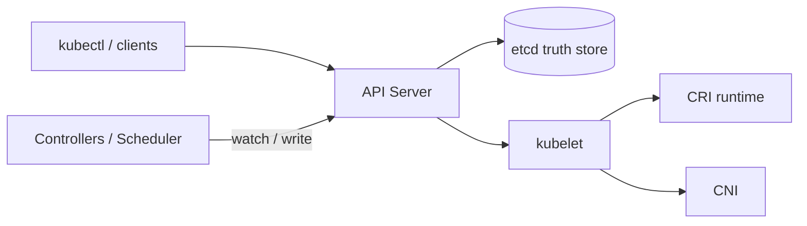

# 架构设计：在集群上声明期望状态并由控制面持续调和到实际状态

> **calibration reproduce（维护者复现校准）**：非正式金标；对照 `corpus/golden/kubernetes` 打分，不冒充 GOLDEN。  
> 模式：deliverable  
> 已定关键决策：控制面与节点分离；声明式 API；controller reconcile；etcd 为真相源；API Server 为唯一正规前门；运行时/网络可插拔（CRI/CNI）。  
> 明确不做：SSH 进节点改容器当作集群真相；kubelet 绕过 API 直写 etcd 作为正规扩展；把 API Server 当成有状态真相源本身；生产默认「单机控制面无备份无容错叙述」。  
> 待验证事实：具体托管发行版上 cloud-controller 与 CNI 自带转发的默认裁剪组合；etcd 容量阈值与备份 RPO 的环境标定。

---

## 层 A — 叙事

### A1 摘要

问题类：在机器集群上运行容器化工作负载——用户提交**期望状态**，控制面持续 **reconcile**，把实际状态拉近期望。成功时：`kubectl apply` 一类声明进入系统后，调度、拉起、联网与自愈按对象规格发生，而无需人逐步远程指挥每台机器。

不解决：把节点本地改动当作权威配置源；允许节点组件绕过前门改集群真相；或在无容错叙述下把单机控制面默认为生产架构。

硬约束：生产控制面需可容错；状态需强一致存储；节点侧运行时/网络可插拔；**API 是唯一正规前门**。

### A2 上下文与边界

落点：容器编排控制面 + 工作节点。信任边界：所有集群状态读写经 **API Server**；**etcd** 持久化对象；控制器与调度器只通过 API 观察与更新；**kubelet** 等节点代理按分配到本节点的规格驱动 CRI/CNI，不直写 etcd。

外部接口：声明式 HTTP/gRPC API、认证鉴权、admission；节点上的运行时与网络插件；可选云控制器对接云资源。

### A3 主路径

一条「部署工作负载」的端到端路径：

1. **声明**：用户 `kubectl apply` 提交 Deployment/Pod 等期望对象。  
2. **前门**：请求经认证/鉴权/admission 进入 **API Server**；对象写入 **etcd**。  
3. **观察**：相关 **controller** watch 到期望变化，diff 实际（如 ReplicaSet/Pod 集合），写回更多对象以缩小差距。  
4. **调度**：Scheduler 为待调度 Pod 选节点，经 API 绑定。  
5. **执行**：目标节点 **kubelet** 察觉绑定到本节点的 Pod，经 **CRI** 拉镜像/起容器，经 **CNI** 配网；状态经 API 回报。  
6. **持续调和**：若容器退出或节点异常，控制器再次行动，直到实际逼近期望或进入可观察失败态。

读者应能走通：apply → API Server → etcd → controller watch → 节点执行，且不经过「SSH 改容器 = 真相」。

### A4 组件与契约

| 组件 | 职责 | 可调用 | 禁止越界 |
|------|------|--------|----------|
| API Server | 无状态前门 / Gateway；校验与持久化入口 | etcd、客户端、控制器、kubelet | 自己充当长期真相源存储 |
| etcd | 集群状态真相源 | 仅 API Server（正规路径） | 任意节点组件当共享文件夹写入 |
| Controllers | reconcile：watch → diff → act | API Server | 绕过 API 直改 etcd/节点 |
| Scheduler | 为 Pod 选节点 | API Server | 直接起容器 |
| kubelet | 节点代理：执行本节点 Pod 规格 | CRI/CNI、API（状态上报） | 绕过 API 写 etcd 作扩展 |
| CRI / CNI | 可插拔运行时与网络 | kubelet / 插件约定 | 成为集群对象权威存储 |
| cloud-controller-manager（可选） | 云相关控制循环 | API + 云 API | 与通用控制无边界混责时需策略说明 |

分层契约：**API → 控制器 → 节点代理**；扩展（CRD/聚合 API）仍经 API，不另辟直写 etcd 的「捷径」。

### A5 状态、失败与恢复

- **持久化**：etcd 中的 API 对象；节点上的容器是实际态，须被 reconcile 对齐。  
- **控制面故障**：生产应多机/托管高可用；etcd 备份与容量是架构级风险。  
- **节点故障**：控制器把工作负载迁走或标记不可调度；kubelet 本地重启策略与控制面决策配合。  
- **用户可见失败**：Pending（调度不了）、CrashLoop、ImagePullBackOff、配额拒绝；恢复靠改声明、扩容、修插件或等调和，而不是手改 etcd。

### A6 安全与身份

信任模型：客户端与组件身份（证书/令牌/ServiceAccount）经 API Server 鉴权；RBAC 与 admission 决定谁能改哪些对象。节点组件凭证作用域应最小：kubelet 不应被授予「直写 etcd」式权力。云凭证若使用，宜落在 cloud-controller 边界，避免与通用控制面凭证混用。

### A7 演进切片

| 现在 | 下一刀 | 明确不做 |
|------|--------|----------|
| 声明式 API + reconcile + etcd + API 前门 | 按规模选择控制面部署变体与插件裁剪 | 正规化「绕过 API 写 etcd」 |
| CRI/CNI 可插拔 | 云控制器拆分、CNI 自带转发等策略落地 | SSH 改容器当集群真相；无容错单机生产默认 |

### A8 如何验收

1. **刺激**：`kubectl apply` 一个多副本 Deployment → **观察**：API 对象入 etcd；ReplicaSet/Pod 被创建；节点上出现对应容器；副本数趋近期望。  
2. **刺激**：删掉一个 Pod → **观察**：控制器再建 Pod，无需人工 SSH 拉起。  
3. **刺激**：尝试在文档正规路径外让节点组件直写 etcd → **观察**：不被接受为支持扩展；合法变更仍须经 API Server。  
4. **刺激**：控制面一副本故障（在多机部署下）→ **观察**：API 仍可用或按 HA 设计恢复；etcd 数据不依赖「某台 kubelet 的本地文件」当真相。

---

## 层 B — 机制与策略

### B1 基本事实

| 事实 | 状态 |
|------|------|
| 集群状态必须有单一强一致真相源，否则控制循环无法收敛 | 已证实 |
| 用户与自动化必须以同一前门读写状态，否则扩展与审计崩坏 | 已证实 |
| 编排决策与容器执行的故障域应分离 | 已证实 |
| 运行时与网络实现多样，内核机制需可插拔 | 已证实 |
| 生产控制面单点足够「碰运气」而非常态 | 已证实（需 HA/托管叙述） |
| 某托管发行版默认裁剪 kube-proxy / CCM 的组合 | 待验证 |

### B2 机制

该类「声明式集群编排」问题几乎绕不开：

1. **控制面 / 节点（数据面）分离**：决策在控制面，执行在节点。  
2. **声明式 API**：提交期望对象，而非逐步命令式驱动内部。  
3. **Controller reconcile**：watch 差异 → 行动缩小差距（控制循环）。  
4. **etcd（或等价一致存储）** 为真相源。  
5. **API Server** 无状态前门 / Gateway：唯一正规读写入口。  
6. **可插拔** CRI、CNI（及可替换调度器、CRD/聚合 API）。  
7. （加分）分层 API → 控制器 → 节点代理；扩展不绕过 API。

### B3 策略选项

| 策略维 | 选项 | 含义 |
|--------|------|------|
| 控制面部署 | 传统多机 / Static Pod / Self-hosted / Managed | 运维复杂度与责任边界不同 |
| 节点转发 | kube-proxy vs CNI 自带转发 | 节点组件可裁剪 |
| 云控制 | cloud-controller-manager 拆分 vs 与通用控制混部 | 云相关循环边界 |
| 布局 | 小集群混部控制面 vs 生产专用控制面节点 | 规模驱动 |

本设计不绑定单一托管产品，但要求：生产路径显式选择上述变体之一，并写清责任边界。

### B4 取舍

选 **声明式 + reconcile + etcd 真相 + API 唯一前门 + 可插拔节点机制**，因为问题是「持续逼近期望」，不是「远程执行脚本」。

明确放弃：命令式直改节点当真相、绕过 API 写 etcd、不可插拔绑死运行时、无容错单机控制面当生产默认。代价：心智从「我刚才 ssh 改了什么」转向「对象与调和」；etcd 备份/容量成为一等运维问题；插件矩阵增加集成面。

### B5 与对照的关系

对照 Kubernetes 官方 Cluster Architecture：

- **教训**：先写清角色分工与真相源，再列组件清单；「Architecture variations」本身就是策略目录范例。  
- **差异策略**：逻辑多控制器、物理上常打包进少数二进制——简化部署但耦合进程生命周期；选型时要在运维简单与故障域之间显式取舍。

---

## 校准对照

- **日期**：2026-08-05  
- **skill 版本**：architecture-buddy `0.3.0`（deliverable 双层 + S6 gate）

### 必中机制命中表

| 必中机制 | 判定 |
|----------|------|
| 控制面与节点分离 | 命中 |
| 声明式 API | 命中 |
| Controller reconcile | 命中 |
| etcd 为真相源 | 命中 |
| API Server 无状态前门 | 命中 |
| 可插拔 CRI/CNI 等 | 命中 |
| （加分）分层；扩展不绕过 API | 命中 |

### 必中策略命中表

| 必中策略分叉 | 判定 |
|--------------|------|
| 控制面部署变体（传统/Static Pod/Self-hosted/Managed） | 命中 |
| kube-proxy vs CNI 自带转发 | 命中 |
| cloud-controller-manager 拆分 vs 混部 | 命中 |
| （加分）小集群混部 vs 生产专用控制面节点 | 命中 |

### 幻觉黑名单检查

| 黑名单项 | 结果 |
|----------|------|
| kubelet 绕过 API 直改 etcd 为正规扩展 | 未出现（明确禁止） |
| etcd 可被任意节点组件当共享文件夹写 | 未出现 |
| 没有声明式 / 只有命令式为默认心智 | 未出现 |
| API Server 即有状态真相源 | 未出现（区分前门与 etcd） |
| 单机无备份当生产默认且无容错叙述 | 未出现 |
| SSH 改容器 = 集群真相且不点出 reconcile | 未出现 |

### S6 结构

| Gate 项 | 结果 |
|---------|------|
| 摘要说清解决/不解决 | 通过 |
| 信任边界 + 端到端主路径 | 通过 |
| 机制与策略分开；有为何选/不选 | 通过 |
| 失败语义 + ≥3 可测验收 | 通过（4 条） |
| 演进切片 | 通过 |
| 正文几乎无内部黑话 | 通过 |

### 判定

**PASS**

（本轮候选直接达标；未改 skill / 模板。）
