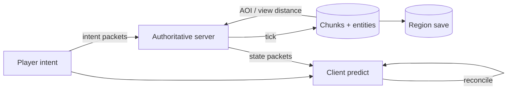

# 架构设计：多人共享体素与实体模拟——权威服、兴趣同步与客户端和解

> **calibration reproduce（维护者复现校准）**：非正式金标；对照 `corpus/golden/minecraft` 打分，不冒充 GOLDEN。  
> 模式：deliverable  
> 已定关键决策：服务端拥有世界权威；离散 tick 推进规则；按区块/兴趣区域裁剪同步；客户端可预测并以服务端和解；内容扩展走数据驱动/模组边界且不得绕过权威。  
> 明确不做：写成「如何编写 Bukkit/Paper 插件」教程；假装存在 Mojang 官方完整架构白皮书正典；默认全图广播或客户端可信；用启动器模块图冒充共享模拟架构。  
> 待验证事实：具体版本协议字段/包 ID；某第三方服区域并行收益；某加载器类隔离细节。  
> **诚实边界**：基于公开 wiki、协议文档与社区/第三方叙述的**合理重构**，**非**厂商正典白皮书。

---

## 层 A — 叙事

### A1 摘要

目标是一类**多人共享模拟**问题：在体素世界与实体之上维持可作弊抵抗的权威状态，按可理解的时间步推进规则，并把每个玩家**需要看见的那一块**高效同步出去——同时让本地操作不必等满 RTT 才有反馈。

成功时：破坏、移动、攻击与库存以服务端结果为准；远处玩家不收全图；预测冲突能收敛；模组/数据包扩展仍落在权威与协议边界内。失败时宁可回滚/拒绝非法动作，也不让客户端成为第二真相。

不解决：插件热重载教程、单机存档编辑器心智、纯客户端美化。问题类是共享体素/实体模拟，不是「怎么写 Java 插件」。

### A2 上下文与边界

落点：**共享世界模拟与状态同步层**。上游：玩家输入、命令、模组/数据包内容。下游：持久化区块、客户端渲染与本地预测。信任边界：客户端不可信；认证会话后只应提交意图，由服务端裁决；双侧模组仍须服从服务端规则与协议兼容。

与 CRUD 业务后端或「通用微服务拓扑」边界：对内是**离散 tick 上的权威世界机** + **按兴趣裁剪的协议复制**，不是请求/响应式业务 API。

### A3 主路径

1. **兴趣加载**：玩家移动使新区块进入视距；服务端加载/生成区块，经协议下发区块与相关实体；离开视距则停更并对端卸载视图。  
2. **意图上行**：客户端发送移动/交互等意图包（非「我已经挖成功了」的权威断言）。  
3. **Tick 裁决**：服务端在模拟循环中推进世界规则，应用合法意图，更新方块/实体/库存。  
4. **状态下行**：按兴趣把变更发给相关客户端。  
5. **和解**：客户端本地预测（如移动）与权威状态冲突时以服务端为准收敛。

应能走通：兴趣加载 → 意图 → tick 裁决 → 状态同步 → 和解。

### A4 组件与契约

| 组件 | 职责 | 可调用 | 禁止越界 |
|------|------|--------|----------|
| Client | 渲染、预测、发意图 | 协议上行 | 自称权威世界/库存结果 |
| Authoritative server | tick 模拟、裁决、兴趣裁剪 | 世界状态、协议下行 | 默认信任客户端坐标/库存 |
| Chunk / region system | 空间分区、加载与存档 | 磁盘区域 | 无 AOI 全图推所有更新 |
| Protocol session | 登录→游戏态包方向 | 双端编解码 | 绕过服务端改权威状态 |
| Mod / datapack loader | 内容与行为扩展 | 数据与加载边界 | 把「写插件教程」当架构主叙事 |

### A5 状态、失败与恢复

- **权威状态**：在线世界（方块、实体、库存）；区块可持久到区域文件。  
- **网络抖动**：预测与权威短暂分叉 → 和解/橡皮筋；非法包拒绝。  
- **过载**：tick 落后、区块生成排队；兴趣裁剪与视距是第一道阀门。  
- **扩展冲突**：模组协议不兼容 → 分叉世界或拒绝入服，而非静默双真相。  
- **可见故障**：橡皮筋、方块回弹、踢出、区块空洞；恢复靠重同步兴趣视图、重连、回档区域。

### A6 安全与身份

会话认证后仍假设客户端敌意：所有改变世界的效果以服务端校验为准。反作弊是权威模拟的延伸，不是可选插件附录。模组双侧存在时，身份与能力边界仍在服务端规则，不在客户端声称。

### A7 演进切片

| 现在 | 下一刀 | 明确不做 |
|------|--------|----------|
| 单逻辑权威 + tick + 区块 AOI + 预测和解 | 标定视距/实体跟踪成本 | 客户端可信；全图广播 |
| 数据驱动/模组服从权威 | 评估代理多服或区域并行 | 假白皮书；插件教程当问题类 |

### A8 如何验收

1. **刺激**：客户端伪造「已挖掉方块」包 → **观察**：服务端拒绝或世界不采纳；权威状态不变。  
2. **刺激**：两名玩家相距很远同时行动 → **观察**：彼此不收到对方全部方块/实体更新（兴趣裁剪）。  
3. **刺激**：注入延迟后快速移动 → **观察**：本地预测有反馈，随后与服务端和解（非要求零延迟完美一致且无机制）。  
4. **刺激**：走进新区域 → **观察**：区块加载包到达后再能交互该处方块。  
5. **刺激**：审查设计文档出处 → **观察**：标明公开 wiki/协议/社区重构，不声称 Mojang 官方完整架构白皮书正典。

---

## 层 B — 机制与策略

### B1 基本事实

| 事实 | 状态 |
|------|------|
| 客户端不可信；作弊与不一致代价高 | 已证实 |
| 全图广播带宽/CPU 不可行 | 已证实 |
| 纯等服务端确认会损害操作手感 | 已证实 |
| 空间上可用区块做加载与同步单位 | 已证实 |
| 离散 tick 是经典共享规则推进方式 | 已证实 |
| **无公开厂商完整架构白皮书**；本叙述为合理重构 | 已证实（诚实边界） |
| 某第三方区域并行在给定硬件上的收益 | 待验证 |

### B2 机制

「共享体素/实体模拟世界」几乎总要落到：

1. **服务端权威世界状态**（方块/实体/库存）。  
2. **离散 tick 模拟循环**（非纯事件驱动 CRUD）。  
3. **区块（chunk）** 作空间分区与加载/同步单位。  
4. **兴趣管理 / 视距裁剪（AOI）**——非默认全图广播。  
5. **协议化同步**：意图上行、状态下行。  
6. **客户端预测 + 与服务端和解**（冲突以权威为准）。  
7. **可模组/数据驱动扩展**服从权威与协议兼容（不是只讲怎么写插件）。

### B3 策略选项

| 选项 | 依赖的事实 | 含义 |
|------|------------|------|
| A. 单线程/单世界 tick | 易推理；经典心智 | 常见基线 |
| B. 区域并行模拟 | 要吞吐；接受跨区交互代价 | 演进/第三方路径 |
| A. 单逻辑权威服 | 一致性简单 | 选（默认） |
| B. 代理/群组多逻辑服 | 要扩容与玩法隔离 | 对照选项 |
| A. 弱预测 | 和解简单 | 可选 |
| B. 强预测 | 手感更好；作弊面与和解更难 | 可选 |
| （加分）数据驱动 vs 深度模组/改协议；接近原版 vs 优化服 | 兼容 vs 性能 | 可选维 |

### B4 取舍

选 **服务端权威 + tick + 区块 AOI + 协议意图/状态 + 预测和解**，因为问题是共享模拟与同步，不是插件 API 教程，也不是 CRUD 后端。

放弃：客户端可信、全图广播、假白皮书正典、教程化主叙事。代价：服务端 CPU/tick 成热点；预测带来和解与反作弊面；扩容常要在「单世界」与「代理多服/区域并行」之间付一致性或玩法隔离成本。

### B5 与对照的关系

- **相对插件开发叙事**：API 是扩展手段，问题类仍是权威模拟与同步。  
- **相对 Folia/代理生态**：作策略分叉材料，不宣布为原版唯一正典。  
- **相对微服务/CRUD**：机制不对齐；禁止整段套用。  
- 诚实：公开资料重构，非厂商白皮书。

---

## 校准对照

- **日期**：2026-08-05  
- **skill 版本**：architecture-buddy `0.3.0`（deliverable 双层 + S6 gate）  
- **类型**：calibration reproduce / not golden

### 必中机制命中表

| 必中机制 | 判定 |
|----------|------|
| 服务端权威世界状态；客户端不可信 | 命中 |
| 离散 tick 模拟循环 | 命中 |
| 区块作为空间分区与加载/同步单位 | 命中 |
| 兴趣管理 / 视距裁剪；非全图广播 | 命中 |
| 协议化：意图上行、状态下行 | 命中 |
| 客户端预测 + 服务端和解 | 命中 |
| 可模组/数据驱动扩展服从权威（非插件教程主叙事） | 命中 |

### 必中策略命中表

| 必中策略分叉 | 判定 |
|--------------|------|
| 单线程/单世界 tick vs 区域并行 | 命中 |
| 单逻辑权威服 vs 代理/群组多逻辑服 | 命中 |
| 弱预测 vs 强预测 | 命中 |
| （加分）数据驱动 vs 深度模组；原版语义 vs 优化服 | 命中 |

### 幻觉黑名单检查

| 黑名单项 | 结果 |
|----------|------|
| 声称 Mojang/Microsoft 官方完整架构白皮书正典 | 未出现 |
| 问题类写成如何编写 Bukkit/Spigot/Paper 插件为主 | 未出现 |
| 客户端拥有权威 / 默认信任客户端坐标与库存 | 未出现 |
| 默认全图广播且无兴趣裁剪必要 | 未出现 |
| 否认预测/和解又要求零延迟完美一致 | 未出现 |
| 整段套用微服务/CRUD 拓扑冒充共享世界模拟 | 未出现 |

### S6 结构

| Gate 项 | 结果 |
|---------|------|
| 摘要说清解决/不解决 | 通过 |
| 信任边界 + 端到端主路径 | 通过 |
| 机制与策略分开；有为何选/不选 | 通过 |
| 失败语义 + ≥3 可测验收 | 通过（5 条） |
| 演进切片（现在/下一刀/不做） | 通过 |
| 正文几乎无内部黑话（M/S 编号） | 通过 |
| 诚实边界：非厂商正典白皮书 | 通过 |

### 判定

**PASS**

（本轮候选直接达标；未改 skill / 模板以凑分。）
