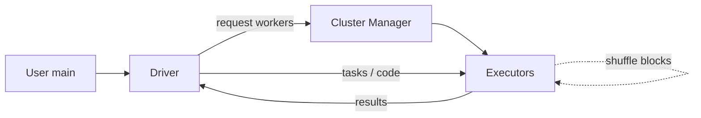

# 架构设计：商品机上的通用数据并行——惰性 DAG、Shuffle 边界与血缘容错

> **calibration reproduce（维护者复现校准）**：非正式金标；对照 `corpus/golden/spark` 打分，不冒充 GOLDEN。  
> 模式：deliverable  
> 已定关键决策：Driver 持上下文并调度；Executor 跑 task 并可保留分区；transformation 惰性构图、action 触发 Job；宽依赖 shuffle 切开 Stage；容错以血缘重算为主、persist 加速复用；引擎与 Cluster Manager 解耦。  
> 明确不做：「无磁盘 / 永不 shuffle」神话；否认 lineage；绑死某一种资源管理器；把每个 transformation 默认立即物化到外部存储。  
> 待验证事实：具体版本 AQE/Catalyst 对某 SQL 的 stage 合并细节；给定集群 shuffle 磁盘水位曲线。

---

## 层 A — 叙事

### A1 摘要

目标是在商品机集群上做**通用数据并行计算**：多阶段流水线、迭代与交互能复用工作集，节点失败时仍能从 source 血缘恢复——不是「再包一层两阶段 MapReduce」，也不是「全程纯内存永不落盘」。

成功时：程序在 Driver 描述变换；Executor 并行跑 task；只有 action 才真正算；跨分区重分布时付出 shuffle；可对热点数据显式 persist。失败时丢分区按 lineage 重算。不解决：假装无 shuffle、否认磁盘 spill、或引擎与单一 Cluster Manager 绑死。

硬约束：多阶段、迭代/交互复用、分区并行、商品机故障常态。

### A2 上下文与边界

落点：**计算引擎层**——上游是 HDFS/对象存储等数据集与用户程序；下游是聚合结果、物化表、迭代中间态与交互应答。信任边界：谁能提交到队列/Cluster Manager；Executor 属于单个 Application（JVM 级隔离）；数据面受存储 ACL 约束。接口：`spark-submit` 与配置、Driver API（RDD/DataFrame）、Driver UI。

与「单次 MapReduce」边界：仍可跑批，但对内是**惰性 DAG + 可选内存工作集 + 血缘**——Stage 可多于两个，复用不必每阶段写回外部存储。

### A3 主路径

1. **资源**：Driver（client 或 cluster 模式）建 SparkContext，向 **Cluster Manager**（Standalone / YARN / Kubernetes…）申请 **Executor**，分发代码。  
2. **惰性构图**：transformation 只记录血缘/计划，不立即全量物化。  
3. **Action 触发**：形成 Job；调度器按**宽依赖（shuffle）**切 **Stage**；窄依赖可流水线进同一 Stage；每个 Stage 拆成 Task 下发 Executor。  
4. **Shuffle（若有）**：序列化、本地磁盘（含 spill）、网络拉块——昂贵路径，不是纯内存魔法。  
5. **复用与容错**：persist/cache 按 StorageLevel 保留分区以加速；Executor/分区丢失仍按 **lineage 重算**。

应能走通：申请 Executor → 惰性图 → Action → Stage/Task →（可选）Shuffle → 结果/缓存。

### A4 组件与契约

| 组件 | 职责 | 可调用 | 禁止越界 |
|------|------|--------|----------|
| Driver / SparkContext | 构图、调度、收集结果 | Cluster Manager、Executor | 假定远端数据「已算完」而不触发 action |
| Executor | 跑 task；可跨 task 保留分区 | 本地盘/内存、shuffle 服务 | 跨 Application 直接共享 JVM 缓存当契约 |
| Cluster Manager | 分配进程/资源 | 启动 Executor | 被叙述成唯一可运行的平台 |
| DAG / Stage 调度 | 按依赖切阶段 | Task 集合 | 把宽依赖当成与窄依赖一样无代价流水线 |

### A5 状态、失败与恢复

- **工作集**：persist 的分区在 Executor 内存/磁盘；**不取消**血缘。  
- **Shuffle 文件**：本地盘可积压；长作业需管磁盘水位。  
- **Executor 失败**：丢失分区按 lineage 重算；不是「数据永久没了」。  
- **Driver 失败**：应用级失败（部署模式影响恢复叙述）；Driver 须对 Executor 可寻址。  
- **可见故障**：OOM、shuffle 拉取失败、推测执行抢跑；恢复靠重试 task / 重算分区 / 调 StorageLevel。

### A6 安全与身份

提交身份与队列配额在 Cluster Manager / 平台侧；Executor 访问存储凭应用凭证。应用级隔离意味着跨 SparkContext 不共享内存缓存——敏感数据落地 persist 时要考虑磁盘与副本 StorageLevel 的暴露面。

### A7 演进切片

| 现在 | 下一刀 | 明确不做 |
|------|--------|----------|
| Driver–Executor + 惰性 DAG + shuffle 切 Stage + lineage | 标定 shuffle 磁盘与 persist 策略 | 「无磁盘/无 shuffle」宣传 |
| 对 CM 无关（YARN/K8s/Standalone） | 演练 client vs cluster 部署距离成本 | 绑死单一资源面 |
| RDD 心智可对照 DataFrame | SQL/AQE 仍服从 stage/shuffle | 用高级 API 否认物理 shuffle |

### A8 如何验收

1. **刺激**：只跑 transformation 链、无 action → **观察**：无全量作业执行（惰性）。  
2. **刺激**：对含 join/repartition 的 action 看 Stage 图 → **观察**：宽依赖处出现 Stage 边界与 shuffle。  
3. **刺激**：kill 一个 Executor 后重跑依赖缓存的 action → **观察**：丢分区可按血缘重算完成（非永久失败）。  
4. **刺激**：同一应用两次 action，中间 persist → **观察**：第二次明显少算；关掉 persist 则按血缘重来。  
5. **刺激**：分别在 YARN 与 Kubernetes 提交 → **观察**：同一应用模型可跑；CM 只负责资源。

---

## 层 B — 机制与策略

### B1 基本事实

| 事实 | 状态 |
|------|------|
| 迭代/交互需要跨轮复用，不能默认每阶段落外部存储 | 已证实 |
| 跨分区重分布必然涉及序列化、磁盘与网络 | 已证实 |
| 分区丢失可用确定性血缘重算恢复 | 已证实 |
| 资源申请可与计算引擎解耦 | 已证实 |
| transformation 与 action 语义不同（惰性 vs 触发） | 已证实 |
| 某版本 AQE 对具体 SQL 的 stage 合并细节 | 待验证 |

### B2 机制

「通用数据并行 / DAG 惰性求值」几乎总要落到：

1. **Driver vs Executor** 职责分离。  
2. **惰性 transformation；action 触发 Job**。  
3. **Job → Stage → Task**；Stage 边界由 **shuffle（宽依赖）** 切开；窄依赖可流水线。  
4. **Shuffle 昂贵**（序列化、spill、网络）。  
5. **Lineage 重算**容错；persist/cache 加速但不取消血缘。  
6. （加分）对 Cluster Manager 无关；client vs cluster 部署。

模式名：Driver–Worker、Lazy Evaluation + Lineage、DAG Scheduler、Wide dependency / Shuffle、Persist with StorageLevel。

### B3 策略选项

| 选项 | 依赖的事实 | 含义 |
|------|------------|------|
| A. 多阶段 DAG + 工作集复用 | 迭代/交互常见 | 选 |
| B. MR 式每阶段物化外部存储 | 只要一次性两阶段 | 对照/排除为主路径 |
| A. 显式 persist/cache | 复用热点 | 选（按需） |
| B. 默认每 action 全量按血缘重算 | 正确但迭代慢 | 默认基线 |
| A. Standalone / YARN / K8s | 平台已有资源面 | 选解耦 |
| B. 引擎绑死专用资源管理器 | 运维只认一种 | 排除 |
| （加分）cluster vs client 部署；RDD vs DataFrame | 运维距离 / API 优化 | 可选维 |

### B4 取舍

选 **惰性 DAG + shuffle 切 Stage + lineage + 可选 persist + CM 解耦**，因为要的是多阶段与复用，不是「每阶段落 HDFS」的 MR 硬套，也不是纯内存神话。

放弃：无磁盘叙事、否认 shuffle、绑死 CM、transformation 立即全量物化。代价：内存与 shuffle 调优成为日常；应用级隔离使跨作业共享缓存要走外部存储；Driver 位置影响调度延迟。

### B5 与对照的关系

短对照 MapReduce / HDFS 存储心智（不整段套用）：

- **相对 MR**：放弃「每 stage 必须落外部存储」的默认，换来内存压力与 shuffle 运维。  
- **相对「取消分区并行」幻想**：Spark 仍是分区并行；宽依赖仍要付 shuffle。  
- **相对某单一 YARN 传说**：官方心智是引擎与资源管理器解耦。  
- 本校准不把 HDFS 存储叙事整段搬进计算引擎主路径。

---

## 校准对照

- **日期**：2026-08-05  
- **skill 版本**：architecture-buddy `0.3.0`（deliverable 双层 + S6 gate）  
- **类型**：calibration reproduce / not golden

### 必中机制命中表

| 必中机制 | 判定 |
|----------|------|
| Driver vs Executor 职责分离 | 命中 |
| 惰性 transformation；action 触发 Job | 命中 |
| Stage 由 shuffle/宽依赖切开；窄依赖可流水线 | 命中 |
| Shuffle 涉及序列化/磁盘 spill/网络 | 命中 |
| 容错靠 lineage 重算；persist 不取消血缘 | 命中 |
| （加分）对 CM 无关；client/cluster 部署 | 命中 |

### 必中策略命中表

| 必中策略分叉 | 判定 |
|--------------|------|
| 多阶段 DAG+内存复用 vs MR 每阶段物化外部存储 | 命中 |
| 显式 persist/cache vs 默认每 action 重算 | 命中 |
| Standalone vs YARN vs Kubernetes（引擎与 CM 解耦） | 命中 |
| （加分）cluster vs client；RDD vs DataFrame 仍服从 stage/shuffle | 命中 |

### 幻觉黑名单检查

| 黑名单项 | 结果 |
|----------|------|
| 「无磁盘 / 永不 shuffle / 全程纯内存」 | 未出现 |
| Executor 失败后永久丢失且无法血缘重算 | 未出现 |
| 必须绑死某一种 Cluster Manager | 未出现 |
| transformation 默认立即全量物化 / 与 action 混淆 | 未出现 |
| 宽依赖与窄依赖一样无代价流水线 | 未出现 |
| 整段套用「MR 两阶段必落 HDFS」或不点 DAG/复用差异 | 未出现 |

### S6 结构

| Gate 项 | 结果 |
|---------|------|
| 摘要说清解决/不解决 | 通过 |
| 信任边界 + 端到端主路径 | 通过 |
| 机制与策略分开；有为何选/不选 | 通过 |
| 失败语义 + ≥3 可测验收 | 通过（5 条） |
| 演进切片（现在/下一刀/不做） | 通过 |
| 正文几乎无内部黑话（M/S 编号） | 通过 |

### 判定

**PASS**

（本轮候选直接达标；未改 skill / 模板以凑分。）
