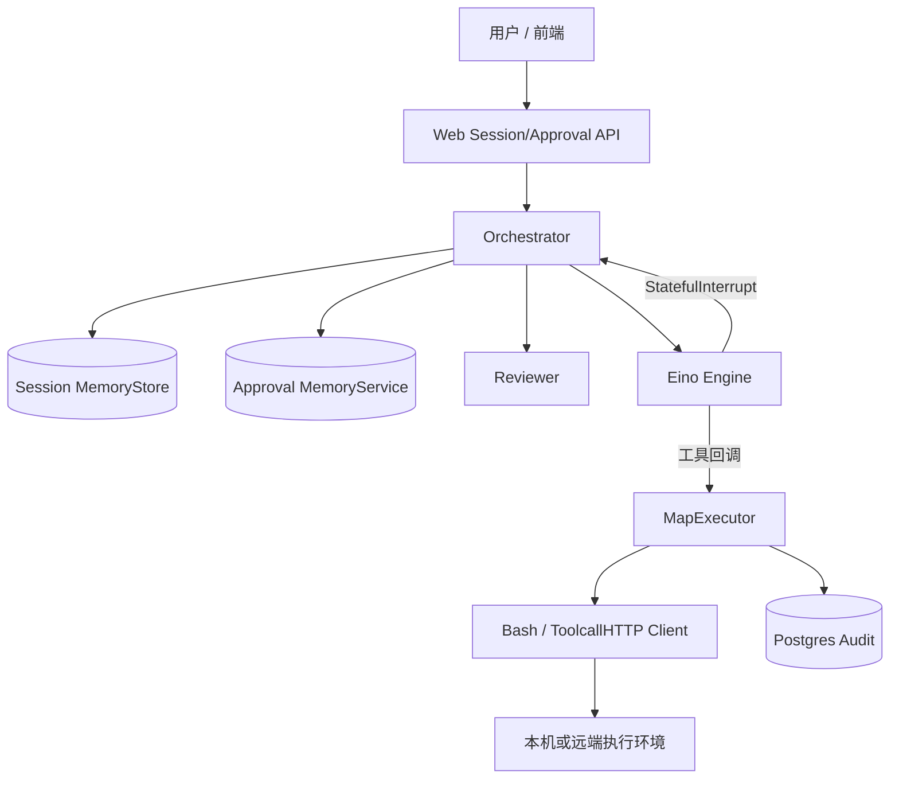

# 架构设计：自然语言运维意图如何变成「可拦、可批、可举证」的副作用

> **标签：live user-path test / deliverable**（非正式金标；非 calibration reproduce；非对 agent-runtime 金标的复现考试）  
> 模式：deliverable  
> 源码只读目标：`/Users/apple/Desktop/xe6/project/SRE-Buddy`（仓库目录为 `Backend/`，Go module import 为 `backend/`）  
> 已定关键决策（以当前主进程装配为准）：工具真实副作用只经 `tool.Executor`；模型提议后由 PendingToolGate 打断；审查/人工审批在编排层决定是否 Resume；Session 记排查过程，Audit 记操作终态；Audit 启动期强制可用  
> 明确不做：替产品拍板「生产必须选哪条策略」；本现场测试不做成熟系统 Top N 调研；不把 `rubric-report.sh` 对 agent-runtime 的勾选表当作本笔记的复现及格线  
> 待验证事实：SSO → Session.User.Email 的端到端注入；Identity 填实并挂回执行前；Jump Executor 与主 Agent 产品化装配；多副本下 Session/Approval/checkpoint 持久化选型  

**关于 rubric-report：** 控制器可能对本文件跑  
`bash scripts/rubric-report.sh agent-runtime …`。该脚本只做结构门禁（A1–A8 / B1–B5）与「最近问题类」RUBRIC 勾选骨架，**不是**要求本 live 笔记复现 `agent-runtime` 金标正文。本文件是用户路径交付物，不是 cal/mig 考卷。

---

## 层 A — 叙事

### A1 摘要

SRE-Buddy 给 SRE / 运维同学一条路径：用自然语言描述排障或变更意图，系统调用 OpenAI 兼容模型去**提议**工具（当前主路径是 `bash`），再在真正碰目标环境之前插入安全审查与（按策略）人工审批，最后经唯一执行入口落地，并把「谁、对什么、做了什么、是否批准、结果摘要」写入可独立举证的审计库。

它解决的是：**语言模型会编排，但运维副作用必须可控**——提议与执行分离、执行前能拦、批准后能续跑、拒绝则不碰环境、事后能举证。  
它**不**解决：替代监控/CMDB/工单全家桶；保证模型建议永远正确；在无审计依赖时仍对外服务；把完整对话原文当作唯一合规依据。

成功长什么样：陌生人读完后能说清「请求怎么进、工具何时被拦住、谁能放行、命令从哪条咽喉出去、过程记在哪、终态举证记在哪」。

### A2 上下文与边界

**落点：** Go 后端（Gin HTTP + Eino 编排）+ React 前端；默认本机 `BashClient`，可通过 `TOOLCALL_BASE_URL` 换成 HTTP 远端 toolcall；仓库另有独立 `jumpexecutor` / `cmd/jump_executor`（票据授权执行面），**当前 `cmd/sre_buddy` 主装配未把 Jump 接到默认 bash Client**（待验证产品化打通计划）。

**信任边界：**

| 边界 | 内侧 | 外侧 |
|------|------|------|
| Web（HTTP/SSE） | 会话、审批转发、事件推送 | 浏览器 / 上游身份 |
| Agent Orchestrator | 会话锁、审查分支、审批单生命周期 | 模型、前端 |
| Eino Engine | 推理、工具桥接、打断/Resume | OpenAI 兼容服务 |
| Tool Executor | 调 Client、写 Audit Begin/Complete | 真实 shell / toolcall 服务 |
| Identity（目标） | 权限判定 | SSO / 上游断言（接口仍为骨架） |

外部接口要点：会话创建/列表/详情/发消息 + SSE；审批 `decision`；可选 SSO 路由（环境不全则禁用）；模型 HTTP；可选 toolcall / Jump 控制面。

### A3 主路径

以「看一下某主机负载」这类请求为例（`PendingToolGate: true`，见 `cmd/sre_buddy`）：

1. 前端创建会话或向已有会话发消息；`SessionHandler` 校验 `content` 与可选 `permission_mode`（`default` | `require_approval`）。  
2. Orchestrator 确保会话存在，对会话加锁，确认没有未决审批；非流式路径追加 `user_message`。  
3. Engine 带着历史事件跑一轮：可能只回文本，或提议一次 `bash`（同轮多工具调用会被门禁拒绝——待验证具体错误文案，行为以 Engine 测试为准）。  
4. bash 工具回调先走 `withApproval`：尚未打断过则 `StatefulInterrupt`，**不**调用 Executor。Engine 返回 `pending_approval` + ToolCall。  
5. Orchestrator `reviewPending`：工具自报只读 + Reviewer 结论只读且 `risk_level=low`，且会话不是 `require_approval` → 自动 `Resume(Approved=false)` 仍可执行（自动放行路径）；否则创建审批单并写 `approval_requested`，对用户可见「等人批」。  
6. 人批：`ApprovalHandler` 解析 `approved|rejected`，经 EventHub claim 后调 `Continue`。拒绝：丢弃 continuation，**不**执行工具。通过：`Engine.Resume(Approved=true)`。  
7. Resume 后工具回调再次进入；此时打断已解除，调用 `Executor.Execute` → `MapExecutor`：`Audit.Begin` → `Client.Call` → `Audit.Complete`（Complete 失败打日志，不吞掉调用错误语义）。  
8. 结果经事件 sink 回写 Session；编排结束或进入下一轮工具提议。

### A4 组件与契约

| 组件 | 职责 | 可调用 | 禁止越界 |
|------|------|--------|----------|
| Web | 协议接入、入参校验、SSE | Orchestrator、Session、Approval | 编排决策、直接执行、写审计业务 |
| Orchestrator | 会话轮次、审查后自动/人工分支、Continue | Engine、Session、Approval、Reviewer | `Client.Call` |
| Eino Engine | 思考→选工具→看结果；打断/Resume | Executor（经工具桥接） | 实现审批状态机、落审计 |
| Tool Executor（MapExecutor） | **唯一**真实执行入口 + 审计挂接 | Client、Audit Recorder | 决定「该不该调」 |
| Tool Client | 参数→外部调用→统一 ToolResult | 外部环境 | 鉴权/审批/审计 |
| Session Store | 排查事件流与元数据 | Agent、Web | 执行与权限决策 |
| Approval Service | 审批单创建/查询/决定 | Agent、Web | 执行命令 |
| Reviewer | 对待执行调用做只读/风险判定 | Orchestrator | 改参数、执行 |
| Identity | 权限接口（目标被 Executor 引用） | 目标态执行闸门 | 当前主路径未接线 |
| Audit Recorder | 操作终态只增 | Executor | 存完整对话（归 Session） |

硬契约（代码 + AGENTS.md / 模块职责文档一致的部分）：

- 工具桥接只调 `Executor.Execute`，禁止直连 `Client.Call`。  
- Session 管过程叙事；Audit 管可举证终态字段（email、host、command 摘要、approved、result summary、耗时）。  
- 审批键为 `(session_id, tool_call_id)`。

文档漂移（需在演进中消除）：模块职责写「Executor 内身份→审批→Client→审计」；**现状**是审批/审查在 Orchestrator，MapExecutor 注释写明身份与审批由上游负责，Executor 做 Client + Audit。

### A5 状态、失败与恢复

**持久化（主进程现状）：**

| 状态 | 实现 | 重启后 |
|------|------|--------|
| Session 事件 | `MemoryStore` | 丢失 |
| Approval 单 | `MemoryService` | 丢失 |
| Engine checkpoint / continuation | 进程内 | 丢失 |
| Audit | PostgreSQL（`DATABASE_URL`） | 保留；库不可用则进程不启动 |

**用户可见失败与恢复：**

| 情况 | 表现 | 恢复 |
|------|------|------|
| 空 content / 非法 permission_mode | HTTP 4xx | 改请求 |
| 已有 pending 审批时再发消息 | 编排拒绝推进 | 先 Decide |
| Reviewer 不可用 / 审查失败 / 非法结果 | 升为需人工审批 | 人批或修 Reviewer |
| 审批拒绝 | `rejected_approval`，无 Client 成功调用 | 新消息再提议 |
| Client 失败 | 工具错误回写；审计仍尝试 Complete | 修环境后重试 |
| Audit Complete 失败 | 错误日志；执行结果仍回编排 | 运维查库（重放策略待验证） |
| 审批 claim 冲突（非暂停态） | HTTP 409 | 对齐当前 pending tool_call |
| 同会话并发 | session lock 串行 | 等待 |

### A6 安全与身份

目标信任模型：上游已验证操作者进入会话；执行前应有权限判定 + 策略化 HITL；审计记录操作者与是否批准。

**当前实现边界（已证实于代码）：**

- `identity.CheckRequest` 仍为 TODO 骨架；`MapExecutor` 不调用 Identity。  
- 执行前闸门实际是 Engine interrupt + Orchestrator/Reviewer + Approval，而非 Executor 内完整四步。  
- SSO：`NewHandlerFromEnv` 失败则告警并禁用路由，服务仍可启。  
- 会话创建路径未见强制绑定已验证 User（待验证与前端/SSO 如何写入 Email）。  
- Jump：HMAC 票据、host bearer、防重放；多副本需共享 TicketConsumer，否则 single-use 仅单实例成立（README）；与主链路装配待验证。

本阶段更贴切的表述是：**产品内 HITL + 强制审计收拢**，而不是已闭合的零信任远端执行平面。

### A7 演进切片

| 现在 | 下一刀 | 明确不做 |
|------|--------|----------|
| Executor 收拢执行 + Postgres Audit 强制启动 | Session / Approval 持久化（设计稿已有 PG 方向） | 无审计对外服务；工具桥接直连 Client |
| PendingToolGate + Reviewer 自动/人工分支 | Identity 填实并明确挂在执行前哪一层 | 用消息总线重做编排 |
| Bash / ToolcallHTTP 演示执行面 | Jump 与主 Agent 产品化打通、共享防重放 | 替代监控/工单全家桶 |
| 模块职责文档作契约意图 | 消除「目标态闸门顺序」与「现状上游审批」漂移 | 本 live 测试开 Top N 对照 |

### A8 如何验收

1. **刺激：** 配置可用 `DATABASE_URL` 并迁移后启动；发一条自报只读且审查为 low 的探测类消息（`permission_mode=default`，Reviewer 可用）。**期望：** 要么自动执行且 Audit 有 Begin/Complete、Session 有工具相关事件；要么因未满足自动条件进入 pending——二者皆可观察，不得静默直连 Client。  
2. **刺激：** 在 `pending_approval` 对 `(session, tool_call)` 提交 `rejected`。**期望：** 无对该调用的成功副作用；会话可见拒绝决策。  
3. **刺激：** 提交 `approved` 后续跑。**期望：** Executor 被调用；审计 `Approved=true`；工具结果进入会话时间线。  
4. **刺激：** 会话设为 `require_approval`，即使审查为只读 low。**期望：** 仍创建审批单，不自动 Resume 执行。  
5. **刺激：** 未设 `DATABASE_URL` 或库不可达时启动。**期望：** 进程退出，不提供无审计服务。  
6. **刺激：** 代码评审/测试确认 bash 桥接只依赖 Executor。**期望：** 无生产路径 `Client.Call` 旁路。

---

## 层 B — 机制与策略

### B1 基本事实

| # | 事实 | 状态 |
|---|------|------|
| F1 | 运维工具一旦执行，可能改变环境或读出敏感信息；「先跑再说」不可接受 | 已证实（问题域） |
| F2 | 「模型提议工具」与「环境已产生副作用」必须是两个可区分状态 | 已证实（interrupt + Executor） |
| F3 | 排障需要过程事件流；合规举证需要另一类只增终态记录 | 已证实（Session vs Audit） |
| F4 | 同会话并发会破坏审批与 checkpoint 一致性 → 需要串行 | 已证实（session lock） |
| F5 | 自动放行只能覆盖高置信只读低风险；会话可强制永远人批 | 已证实（reviewPending 规则） |
| F6 | 审计依赖启动期强制可用 | 已证实（buildRuntime） |
| F7 | 默认装配下会话与审批不跨进程存活 | 已证实（Memory） |
| F8 | Identity 未进入执行闸门 | 已证实（空壳 + 未调用） |
| F9 | Jump 多副本防重放与主链路装配是否生产就绪 | 待验证 |
| F10 | 已验证身份如何写入 Session.User 并进入审计 Email | 待验证 |

### B2 机制

剥掉产品名后，这类「工具型 Agent 控制副作用」问题几乎绕不开：

1. **编排环与副作用环分离**——观察/提议 vs 授权/调用/记录。  
2. **单一执行咽喉（choke point）**——所有真实 Client 调用汇聚一处，横切策略才不靠自觉。  
3. **可恢复打断（HITL interrupt）**——副作用前暂停，保存可 Resume 状态；拒绝则丢弃执行。  
4. **双轨记忆**——过程叙事 vs 只增举证，避免聊天日志冒充审计。  
5. **策略化放行**——在「永远人工」与「永远自动」之间，用只读自评 × 审查 × 会话模式组合可解释子集。  
6. **控制面 / 数据面倾向**（Jump 路径）——票据与授权在控制面，命令在执行器侧；主路径尚未默认走这条。

（心智对照 agent-loop 类问题：循环是「提议→门禁→执行→观察」，门禁不是装饰而是架构主轴。）

### B3 策略选项

| 选项 | 含义 | 依赖的事实 |
|------|------|------------|
| 路径甲：现状增强 | 审批/审查留在 Orchestrator；Executor 专注 Client+Audit；补 Session/Approval 持久化与身份上游注入 | F2–F8；接受与文档目标态不完全同构 |
| 路径乙：闸门内聚 | 身份→审批等待→Client→审计严格收进 Executor；Orchestrator 只管编排与展示 | F2、F3、F8；需重嵌异步 HITL 与 Executor |
| 路径丙：远端票据默认 | Jump 为唯一生产执行面，本机 Bash 仅开发 | F1、F9；共享防重放与 Host 信任链 |

### B4 取舍

**当前代码路径接近路径甲：** 用结构保证「执行必经 Executor + 审计强制启动」，用 Engine 打断 + Orchestrator/Reviewer 保证「执行前能拦」，用内存 Session/Approval 换迭代速度。

**明确推迟：** 路径乙的完整内聚（避免一次性重写审批等待与 checkpoint）；路径丙作为默认生产执行面。

**代价：** 新人易把文档目标态当成已实现安全边界；重启丢排查与审批上下文；权限仍主要依赖网络位置与人工习惯，而非 Identity 强制拒绝。

### B5 与对照的关系

未对照（本 live user-path 交付约定跳过成熟系统 Top N / 对照调研）。  
可选后续：若对照「Agent 运行时 / 工具闸门」类系统，只抽一条机制教训（咽喉点）与一条策略差异（审批挂编排层 vs 执行器内）进笔记——**本次未做**。

---

## 附录

### 包映射（Backend）

| 包 | 角色 |
|----|------|
| `web/` | HTTP、SSE EventHub、会话与审批 Handler |
| `agent/` + `agent/eino/` | Orchestrator、Engine、bash 桥接、HITL |
| `tool/` | Executor、Client、MapExecutor |
| `session/` | 会话/事件、PermissionMode、MemoryStore |
| `approval/` | 审批单与 MemoryService |
| `reviewer/` | 审查契约与事件 |
| `audit/` | Entry/Recorder、Postgres |
| `identity/` | IdentityChecker 骨架 |
| `database/` | 连接池与迁移 |
| `jumpexecutor/` | 远端执行控制面与 authz |
| `sso/` | 可选 SSO |
| `security/` | bearer、HMAC、replay 等 |
| `cmd/sre_buddy` | 主进程装配 |
| `cmd/toolcall_service` / `cmd/jump_executor` / `cmd/migrate` | 侧车与迁移 |

### 依赖方向（AGENTS.md）

`cmd/sre_buddy` → `agent/` → `{ session/, tool/ }` + `approval/` + `identity/`（目标）+ `audit/`（已在 Executor 装配）。

---

## 完成门禁自检

对照 Architecture Buddy 完成门禁（完成检查），本 live 交付逐项：

| # | 门禁项 | 结果 | 说明 |
|---|--------|------|------|
| 1 | 摘要能否让陌生人讲清「解决什么 / 不解决什么」 | **pass** | A1 |
| 2 | 是否有信任/边界与一条端到端主路径 | **pass** | A2 + A3 |
| 3 | 机制与策略是否分开；策略是否有为何选/不选 | **pass** | B2 / B3 / B4；B5 未对照已记录 |
| 4 | 是否有失败语义与可测验收句（≥3） | **pass** | A5 + A8（6 条） |
| 5 | 是否有演进切片（现在 / 下一刀 / 明确不做） | **pass** | A7 |
| 6 | 正文几乎无内部黑话（M1、入口 B、S0…） | **pass** | 未使用 M 问卷或考试话术；完成门禁表仅在文末自检 |

**阻塞/待验证（不假装产品安全闭合）：** F8 Identity 未挂闸门；F7 内存会话/审批；F9–F10 Jump 与身份注入。上述**不**阻挡本文件作为双层架构设计的结构完整性；本笔记**不**宣称生产架构已闭合，仅宣称交付物结构过完成检查。

---

## 现场测试结论

**V7 风格用户路径交付标准（对照 `docs/design/acceptance-checklist.md` V7）：**

| 项 | 结果 |
|----|------|
| 进入 deliverable（完整架构设计意图） | **pass** |
| 单一文件含层 A（A1–A8）与层 B（B1–B5） | **pass** |
| 交卷前显式过完成门禁（或列出阻塞/待验证） | **pass**（S6 全 pass；产品待验证已标明） |
| 正文无 M1–M9 问卷结构；陌生人能讲清解决什么与主路径 | **pass** |
| 全程无「开考/打分/及格」话术 | **pass** |

**辅助脚本：** `check-architecture-buddy.sh` → OK；`rubric-report.sh agent-runtime` → structure OK（A1–A8 / B1–B5）。该报告仅为结构 + 最近问题类勾选骨架，**不是**对本 live 笔记相对 agent-runtime 金标的复现考试。

**总判：** V7 风格用户交付标准 **pass**；完成门禁（S6）六项 **全部 pass**。
