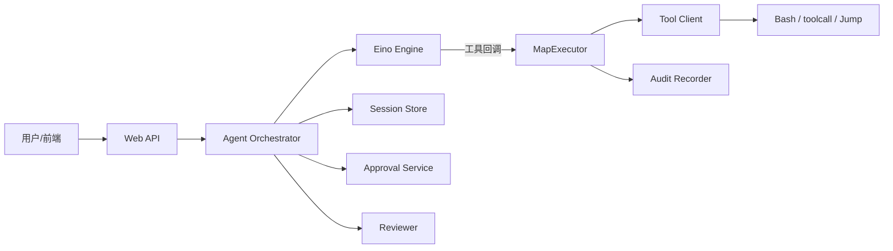

# 架构设计：运维域可控工具型 Agent（自然语言 → 闸门 → 唯一执行 → 可举证）

> **迁移校准（migration）**：Architecture Buddy Phase 2 对未见金标目标的正式迁移记录；**非正式 GOLDEN**，不可当金标抄写源。  
> 由 `corpus/runs/2026-08-05-smoke-sre-buddy.md` 重写提升（问题类收紧、事实与代码对照、校准对照）；勿仅改文件名冒充迁移。  
> 模式：deliverable  
> 源码只读：`/Users/apple/Desktop/xe6/project/SRE-Buddy`（目录 `Backend/`，Go import `backend/`）  
> 已定关键决策：真实副作用只经统一 Executor；副作用前 HITL 打断；Session 记排查过程，Audit 记操作终态；低风险只读可自动放行，其余默认人批  
> 明确不做：替用户拍板生产变更策略；无审计服务对外；用聊天原文冒充合规审计；本迁移不做成熟系统 Top N 深调研  
> 待验证事实：Session/Approval 跨进程持久化；Identity 与 SSO 字段对齐并挂回闸门；Jump 多副本防重放生产就绪度  

---

## 层 A — 叙事

### A1 摘要

SRE-Buddy 面向 SRE / 运维排障：用户用自然语言说明要查什么、改什么；系统用 OpenAI 兼容模型做工具编排，但在**真实探测或改动目标环境之前**插入可控闸门（安全审查、人工审批），执行后留下可独立举证的审计终态。

**解决的问题类**：在运维副作用昂贵且不可逆的前提下，如何让「模型会选工具」与「操作必须可拦、可批、可追」同时成立——属于带权限与人审边界的**工具型 Agent 运行时**，并额外强调运维举证与会话过程叙事分离。

**不解决**：完整 CMDB / 监控 / 工单替代；无监督全自动生产变更；模型正确性本身；把对话日志当作合规审计唯一依据；通用「消息总线编排一切」平台。

成功时：一条排障请求走完「会话 → 模型提议工具 →（审查/审批）→ 唯一执行入口 → 结果回写会话 → 终态审计」；陌生人能指出谁批了、对哪台目标、跑了什么、结果摘要是什么。

### A2 上下文与边界

**落点**：Go 后端（Gin HTTP + Eino 编排）+ React 前端。默认本机 Bash Client；可选 `TOOLCALL_BASE_URL` 远端工具服务；另有 Jump Executor 控制面（独立包/进程）做带票据的远端执行授权。

**信任边界**（按当前代码与模块契约）：

| 边界 | 内侧 | 外侧 |
|------|------|------|
| HTTP / SSE（Web） | Session、Orchestrator、Approval 转发 | 浏览器 / 上游身份 |
| 编排（Orchestrator + Eino Engine） | 工具提议、打断、Resume、审查分支 | 模型 HTTP、工具回调 |
| 执行咽喉（MapExecutor） | Client 调用、Audit Begin/Complete | 真实 shell / toolcall / Jump |
| 身份（Identity） | 权限判断接口（骨架） | SSO / 上游断言（接入未完成） |

外部接口：会话 CRUD + 发消息 + SSE；审批决定 API；可选 SSO；模型 HTTP；可选 toolcall / Jump 控制面。

### A3 主路径

一条「查主机负载」类请求（`PendingToolGate` 开启）的端到端路径：

1. 前端创建会话或发消息；Web 校验入参，交给 Orchestrator。  
2. Orchestrator 确保会话存在，追加用户消息事件，对会话加锁，确认无未决审批。  
3. Engine 带历史跑一轮：模型可只回文本，或提议一次工具（门禁拒绝同轮多工具）。  
4. 若提议工具：Engine 在真实执行前打断，返回 `pending_approval` + ToolCall。  
5. Orchestrator 调 Reviewer：结合本轮意图、历史工具结果、待执行调用，产出只读判定与风险等级。  
6. **自动放行**仅当同时满足：工具自报只读、审查结论只读且 `risk_level=low`、会话权限模式不是 `require_approval`。否则建审批单，写入 `approval_requested`，API/SSE 等待人批。  
7. 人批：Web 解析 `approved|rejected` → Orchestrator `Continue`；拒绝不执行；通过则 `Engine.Resume(Approved=true)`。  
8. 工具桥接只调 `Executor.Execute`；MapExecutor：Audit Begin → `Client.Call` → Audit Complete；结果经事件回写 Session。  
9. 编排继续或结束；时间线可见排查过程，审计库留下终态摘要。

### A4 组件与契约

| 组件 | 职责 | 可调用 | 禁止越界 |
|------|------|--------|----------|
| Web | HTTP/SSE、入参校验、转发 | Agent、Session、Approval | 编排决策、直接执行、写审计业务 |
| Agent Orchestrator | 轮次、审批生命周期、审查后自动/人工分支 | Engine、Session、Approval、Reviewer | 直接 `Client.Call` |
| Eino Engine | 思考→选工具→看结果；打断/Resume | Executor（经工具回调） | 身份/审批实现、审计落盘 |
| Tool Registry | 工具名、参数、元数据 | 装配与发现 | 执行 |
| MapExecutor | **唯一**真实执行入口；审计挂接 | Client、Audit Recorder | 决定「该不该调」（现归属编排） |
| Tool Client | Bash / HTTP toolcall 等适配 | 外部执行环境 | 鉴权/审批/审计 |
| Session Store | 排查事件流与会话元数据 | Agent、Web | 执行、鉴权决策 |
| Approval Service | 审批单创建/查询/决定 | Agent、Web | 执行命令 |
| Reviewer | 待执行调用安全审查 | Orchestrator | 改参数、执行工具 |
| Identity | 权限判断接口 | 目标态由 Executor 引用 | 执行、审批状态机 |
| Audit Recorder | 操作终态只增写入 | Executor | 存完整对话（归 Session） |

关键契约：

- 「凡经工具桥接的执行必走 Executor」——AGENTS.md 硬约束。  
- Session ≠ Audit：过程叙事在 Session；可举证终态字段在 Audit。  
- 审批单由 `(session_id, tool_call_id)` 限定。  
- **文档漂移明示**：`docs/模块职责.md` 目标态写「身份→审批→Client→审计」收进 Executor；当前装配是审批/审查在 Orchestrator，Executor 注释写明身份与审批由上游负责、本层做 Client+Audit。迁移文以**代码现状**为主路径，目标态放演进切片。

### A5 状态、失败与恢复

**持久化（默认装配）：**

- Session：`MemoryStore` —— 进程重启丢失。  
- Approval：`MemoryService` —— 同上。  
- Audit：PostgreSQL —— `DATABASE_URL` 不可用则启动失败；Begin/Complete 两段式。  
- Engine checkpoint：进程内，支撑打断后 Resume。

**用户可见失败与恢复：**

| 情况 | 可见表现 | 恢复 |
|------|----------|------|
| 空输入 / 非法 permission_mode | HTTP 4xx | 改请求重试 |
| 已有 pending 时再发消息 | 编排拒绝推进 | 先决定审批 |
| Reviewer 不可用 / 审查失败 | 升为需人工审批 | 人批或修 Reviewer |
| 审批拒绝 | `rejected`，不执行工具 | 新消息重新提议 |
| Client 调用失败 | 工具错误回写；审计仍尝试 Complete | 修环境后重试 |
| Audit Complete 失败 | 错误日志；结果仍回编排 | 运维查库；重放策略待验证 |
| 会话锁争用 | 同会话串行 | 等上一轮结束 |

### A6 安全与身份

信任模型目标：上游已验证用户（Email 为主体）进入会话；工具执行前应有身份校验 +（按策略）人工审批；审计记录操作者与是否曾批准。

**当前实现边界：**

- `identity.IdentityChecker` 为接口骨架（`CheckRequest` 含 TODO）；MapExecutor **不**调用 Identity。  
- 审批/审查挂在 Orchestrator + Engine 打断链，而非 Executor 内完整「身份→审批→Client→审计」。  
- SSO：`NewHandlerFromEnv` 失败则路由禁用（告警，不致命）。  
- Jump：HMAC 票据、bearer host token、防重放；多副本需共享 TicketConsumer，否则 single-use 仅单实例成立。  
- 会话创建路径未强制写入已验证 `User`（与 SSO 打通方式待验证）。

不适用「完整零信任执行平面」口号：现阶段是**产品内 HITL + 审计收拢**；Jump 是另一条授权执行面，与主 Agent 装配关系需演进中显式化。

### A7 演进切片

| 现在（代码已具备） | 下一刀（文档/计划已指向） | 明确不做（本阶段） |
|--------------------|---------------------------|--------------------|
| Executor 收拢执行 + Postgres Audit | Session/Approval 持久化（PostgreSQL 设计稿） | 无审计的「直接 Client」捷径 |
| PendingToolGate + Reviewer 自动/人工 | Identity 填实；可选把授权收进 Executor（已有计划稿） | 用消息总线重做编排 |
| Bash / ToolcallHTTP 演示主路径 | Jump 与主 Agent 链路产品化打通 | 替代监控/工单全家桶 |
| 模块职责文档作契约参考 | 消除「目标态闸门顺序」与「现状上游审批」漂移 | 本迁移做 Top N 对照调研 |

### A8 如何验收

1. **刺激**：迁移后的实例发一条只读低风险命令会话（Reviewer 可用）。**期望**：满足自动放行则执行且 Audit 有 Begin/Complete、Session 有对应事件；否则出现待审批。  
2. **刺激**：`pending_approval` 时对该 `(session, tool_call)` 提交 `rejected`。**期望**：无对该调用的成功 `Client.Call`；会话可见拒绝。  
3. **刺激**：提交 `approved` 后续跑。**期望**：Executor 调用一次；审计 `Approved=true`；工具结果进入时间线。  
4. **刺激**：代码评审/测试夹具试图绕过 Executor 直调 Client。**期望**：静态约束与测试失败或被规范禁止。  
5. **刺激**：未配置 `DATABASE_URL` 或库不可达时启动。**期望**：进程退出，不提供「无审计」服务。

---

## 层 B — 机制与策略

### B1 基本事实

| # | 事实 | 状态 |
|---|------|------|
| F1 | 运维动作一旦发出，目标环境可能被改变或敏感信息被读出；「先执行再解释」不可接受 | 已证实（问题域） |
| F2 | 模型编排与真实副作用必须分离：提议工具 ≠ 已执行 | 已证实（Engine 打断 + Executor） |
| F3 | 排查需要完整过程叙事；举证需要另一类「谁对何目标做了何操作」终态记录 | 已证实（Session vs Audit） |
| F4 | 同会话并发多轮会破坏审批与 checkpoint 一致性，需要串行化 | 已证实（session lock） |
| F5 | 自动放行只能覆盖高置信只读低风险；否则人必须能否决 | 已证实（Reviewer + permission_mode） |
| F6 | 审计依赖在启动期强制可用（Postgres） | 已证实（`buildRuntime`） |
| F7 | 默认装配下会话与审批不跨进程存活 | 已证实（Memory 实现） |
| F8 | Identity 在执行闸门内强制校验尚未落地 | 已证实（接口空壳 + Executor 未调用） |
| F9 | Jump 多副本防重放是否生产就绪 | 待验证 |
| F10 | 前端/SSO 如何把已验证 Email 写入 Session.User | 待验证 |

### B2 机制

剥掉产品名后，这类问题几乎绕不开（问题类语言，不是模块复述）：

1. **编排与副作用分离**：观察→提议 与 授权→调用→记录 分轨。  
2. **单一执行咽喉（choke point）**：所有真实 Client 调用汇聚一处，横切策略才不漏。  
3. **人机协同打断（HITL interrupt）**：副作用前暂停，保存可恢复状态；批准继续、拒绝丢弃执行。  
4. **双轨记忆**：过程事件流（排障理解）与只增审计（举证）分离。  
5. **策略化放行**：在「永远人工」与「永远自动」之间，用只读/风险/会话模式组合可解释自动子集。  
6. **控制面 / 数据面倾向**（Jump 路径）：票据与授权 vs 实际命令执行拆开。

这些是**工具型 Agent 运行时**的共性结构，再叠加运维域的举证与副作用成本——不是日志型消息总线、不是分布式对象存储、也不是「无护栏全自动 agent」。

### B3 策略选项

| 选项 | 含义 | 依赖的事实 |
|------|------|------------|
| S-A 现状增强 | 审批/审查留在 Orchestrator；Executor 专注 Client+Audit；补 Session/Approval 持久化与 Identity 上游注入 | F2–F8；接受闸门顺序与文档目标态不同构 |
| S-B 闸门内聚 | 身份→审批等待→Client→审计严格收进 Executor；Orchestrator 只管编排与展示 | F2、F3、F8；需重嵌 HITL 与 Executor 异步等待 |
| S-C 远端执行优先 | Jump 票据为唯一生产执行面；本机 Bash 仅开发 | F1、F9；依赖共享防重放与 Host 信任链 |

### B4 取舍

**当前路径接近 S-A**：结构上保证「执行必经 Executor + 审计强制」；用 Engine 打断 + Orchestrator/Reviewer 解决「执行前能拦」；用内存 Session 换迭代速度。

**放弃 / 推迟**：S-B 完整内聚（避免一次重写异步审批与 checkpoint）；S-C 作为默认（演示仍走本机 Bash）。

**代价**：文档目标态与代码「审批在上游」并存，新人易误判安全边界；重启丢排查上下文；Identity 空壳意味着权限主要靠网络位置与人工审批习惯。

### B5 与对照的关系

**未对照成熟系统 Top N**（本迁移按交付约定跳过深调研）。

**最近邻问题类（不打开金标正文、不作叙事抄写）**：

- 与 **agent-runtime**（LLM 工具循环 + 权限/人审/可观测）同族：本设计共享「工具循环、打断、护栏」机制语言是合理的。  
- **刻意不套**：日志追加/位点（log-stream）、内容寻址 DAG（协作历史）、块复制元数据分离（分布式文件系统）——那些是邻近金标常见机制，但**不是**本系统主矛盾。  
- 本系统相对通用 agent-runtime 的**差异策略**：运维副作用成本更高 → 默认 fail-closed 人批 + 强制审计启动依赖 + Session/Audit 双轨；不是「能跑通工具循环即完成」。

---

## 附录

### 包映射（Backend）

| 包 | 角色 |
|----|------|
| `web/` | HTTP、SSE EventHub、会话与审批 Handler |
| `agent/` + `agent/eino/` | Orchestrator、Engine、工具桥接、HITL |
| `tool/` | Executor、Client、MapExecutor |
| `session/` | 会话与事件、MemoryStore |
| `approval/` | 审批单与 MemoryService |
| `reviewer/` | 安全审查契约与事件 |
| `audit/` | Entry/Recorder、Postgres |
| `identity/` | IdentityChecker 接口（待填实） |
| `database/` | 连接池与迁移 |
| `jumpexecutor/` | 远端执行控制面与 authz |
| `sso/` | 可选 SSO |
| `security/` | bearer、HMAC、replay 原语 |
| `cmd/sre_buddy` | 主进程装配 |
| `cmd/toolcall_service` / `cmd/jump_executor` / `cmd/migrate` | 侧车与迁移 |

### 依赖方向（AGENTS.md）

`cmd/sre_buddy` → `agent/` → `{ session/, tool/ }` + `approval/` + `identity/` + `audit/`（identity 为目标依赖；审计已在 Executor 装配）。

### 相对冒烟样本的提升点

- 封面改为正式 **migration**，明确非 GOLDEN。  
- A1/B2 收紧问题类：运维可控工具型 Agent ⊂ agent-runtime，并写清非目标。  
- A4 显式记录文档目标态 vs 代码现状漂移。  
- B5 增加最近邻类比护栏（可提 agent-runtime / 禁乱套 log-stream 等）。  
- 文末增加迁移校准对照与 PASS 判定。

---

## 完成门禁自检（S6）

| # | 门禁项 | 结果 | 说明 |
|---|--------|------|------|
| 1 | 摘要能否让陌生人讲清「解决什么 / 不解决什么」 | **pass** | A1 |
| 2 | 是否有信任/边界与一条端到端主路径 | **pass** | A2 + A3 |
| 3 | 机制与策略是否分开；策略是否有为何选/不选 | **pass** | B2 / B3 / B4；B5 未对照已记录 |
| 4 | 是否有失败语义与可测验收句（≥3） | **pass** | A5 + A8（5 条） |
| 5 | 是否有演进切片（现在 / 下一刀 / 明确不做） | **pass** | A7 |
| 6 | 正文几乎无内部黑话（M1、入口 B、S0…） | **pass** | 用户可见节用 A/B；无考试话术 |

**阻塞/待验证（不假装产品闭合）：** F7–F10。本文件宣称的是**迁移校准交付物结构过门禁**，不宣称生产架构已闭合。

---

## 迁移校准对照

- **S6 结构**：上表 6 项全 pass；双层 A1–A8 / B1–B5 齐全。  
- **陌生读者 5 分钟**：能讲清——解决「运维自然语言驱动工具但必须可拦可批可追」；主路径是会话→提议→审查/审批→Executor→Audit；不做无审计自动变更、不做全家桶运维平台替代。  
- **最近邻金标（问题类级，未打开 GOLDEN 正文）**：与 agent-runtime（工具循环 + 护栏/人审）同族对齐合理；未把 log-stream 位点叙事、Git DAG、HDFS 块复制等乱套进本系统主机制。差异点（强制审计启动、Session/Audit 双轨、运维 fail-closed）已写明。  
- **判定：PASS**

（本轮候选直接达标；未改 skill / 模板；未改动 SRE-Buddy 源码。）
