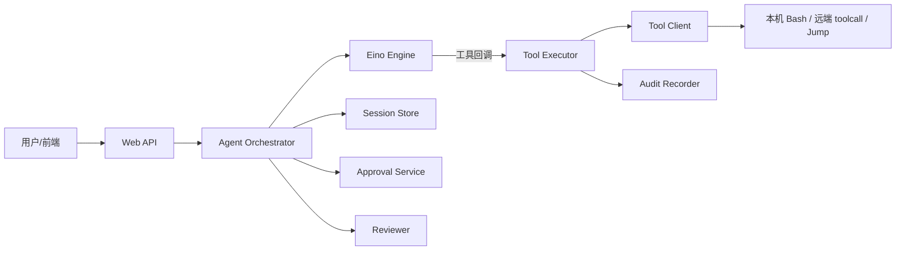

# 架构设计：可控的运维工具型 Agent（自然语言 → 受控执行 → 可举证）

> **冒烟样本（smoke）**：Architecture Buddy deliverable 工作流端到端验证产出；非正式校准金标。  
> 模式：deliverable  
> 源码只读：`/Users/apple/Desktop/xe6/project/SRE-Buddy`（Backend 包路径在仓库中为 `Backend/`，Go import 为 `backend/`）  
> 已定关键决策：工具真实执行只经统一 Executor；审批打断在执行前；Session 记排查过程，Audit 记操作终态  
> 明确不做：替用户拍板生产策略；本冒烟不做成熟系统对照调研  
> 待验证事实：生产多副本下审批/会话持久化选型；Identity 与 SSO 字段对齐；Jump Executor 与主链路装配完整度  

---

## 层 A — 叙事

### A1 摘要

SRE-Buddy 面向 SRE / 运维排障：用户用自然语言描述要查什么、改什么，系统用 OpenAI 兼容模型编排工具调用，在**真正改动或探测目标环境之前**插入可控闸门（安全审查、人工审批），并在执行后留下可独立举证的审计记录。

它解决的是「人会说话、模型会选工具，但运维操作必须可拦、可批、可追」这一类问题。  
它**不**解决：完整 CMDB/监控替代、无监督的全自动生产变更、模型本身的正确性保证，也不把对话原文当作合规审计的唯一依据。

成功时：一条排障请求能走完「会话 → 模型提议工具 →（审查/审批）→ 唯一执行入口 → 结果回写会话 → 终态审计」；陌生人能指出谁批了、对哪台机、跑了什么、结果摘要是什么。

### A2 上下文与边界

**落点**：Go 后端（Gin HTTP + Eino 编排）+ React 前端；默认本机演示用 Bash Client，可选 HTTP 远端工具服务（`TOOLCALL_BASE_URL`）；另有 Jump Executor 控制面用于带票据的远端执行授权（独立进程/包）。

**信任边界**（按代码与文档意图）：

| 边界 | 谁在内侧 | 谁在外侧 |
|------|----------|----------|
| HTTP API（Web） | Session / Orchestrator / Approval 转发 | 浏览器 / 上游身份接入 |
| 编排（Agent + Eino） | 工具提议、打断、恢复 | 模型服务、工具 Client |
| 执行闸门（Executor） | 调 Client、写 Audit | 真实 shell / toolcall 服务 |
| 身份（Identity） | 权限判断接口 | SSO / 上游断言（当前接入未完成） |

与外部的主要接口：会话 CRUD + 发消息 + SSE 事件；审批决定 API；可选 SSO 路由；模型 HTTP；可选 toolcall / Jump 控制面。

### A3 主路径

一条「查主机负载」类请求的端到端路径（`PendingToolGate` 开启时）：

1. 前端 `POST` 创建会话或向已有会话发消息；Web 校验入参，交给 Orchestrator。  
2. Orchestrator 确保会话存在，追加 `user_message`（非流式路径），对会话加锁，确认无未决审批。  
3. Engine 带着历史事件跑一轮：模型可能只回文本，或提议一次 `bash`（门禁拒绝同轮多工具调用）。  
4. 若提议工具：Engine 在真实执行前打断，返回 `pending_approval` + ToolCall。  
5. Orchestrator 调 Reviewer：结合本轮用户意图、历史工具结果、待执行调用，产出只读判定与风险等级。  
6. **自动放行条件**（同时满足）：工具自报只读、审查结论只读且 `risk_level=low`、会话权限模式不是 `require_approval`。否则创建审批单，会话事件写入 `approval_requested`，API/SSE 提示等待人批。  
7. 人批：Web ApprovalHandler 解析 `approved|rejected` → Orchestrator `Continue`；拒绝则不执行工具；通过则 `Engine.Resume(Approved=true)`。  
8. 工具桥接只调 `Executor.Execute`；MapExecutor 写 Audit Begin → `Client.Call` → Audit Complete，结果经事件回写 Session（`tool_result` 等）。  
9. 编排继续或结束；用户在时间线看到排查过程，审计库留下终态摘要。

### A4 组件与契约

| 组件 | 职责 | 可调用 | 禁止越界 |
|------|------|--------|----------|
| Web | HTTP/SSE 接入、参数校验、转发 | Agent、Session、Approval | 编排决策、直接执行工具、写审计业务逻辑 |
| Agent Orchestrator | 会话轮次、审批生命周期衔接、审查后自动/人工分支 | Engine、Session、Approval、Reviewer | 直接 `Client.Call` |
| Eino Engine | 思考→选工具→看结果；PendingToolGate 打断/Resume | Executor（经工具回调） | 身份/审批实现、审计落盘 |
| Tool Registry / 定义 | 工具名、参数、元数据 | 装配与 Agent 发现 | 执行 |
| Tool Executor | **唯一**真实执行入口；审计挂接 | Client、Audit Recorder | 决定「该不该调」（属编排） |
| Tool Client | Bash / HTTP toolcall 等适配 | 外部执行环境 | 鉴权/审批/审计 |
| Session Store | 排查事件流与会话元数据 | Agent、Web | 执行、鉴权决策 |
| Approval Service | 审批单创建/查询/决定 | Agent、Web | 执行命令 |
| Reviewer | 对待执行调用做安全审查 | Orchestrator | 改参数、执行工具 |
| Identity | 权限判断接口 | 目标态由 Executor 引用 | 执行、审批状态机 |
| Audit Recorder | 操作终态只增写入 | Executor | 存完整对话（归 Session） |

关键契约语言：

- 「凡经工具桥接的执行必走 Executor」——AGENTS.md 与模块职责文档的硬约束。  
- Session 与 Audit 职责分离：对话/完整工具输出在 Session；可举证终态字段在 Audit。  
- 审批单由 `(session_id, tool_call_id)` 限定。

### A5 状态、失败与恢复

**持久化现状（代码装配）：**

- Session：`MemoryStore` —— 进程重启丢失会话与事件。  
- Approval：`MemoryService` —— 同上。  
- Audit：PostgreSQL —— `DATABASE_URL` 不可用则服务不启动；Begin/Complete 两段式。  
- Engine checkpoint：进程内，支撑打断后 Resume。

**用户可见失败态：**

| 情况 | 可见表现 | 恢复 |
|------|----------|------|
| 空输入 / 非法 permission_mode | HTTP 4xx | 改请求重试 |
| 已有 pending 审批时再发消息 | 编排拒绝推进 | 先决定审批 |
| 审查失败 / Reviewer 不可用 | 默认升为需人工审批 | 人工批或修 Reviewer |
| 审批拒绝 | `rejected`，不执行工具 | 新消息重新提议 |
| Client 调用失败 | 工具结果/错误回写；审计仍尝试 Complete | 按错误修环境后重试 |
| Audit Complete 失败 | 打错误日志；执行结果仍返回编排 | 运维查库/重放策略待验证 |
| 会话锁争用 | 同会话串行 | 等待上一轮结束 |

### A6 安全与身份

信任模型目标：上游已验证用户（Email 作为主体标识）进入会话；工具执行前应有身份校验 +（按策略）人工审批；审计记录操作者与是否曾批准。

**当前实现边界：**

- `identity.IdentityChecker` 仅为接口骨架（`CheckRequest` 含 TODO）；`MapExecutor` 注释写明身份与审批策略由**上游**负责，Executor 侧重 Client + Audit。  
- 实际审批/审查挂在 Orchestrator + Engine 打断链，而非 Executor 内顺序「身份→审批→Client→审计」的完整实现。  
- SSO：`sso.NewHandlerFromEnv` 失败则路由禁用（告警，不致命）。  
- Jump Executor：HMAC 票据、bearer host token、防重放；多副本需共享 TicketConsumer，否则 single-use 语义仅单实例成立。  
- 会话创建路径当前未强制写入已验证 `User`（待验证与 SSO 打通方式）。

若不适用「完整零信任执行平面」表述：本系统现阶段是**产品内 HITL + 审计收拢**，远端 Jump 是另一条授权执行面，两者装配关系需在演进中显式化。

### A7 演进切片

| 现在（代码已具备） | 下一刀（文档/接口已指向） | 明确不做（本阶段） |
|--------------------|---------------------------|--------------------|
| Executor 收拢执行 + Postgres Audit | Session/Approval 持久化（设计稿已有 PostgreSQL 方向） | 无审计的「直接 Client」捷径 |
| PendingToolGate + Reviewer 自动/人工分支 | Identity 填实并挂回执行前闸门 | 用消息总线重做编排 |
| Bash / ToolcallHTTP 演示执行 | Jump 与主 Agent 链路产品化打通 | 替代监控/工单全家桶 |
| 模块职责文档作为契约 | 消除「目标态闸门顺序」与「现状上游审批」文档漂移 | 本冒烟做 Top N 对照 |

### A8 如何验收

1. **刺激**：对空库迁移后的实例发一条只需只读低风险命令的会话消息（Reviewer 可用）。**期望**：若不满足自动放行条件则出现待审批；满足则工具执行且 Audit 有 Begin/Complete，Session 有对应事件。  
2. **刺激**：在 `pending_approval` 时对该 `(session, tool_call)` 提交 `rejected`。**期望**：不出现对该调用的成功 `Client.Call`；会话可见拒绝决策事件。  
3. **刺激**：提交 `approved` 后续跑。**期望**：Executor 被调用一次；审计 `Approved=true`；工具结果进入会话时间线。  
4. **刺激**：故意让工具桥接绕过 Executor 直调 Client（代码评审/测试夹具）。**期望**：静态约束与测试应失败或被规范禁止（回归门禁）。  
5. **刺激**：未配置 `DATABASE_URL` 或库不可达时启动。**期望**：进程退出，不对外提供「无审计」服务。

---

## 层 B — 机制与策略

### B1 基本事实

| # | 事实 | 状态 |
|---|------|------|
| F1 | 运维动作一旦发出，目标环境状态可能被改变或敏感信息被读出；「先执行再解释」不可接受 | 已证实（问题域） |
| F2 | 模型编排与真实副作用必须分离：提议工具 ≠ 已执行 | 已证实（Engine 打断 + Executor） |
| F3 | 排查需要完整过程叙事；合规/举证需要另一类「谁对何目标做了何操作」的终态记录 | 已证实（Session vs Audit 分包） |
| F4 | 同一会话并发多轮会破坏审批与 checkpoint 一致性，需要串行化 | 已证实（session lock） |
| F5 | 自动放行只能覆盖「高置信只读且低风险」；否则人必须能否决 | 已证实（Reviewer 规则 + permission_mode） |
| F6 | 审计依赖在启动期强制可用（Postgres） | 已证实（main buildRuntime） |
| F7 | 会话与审批在默认装配下不跨进程存活 | 已证实（Memory 实现） |
| F8 | Identity 在执行闸门内的强制校验尚未落地 | 已证实（接口空壳 + Executor 未调用） |
| F9 | 多副本 Jump 防重放是否已生产就绪 | 待验证 |
| F10 | 前端代理与 SSO cookie/bearer 如何把 Email 写入 Session.User | 待验证 |

### B2 机制

剥掉产品名后，这类问题几乎绕不开：

1. **编排与副作用分离**：决策循环（观察→提议）与执行循环（授权→调用→记录）分轨。  
2. **单一执行咽喉（choke point）**：所有真实 Client 调用汇聚一处，才能保证横切策略不漏。  
3. **人机协同打断（HITL interrupt）**：在副作用前暂停，保存可恢复状态，批准后继续、拒绝则丢弃执行。  
4. **双轨记忆**：过程事件流（排障理解）与只增审计（举证）分离，避免用聊天日志冒充审计。  
5. **策略化放行**：在「永远人工」与「永远自动」之间，用只读/风险/会话模式组合出可解释的自动子集。  
6. **控制面 / 数据面倾向**：Jump 路径把「票据与授权」和「实际命令执行」拆开（授权在控制面，执行在执行器侧）。

### B3 策略选项

| 选项 | 含义 | 依赖的事实 |
|------|------|------------|
| S-A 现状增强 | 保持审批/审查在 Orchestrator，Executor 专注 Client+Audit；补齐 Session/Approval 持久化与 Identity 上游注入 | F2–F8；接受闸门顺序与文档目标态不完全同构 |
| S-B 闸门内聚 | 把身份→审批等待→Client→审计严格收进 Executor，Orchestrator 只编排与展示 | F2、F3、F8；需重嵌 HITL 与 Executor 的异步等待模型 |
| S-C 远端执行优先 | 以 Jump 票据模型为唯一生产执行面，本机 Bash 仅开发 | F1、F9；依赖共享防重放与 Host 信任链 |

### B4 取舍

**当前路径接近 S-A**：先用结构保证「执行必经 Executor + 审计强制」，用 Engine 打断 + Orchestrator/Reviewer 解决「执行前能拦」，用内存 Session 换取迭代速度。

**放弃 / 推迟**：S-B 的完整内聚（避免一次性重写异步审批与 checkpoint）；S-C 作为默认（本机 Bash 仍是演示主路径）。

**代价**：文档中的「Executor 内身份→审批→审计」与代码「审批在上游、Executor 做审计」并存，新人易误判安全边界；Memory Session 使重启丢排查上下文；Identity 空壳意味着权限仍主要依赖网络位置与人工审批习惯。

### B5 与对照的关系

未对照（本冒烟按交付约定跳过成熟系统 Top N / 对照调研）。

---

## 附录

### 包映射（Backend）

| 包 | 角色 |
|----|------|
| `web/` | HTTP、SSE EventHub、会话与审批 Handler |
| `agent/` + `agent/eino/` | Orchestrator、Engine、工具桥接、HITL |
| `tool/` | Executor、Client、MapExecutor |
| `session/` | 会话与事件类型、MemoryStore |
| `approval/` | 审批单与 MemoryService |
| `reviewer/` | 安全审查契约与事件 |
| `audit/` | Entry/Recorder、Postgres 实现 |
| `identity/` | IdentityChecker 接口（待填实） |
| `database/` | 连接池与迁移 |
| `jumpexecutor/` | 远端执行控制面与 authz |
| `sso/` | 可选 SSO |
| `security/` | bearer、HMAC、replay 等原语 |
| `cmd/sre_buddy` | 主进程装配 |
| `cmd/toolcall_service` / `cmd/jump_executor` / `cmd/migrate` | 侧车与迁移 |

### 依赖方向（AGENTS.md）

`cmd/sre_buddy` → `agent/` → `{ session/, tool/ }` + `approval/` + `identity/` + `audit/`（identity 目标依赖；审计已在 Executor 装配）。

---

## 完成门禁自检

对照 Architecture Buddy 完成门禁，本冒烟文件逐项结果：

| # | 门禁项 | 结果 | 说明 |
|---|--------|------|------|
| 1 | 摘要能否让陌生人讲清「解决什么 / 不解决什么」 | **pass** | A1 明确可控工具型 Agent 与非目标 |
| 2 | 是否有信任/边界与一条端到端主路径 | **pass** | A2 边界表 + A3 主路径 |
| 3 | 机制与策略是否分开；策略是否有为何选/不选 | **pass** | B2 / B3 / B4；B5 未对照已显式记录 |
| 4 | 是否有失败语义与可测验收句（≥3） | **pass** | A5 + A8（5 条） |
| 5 | 是否有演进切片（现在 / 下一刀 / 明确不做） | **pass** | A7 |
| 6 | 正文几乎无内部黑话（M1、入口 B、S0…） | **pass** | 未使用 M 问卷结构或考试话术；未对照成熟系统 |

**阻塞/待验证（不假装已产品完备）：** F8 Identity 未挂执行闸门；F7 会话/审批内存；F9–F10 生产身份与 Jump 多副本。上述不影响本文件作为「双层架构设计冒烟」的结构完整性，但若宣称「生产架构已闭合」则应标红——本冒烟**不**宣称生产闭合，仅宣称交付物结构过门禁。
