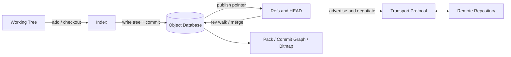

# Git 架构设计：最终交付版

> 问题类：多人协作的文件树版本历史，需要离线记录、分支合并、内容完整性和可选择的跨仓库分享
> 设计基线：`https://github.com/git/git`，官方仓库 `master`，检出提交 `5b24717`
> 明确不做：代码托管产品、代码审查、CI/CD、工单、实时协同编辑、访问控制中心
> 设计对象/目标层：分布式文件历史的对象/状态模型、仓库工作流与跨仓库传输边界；不把企业业务层或托管产品层当作 Git 核心
> 架构推导链：核心问题/使用场景与流程 → 状态不变量与对象边界 → 工作流/应用组合与仓库集成 → 存储/传输机制与完整性、离线性、可演进性质量属性
> 圆桌过程记录：见本文“附录：圆桌过程证据”；独立完整记录见 `2026-08-05-live-test-git-roundtable.md`

## 层 A — 叙事

### A1 摘要

Git 解决的是：多个贡献者在本地独立修改一棵文件树，先记录自己的历史，再在需要时交换和合并历史。系统必须允许断网提交、廉价创建分支、表达多父合并，并能用内容身份复用相同数据和发现存储损坏。

成功时，用户可以在没有远程服务器的情况下完成一次本地提交；另一个分支可以独立前进；两条历史可以合并；需要分享时，仓库只交换对方缺少的对象并更新约定的 refs。Git 不把远程服务器作为本地历史成立的前提，也不把分支实现成整棵工作树的复制品。

### A2 上下文与边界

系统边界包含四类状态：

- 工作树是用户直接编辑的文件系统状态，允许存在尚未暂存、尚未提交的变化。
- 索引是当前工作树与下一次提交之间的暂存状态，支持选择性加入、冲突阶段和稀疏表示。
- `.git` 中的对象库、refs、HEAD、reflog、配置和每个 worktree 的辅助状态构成仓库状态。
- 远程仓库通过 Git 协议或其他传输通道交换 refs 与 pack；它是分享和协作节点，不是本地提交的必经控制面。

核心信任边界是：对象库负责内容寻址和完整性；refs 负责发布哪些对象可达；传输端负责协商和接收检查；远程宿主负责认证、授权和网络暴露。对象哈希不能替代机密性、用户身份或远程 ACL。

### A3 主路径

一次本地提交以及随后分享的端到端路径如下：

1. 用户修改工作树中的文件。`git add` 读取变更，将相关文件内容写入或复用 blob，并把路径、模式、对象 ID 等信息写入索引。
2. `git commit` 根据索引生成目录 tree；未改变的子树可以复用已有对象；随后写入 commit 对象，记录根 tree、一个或多个父 commit、作者/提交者和消息。
3. ref 更新把当前分支指向新的 commit；`HEAD` 通常是指向当前分支的 symbolic ref。至此本地历史已成立，网络不在主路径上。
4. 用户执行 `push` 时，客户端读取远程 refs，计算共同对象和缺失对象，生成 pack 并通过协商协议发送。远端接收、校验并在 ref 更新条件满足时发布新的 ref。
5. 另一台机器执行 `fetch` 或 `clone` 时，按同一对象格式接收 pack，建立本地对象库和 remote-tracking refs；需要工作树时再由 refs/index checkout 出文件。

### A4 组件与契约

| 组件 | 职责 | 关键契约 |
|------|------|----------|
| Working Tree | 承载用户可编辑文件 | 可与历史暂时不一致；未提交状态不等于对象历史 |
| Index | 选择下一次 tree 快照的路径集合 | 允许选择性暂存、冲突 stages 和 sparse-index；不直接等于当前 commit |
| Object Database | 保存 blob、tree、commit、tag 及其压缩表示 | 对象 ID 由对象内容和类型计算；逻辑对象不可变；缺失对象必须显式暴露 |
| Revision / Merge Engine | 解析父指针、可达性、共同祖先和合并结果 | 历史是 DAG；merge commit 可以有多个父；祖先关系不能用全局修订号替代 |
| Refs / HEAD / Reflog | 发布可达 tips，表达分支、标签、当前分支和历史移动 | 分支是可变指针；ref 更新要经过合法名称、旧值检查和后端事务/锁语义 |
| Transport / Server Process | 交换 refs、协商共同历史并传输 pack | `fetch`/`push` 不改变对象身份；远端是否接受 ref 更新由其策略和协议条件决定 |
| Pack / Index / Commit Graph | 降低对象存储、查找、遍历和传输成本 | 可替换的物理加速层，不改变 blob/tree/commit 的逻辑模型 |
| Plumbing / Porcelain | 分离底层对象原语和面向用户的工作流 | 高层命令组合底层能力；脚本依赖稳定的 plumbing 契约 |

禁止越界：不要把 pack 当作另一种历史语义；不要把远程 push 写成 commit 的同义词；不要用命令目录或源文件数量代替状态与契约。

### A5 状态、失败与恢复

持久化状态包括对象库中的 loose objects 或 packs、refs/HEAD、reflog、索引、配置、工作树关联信息和可选的 commit-graph、bitmap、MIDX、shallow/promisor 元数据。对象通常先以 loose 形式落盘，再由 repack/gc 组织为 pack；压缩不能改变对象的逻辑身份。

主要失败语义：

- 工作树与索引不一致：显示为未暂存或未提交变更；用户可以继续暂存、丢弃或恢复。
- 合并冲突：索引保存多阶段候选，工作树保留冲突结果；解决后再写入新的 tree/commit。
- ref 更新条件失败或 push 非快进：不发布新的 ref；本地已有对象和 commit 不因此消失，用户需要 merge/rebase 后重试。
- 对象校验失败或对象缺失：对象库不应静默把错误当成正常历史；可用 `fsck`、其他完整仓库、远程、alternate 或重新获取恢复，partial/shallow 仓库还要尊重其声明的边界。
- 中断或历史重写：reflog、仍可达对象和未被 gc 的对象提供恢复窗口；gc/prune 后则不能承诺所有不可达对象仍可找回。

### A6 安全与身份

Git 的核心安全属性是内容完整性和历史可验证性：对象 ID 绑定对象内容，pack、索引和协议有校验字段，接收端可以在发布 refs 前检查接收内容。当前仓库同时演进 SHA-1 与 SHA-256 相关能力，因此设计不能把某一个哈希算法名称当作永久抽象。

这不等于访问控制。谁可以读取对象、更新哪些 refs、签署或接受哪些提交，由传输认证、远程宿主授权、签名验证和 hooks 等策略决定。对象进入仓库后，不能依赖对象名不可猜测来保护机密；敏感数据需要在仓库外建立密钥、权限和清理策略。

### A7 演进切片

- **现在：** 保持内容寻址的 blob/tree/commit/tag、DAG 历史、refs/HEAD、工作树与 index 三态、离线 commit、可选 push/fetch 和 plumbing/porcelain 分层。
- **下一刀：** 对大仓库增强 pack/repack、MIDX、reverse index、commit-graph、bitmap、sparse-index、partial clone 和协议协商；再根据 ref 数量与并发写入场景评估 files 或 reftable 后端。
- **明确不做：** 把中央服务变成本地 commit 的事务协调器；把所有历史压平成线性修订号；把完整工作树复制当作分支原语；用实时锁服务替代本地对象和 ref 模型。

### A8 如何验收

1. **刺激：** 在断网环境初始化仓库，修改文件并执行 `add`、`commit`。**观察：** 新 blob/tree/commit 可由本地对象库读取，当前分支 ref 指向新 commit，整个过程不访问远程。
2. **刺激：** 从同一祖先创建两个分支，各自提交后合并。**观察：** 合并结果包含多个父 commit，共同祖先通过 DAG 可达性计算，不依赖全局递增修订号。
3. **刺激：** 在两个不同 commit 中保留同一文件内容。**观察：** 内容对应同一对象 ID；未改变的子树可复用，逻辑模型不是每个版本复制全部文件内容。
4. **刺激：** 本地已有 commit 后向远程 push，再在另一仓库 fetch。**观察：** 远程获得可验证的相同对象和 ref 更新；本地 commit 早于 push 且不依赖远程在线。
5. **刺激：** 制造对象校验错误、非快进 push、合并冲突和 shallow/partial 缺失对象。**观察：** Git 分别报告完整性、发布条件、索引冲突或对象边界错误，不能静默伪造完整历史。

## 层 B — 机制与策略

### B1 基本事实

- **已证实（Git 仓库文档与代码）：** 本地仓库包含对象库、refs、HEAD、index 和工作树关联状态；仓库也可以是 bare 或使用不同的 common directory。
- **已证实：** Git 的逻辑对象包括 blob、tree、commit、tag；对象 ID 由哈希标识，内容相同可以复用身份。
- **已证实：** tree 通过对象引用组织目录快照；commit 通过父指针组织历史，合并 commit 可以有多个父。
- **已证实：** refs 是指向对象的可变命名层，`HEAD` 可以是 symbolic ref；分支创建和移动不需要复制工作树。
- **已证实：** index 是独立的持久化暂存格式，支持冲突 stages、cache-tree、split-index 和 sparse-index 等扩展。
- **已证实：** loose objects 会被组织成 pack；pack index、MIDX、commit-graph 和 bitmap 优化查找、遍历、传输和存储。
- **已证实：** fetch/push 使用 refs 广播、共同对象协商和 pack 传输；协议支持能力协商、对象格式声明、浅历史和过滤请求。
- **待验证（部署相关）：** 某个远程宿主的认证、ACL、签名策略、钩子策略和存储可用性；具体仓库规模下各加速索引的成本收益。

### B2 机制

这类“分布式文件历史”问题几乎绕不开以下结构：

1. **内容寻址对象库：** 用内容身份同时获得去重、引用和完整性检查。
2. **快照树：** blob/tree 组成可复用的目录快照，未改变的子树可以共享。
3. **历史 DAG：** commit 的父边表达发散、共同祖先和合并，不把历史约束为单链。
4. **可变发布指针：** refs/HEAD 把稳定对象图映射成当前分支、标签和工作焦点。
5. **工作树—index—对象库三态：** 把编辑、选定提交内容和已记录历史分开，支持选择性暂存与冲突处理。
6. **增量物理表示：** loose、pack、delta、索引和遍历辅助结构优化物理成本，但不改变逻辑对象。
7. **差集同步协议：** 先交换 refs 和能力，再协商共同历史，只发送接收端缺少的对象。
8. **发布与回收分离：** ref/reflog 决定可达和恢复边界，gc/repack 可以回收或重排未发布对象。
9. **Plumbing / Porcelain 分层：** 底层对象、索引、refs 和传输原语承载稳定机制；面向用户的命令组合成 add、commit、merge、push、fetch 等工作流。

### B3 策略选项

| 决策维度 | Git 路径 | 主要替代 | 依赖的事实 |
|----------|----------|----------|------------|
| 内容表示 | DAG 快照对象，pack delta 只是物理压缩 | delta changeset 作为唯一主模型 | 是否需要内容身份、跨仓库复用和直接重建任意快照 |
| 历史表示 | 多父 commit DAG | 单链修订号或强制线性历史 | 是否需要原生表达并行开发和合并谱系 |
| 分发模型 | 每个 clone 可独立提交，按需 push/fetch | 中央服务器事务式提交 | 是否需要离线工作、多发布面和本地历史完整性 |
| 暂存模型 | 独立 index，提交前选择路径 | 直接把工作树整体作为一次提交 | 是否需要分批提交、冲突阶段和稀疏工作集 |
| 对象布局 | loose 起步，pack/MIDX/bitmap/commit-graph 按需加速 | 每对象永久独立文件或单一大文件 | 仓库规模、随机读取、repack 成本和传输局部性 |
| refs 后端 | files 或 reftable，通过 refs API 隔离 | 业务代码直接读写目录/数据库 | ref 数量、并发更新、压缩与兼容性需求 |
| 克隆完整度 | full、shallow、partial/promisor | 所有客户端必须拿全量历史 | 是否允许明确的历史/对象边界和在线回填 |

### B4 取舍

Git 选择“不可变内容寻址对象 + 快照树 + 多父历史 DAG + 可变 refs + 独立 index + 仓库间差集同步”，因为它同时满足离线提交、廉价分支、可解释合并、内容完整性和跨仓库复用。

它明确放弃了以下东西：

- **中央提交事务：** 得到更简单的可见性和权限心智，但失去断网提交和多发布面；代价是用户必须区分 commit、fetch、merge、push。
- **纯线性历史：** 读起来更简单，但合并谱系、共同祖先和“变更是否已包含”需要额外约定；代价是 DAG 遍历和历史可视化更复杂。
- **delta 作为逻辑主模型：** 对大文件小改可能更省空间，但弱化内容身份、任意快照重建和跨仓库去重；Git 用 pack delta 收取物理成本，而保留快照逻辑。
- **工作树直接提交：** 操作更少，但无法自然表达选择性暂存和冲突中间态；代价是 index 成为用户必须理解的额外状态。
- **永久完整 clone：** 能力最直观，但大仓库初始传输和存储成本高；shallow/partial clone 降低成本，同时引入缺失对象和历史边界语义。

负面后果不能隐藏：对象、refs、index、reflog、pack、协议和多种 clone 模式带来较高概念负担；重写历史会产生不可达对象；大仓库需要维护和索引策略；哈希完整性不等于保密或授权。

### B5 与对照的关系

- **中央线性 VCS：** 本地可提交的对象库和多仓库分享说明“提交记录”和“向公共面发布”应拆成两个机制；但如果团队只需要单一中央工作流，Git 的灵活性会换来更高的学习与治理成本。
- **追加日志系统：** 追加和重放不是 Git 的全部真相；消费位点或 broker 日志不能替代可寻址对象和 DAG。
- **中心共识控制面：** 单个仓库的 ref 更新需要局部锁、旧值检查和事务语义，但本地 commit 不需要跨仓库多数派；中央协调应留在托管平台边界。
- **Git 自身演进：** files/reftable、SHA-1/SHA-256、full/shallow/partial、loose/pack 是策略替换点；稳定的边界是对象、引用、索引和协议契约，而不是某个磁盘目录布局。

### B6 组合增长与边界检验

Git 的组合意图可以写成：

`内容寻址对象 × 快照树 × 历史 DAG × 可变 refs × 仓库间同步 → 可离线、可分支、可合并的文件历史`

变化轴是：对象格式、历史可见范围、物理布局、refs 后端和传输能力。N+1（新增下一种同类需求）时：

- **应该修改：** 对应的对象格式适配、clone 过滤/边界策略、pack 或遍历索引、refs 后端和协议能力协商。
- **不应该修改：** blob/tree/commit 的逻辑语义、父指针形成的 DAG、refs 作为可变发布层、工作树与 index 的职责边界。

反例是实时协同编辑、需要全局线性化写入的数据库事务、以不可变事件消费为核心的业务流水，以及必须由中央授权服务才能成立的工作流。这些问题的事实来源、冲突语义或信任边界不同，不能仅通过增加 Git 对象类型塞进同一抽象。

这次增加的是可组合能力，不只是复杂度：复杂度集中在可替换的物理布局、同步策略和工作流界面，核心历史模型仍由少数稳定概念约束。

## 附录：证据基线

- 官方仓库：`https://github.com/git/git`
- 检出提交：`5b24717`
- 仓库布局：`Documentation/gitrepository-layout.adoc`
- 对象与 pack：`Documentation/gitformat-pack.adoc`
- 索引格式：`Documentation/gitformat-index.adoc`
- 协议：`Documentation/gitprotocol-v2.adoc`、`Documentation/gitprotocol-pack.adoc`
- 历史加速：`Documentation/gitformat-commit-graph.adoc`
- refs 后端：`Documentation/technical/reftable.adoc`、`refs.c`
- 核心实现入口：`repository.c`、`read-cache.c`、`object-file.c`、`fetch-pack.c`、`send-pack.c`、`upload-pack.c`

## 附录：圆桌过程证据

### 圆桌提议与用户选择

主策略形成前识别出三个高影响互斥分叉：历史是追加日志还是内容寻址 DAG；refs 发布是否需要中央强一致；逻辑快照与 pack/delta 物理优化是否混为一层。主持人说明这些分叉会改变历史真相、提交边界和故障语义，并提议圆桌；用户明确同意。

### 选席与透镜契约

选择两席：`log-stream` 用于检验“Git 是事件日志”的类比边界；`raft-cp` 用于检验 refs 发布是否真的需要跨仓库多数派。两席均为做法立场，不是名人扮演。

#### Lens: Log Stream

##### On the decision point

区分可寻址对象与单一消费日志：commit 可遍历但不是必须顺序消费的事件，pack 是传输/存储表示。

##### Heuristics applied

检查事实来源、重放边界、保留成本和缺失对象，而不是假设存在 consumer offset。

##### Risks / what they'd worry about

担心把 commit 误写成顺序事件、把 pack 误写成事务日志，以及忽略 reflog、gc 和 shallow/partial 边界。

##### Would not do

不会把 broker、consumer group 或 offset 作为 Git 核心，也不会用追加日志替代 blob/tree/commit 对象模型。

##### Evidence style

对照对象格式、pack、fetch negotiation、reflog、shallow/partial clone，并用 clone/fetch/repack/fsck 验证。

#### Lens: Raft CP

##### On the decision point

区分本地 ref 更新的锁/事务语义与跨仓库共识；本地 commit 不以中央 leader 为前提。

##### Heuristics applied

检查是否存在共同实时控制面，并把 refs 小元数据与对象数据面分开。

##### Risks / what they'd worry about

担心把托管平台误写成 Git 核心共识层，把 ref 后端局部事务夸大为跨仓库多数派。

##### Would not do

不会为所有仓库引入中央 Raft，也不会把 push 的远程策略写成 commit 必须经 leader 批准。

##### Evidence style

对照 refs API、files/reftable、receive-pack 和离线 commit 行为；托管平台的 ACL 单独评估。

### 主持人综合结论

两席共同否定“中央追加日志 + 多数派提交”作为 Git 核心。结论回写到本文 A2、A3、B2、B4 和 B6：逻辑真相是内容寻址对象与多父 DAG；refs/HEAD 是可变发布层；pack/delta 只优化物理成本；plumbing/porcelain 通过稳定契约组合用户工作流；中央协调留在托管平台边界。

## 完成检查

| 检查项 | 结果 | 证据 |
|--------|------|------|
| 陌生读者能说清解决什么与不解决什么 | pass | A1、A2 |
| 有信任边界和端到端主路径 | pass | A2、A3、A6 |
| 机制与策略分开，且写明取舍 | pass | B2、B3、B4 |
| 有失败语义和至少三条可测验收句 | pass | A5、A8 |
| 有现在/下一刀/明确不做 | pass | A7 |
| 有 N+1、反例和复杂度边界 | pass | B6 |
| 正文不依赖内部阶段编号 | pass | 全文 |
